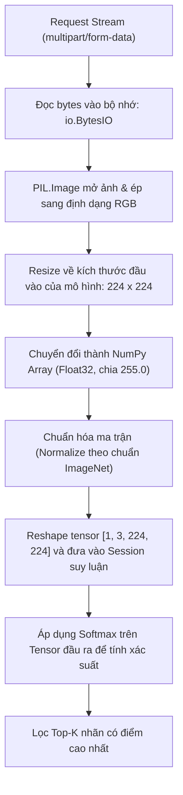
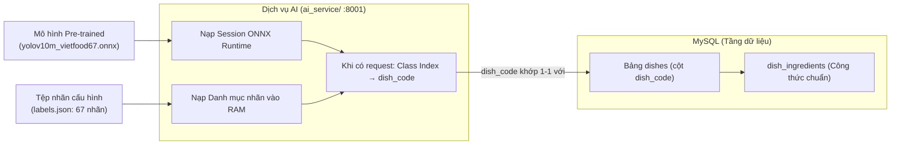
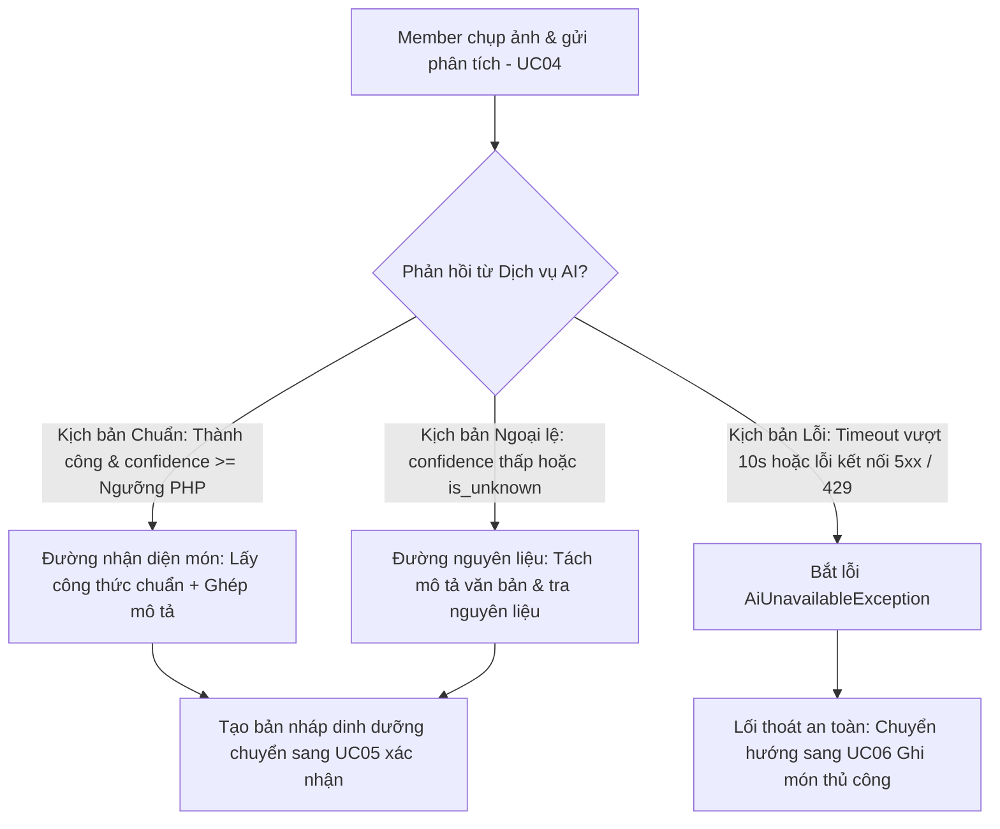

# FlexiDiet: Thiết Kế & Kế Hoạch Thực Nghiệm PoC Dịch Vụ AI (AI Service PoC)

> **Pha 2 – Elaboration (E1/E2).**  
> **Nguồn tham chiếu:** `01_business_modeling.md` (v1.1), `02_srs_requirements_v1.1.md` (NFR-02, NFR-03, NFR-08, NFR-12, NFR-13), `02_architecture_design.md` (Mục 10), `02_database_design.md`.  
> **Mục tiêu:** Thiết lập khung kiến trúc kết nối (Architectural Skeleton), cơ chế ánh xạ nhãn động, kịch bản xử lý ngoại lệ và phương pháp đo kiểm thực nghiệm cho dịch vụ AI Vision.

---

## 1. Đặt Vấn Đề & Mục Tiêu PoC

### 1.1. Vấn đề kiến trúc
Dịch vụ nhận diện món ăn bằng AI là thành phần có rủi ro kỹ thuật cao nhất (*Architecturally Significant Risk - AS1*) trong dự án FlexiDiet:
* **Khác biệt nền tảng:** PHP là nền tảng xử lý nghiệp vụ web chính, nhưng không phù hợp để chạy suy luận mạng nơ-ron tích chập (CNN). Dịch vụ AI bắt buộc phải tách thành một tiến trình độc lập viết bằng Python.
* **Nguy cơ nghẽn tài nguyên:** Xử lý ảnh tiêu tốn CPU và RAM. Nếu không có giới hạn hàng đợi và cơ chế timeout, một vài request AI bị treo có thể làm nghẽn toàn bộ server web.
* **Quyền riêng tư (NFR-08):** Hệ thống không được lưu trữ hình ảnh người dùng trên đĩa của dịch vụ AI nếu không có sự đồng ý.

### 1.2. Mục tiêu kỹ thuật của PoC
1. Xây dựng một **khung microservice độc lập (Skeleton)** bằng FastAPI để làm "vỏ bọc" (wrapper) cho mô hình Pre-trained YOLOv10m VietFood-67 (ONNX).
2. Thiết kế **pipeline xử lý ảnh hoàn toàn trên bộ nhớ RAM (Zero-Disk I/O)** để bảo vệ dữ liệu người dùng.
3. Thiết lập **cơ chế ánh xạ nhãn động (Dynamic Mapping)**: dịch vụ AI không fix cứng số lượng hay tên món trong mã nguồn, mà nạp danh mục nhãn từ tệp cấu hình đi kèm mô hình pre-trained (`labels.json`).
4. Xây dựng **kế hoạch đo kiểm thực nghiệm (Test Protocol)** để xác định thời gian đáp ứng (latency), mức tiêu thụ tài nguyên và phương pháp xác định ngưỡng tin cậy (Confidence Threshold).

---

## 2. Kiến Trúc Dịch Vụ & Lựa Chọn Công Nghệ

```mermaid
flowchart LR
    subgraph CLIENT_TIER["Trình duyệt (Mobile / Web)"]
        UI[Chụp ảnh / Chọn tệp] --> RESIZE[JS thu nhỏ ảnh: max 1024px, JPEG 85%]
    end

    subgraph PHP_TIER["PHP Backend Monolith"]
        FPM[PHP Controller / Service] --> CLIENT[RecognitionClient]
    end

    subgraph AI_TIER["Python AI Microservice (:8001)"]
        FASTAPI[FastAPI Router: POST /v1/recognize]
        AUTH[Xác thực Header: X-Service-Key]
        MEM[Đọc stream ảnh vào RAM: io.BytesIO]
        PRE[Tiền xử lý: Resize 224x224 & Normalize]
        ENGINE[Engine suy luận: ONNX Runtime CPU/GPU]
        POST[Hậu xử lý: Softmax & Top-K]
        MAP[Dynamic Label Mapper: Index → dish_code]

        FASTAPI --> AUTH --> MEM --> PRE --> ENGINE --> POST --> MAP
    end

    RESIZE -->|Upload qua Internet| FPM
    CLIENT -->|HTTP POST Multipart mạng nội bộ| FASTAPI
    MAP -->|JSON: predictions + is_unknown| CLIENT
```



### 2.1. Đề xuất Engine suy luận: ONNX Runtime
Thay vì chạy trực tiếp bằng framework huấn luyện nặng nề (PyTorch/TensorFlow) trên server, hệ thống sử dụng trực tiếp mô hình Pre-trained YOLOv10m chuyên biệt cho ẩm thực Việt (VietFood-67) ở định dạng chuẩn **ONNX (`.onnx`)**:
* **Tính độc lập:** Không cần cài đặt thư viện PyTorch nặng hàng GB trên máy chủ web.
* **Tối ưu hóa phần cứng:** ONNX Runtime hỗ trợ cả CPU lẫn GPU. Nếu chạy trên máy cá nhân có card NVIDIA, có thể kích hoạt `CUDAExecutionProvider`; khi đưa lên VPS phổ thông, tự động chuyển về `CPUExecutionProvider` mà không cần sửa mã nguồn.

### 2.2. Web Framework: FastAPI (ASGI)
* Chạy bất đồng bộ, tốc độ cao, tiêu tốn ít RAM.
* Định nghĩa rõ ràng hợp đồng dữ liệu qua Pydantic schema.

---

## 3. Quy Chuẩn Pipeline & Hợp Đồng Giao Tiếp

### 3.1. Pipeline xử lý ảnh trên RAM (Zero-Disk I/O)
Để tuân thủ yêu cầu phi chức năng **NFR-08**, chu trình xử lý ảnh tại dịch vụ AI không ghi tệp ra đĩa:

> **Lưu ý kỹ thuật:** FastAPI/Starlette sử dụng `SpooledTemporaryFile` với `max_size` mặc định 1 MB. Ảnh vượt ngưỡng này sẽ bị ghi ra đĩa tạm. Vì giới hạn upload là 2 MB, cần cấu hình `spool_max_size ≥ 3 MB` (hoặc đọc trực tiếp `request.stream()` vào `io.BytesIO`) để đảm bảo toàn bộ pipeline nằm trong RAM.



---

### 3.2. Đặc tả Hợp đồng API (`POST /v1/recognize`)

Dịch vụ AI chỉ lắng nghe tại mạng nội bộ (mặc định cổng `8001`), không mở trực tiếp ra Internet.

#### Header:
* `X-Service-Key`: Chuỗi bí mật chia sẻ nội bộ giữa PHP và Python (cấu hình qua biến môi trường `AI_SERVICE_SECRET`).

#### Request (`multipart/form-data`):
* `image`: Tệp ảnh dạng nhị phân (JPEG/PNG).
* `top_k` (tùy chọn, mặc định `3`): Số lượng kết quả dự đoán muốn lấy về.

#### Response (`HTTP 200 OK`):
```json
{
  "model_version": "v1.0.0",
  "is_unknown": false,
  "predictions": [
    { "dish_code": "com_tam_suon", "confidence": 0.84 },
    { "dish_code": "com_ga",       "confidence": 0.09 },
    { "dish_code": "bun_cha",      "confidence": 0.04 }
  ],
  "inference_ms": 115
}
```

---

## 4. Cơ Chế Ánh Xạ Nhãn Động (Dynamic Label Mapping)

Hệ thống sử dụng **mô hình Pre-trained YOLOv10m** chuyên biệt cho bộ dữ liệu **VietFood-67** (nhận diện 67 món ăn truyền thống Việt Nam). Dịch vụ AI **không mã hóa cứng (hardcode)** danh mục món ăn trong mã nguồn, mà quản lý tách biệt qua tệp nhãn `labels.json` được nạp động khi khởi động.



### Nguyên tắc hoạt động:
1. **Tệp nhãn đi kèm mô hình pre-trained:** Mô hình đi kèm tệp `labels.json` chứa danh sách ánh xạ 67 món theo thứ tự chỉ số lớp (Class Index $0, 1, 2... 
ightarrow$ `dish_code`).
   * Ví dụ định dạng `labels.json`:
     ```json
     {
       "0": "com_tam_suon",
       "1": "pho_bo",
       "2": "bun_cha",
       "3": "banh_mi_thit"
     }
     ```
2. **Khởi động động:** Khi FastAPI khởi chạy, dịch vụ nạp tệp này vào RAM. Dịch vụ AI hoàn toàn độc lập với việc thay đổi hay bổ sung mô hình, không cần sửa đổi mã nguồn API.
3. **Đồng bộ 100% với CSDL:** Toàn bộ 67 mã `dish_code` trong tệp nhãn đã được chuẩn hóa và ánh xạ trực tiếp với bảng `dishes` (MySQL), đảm bảo khi nhận diện ra mã món, backend PHP luôn tra cứu được công thức nguyên liệu chuẩn từ `dish_ingredients` để tính toán dinh dưỡng chính xác.

---

## 5. Kế Hoạch Thực Nghiệm & Phương Pháp Đo Kiểm (Test Protocol)

Vì hệ thống tích hợp trực tiếp **mô hình Pre-trained YOLOv10m VietFood-67** đã có sẵn thông số benchmark độ chính xác ($mAP_{50} = 0.92$), nhóm không cần tốn thời gian đo đạc đường cong hội tụ khi huấn luyện (loss/epoch). Thay vào đó, toàn bộ trọng tâm đo kiểm PoC tập trung vào **hiệu năng kỹ thuật phần mềm (Software Engineering Performance)** và khả năng vận hành ổn định:

### 5.1. Tiêu chí Chấp nhận Mục tiêu (Target SLA / Acceptance Criteria)

Dựa trên yêu cầu SRS và điều kiện máy chủ dự kiến, cần phân biệt rõ ba khái niệm thời gian:

| Khái niệm | Giá trị | Ý nghĩa |
|---|:---:|---|
| **Mục tiêu SLA tổng (end-to-end)** | $\le 3$ giây | Thời gian từ lúc client gửi ảnh đến khi nhận bản nháp dinh dưỡng (NFR-02). |
| **Mục tiêu suy luận AI (Inference)** | $\le 500$ ms trên CPU | Phần thời gian dành riêng cho ONNX Runtime suy luận, không tính mạng. |
| **Timeout cứng (Circuit Breaker)** | $10.0$ giây | Giới hạn tối đa PHP chờ dịch vụ AI; vượt thì cắt, ném `AiUnavailableException`. |

| Chỉ số | Mục tiêu kiểm thử | Căn cứ yêu cầu |
|---|:---:|---|
| **Thời gian phản hồi AI (Inference Latency)** | $\le 500$ ms trên CPU | Đảm bảo tổng thời gian end-to-end $\le 3$ giây (NFR-02). |
| **Mức tiêu thụ RAM tĩnh (dịch vụ AI)** | $\le 256$ MB | Dịch vụ AI phải chạy vừa trên VPS tối thiểu **2 GB RAM** (chia sẻ với MySQL, PHP-FPM, Nginx). |
| **Độ ổn định khi không có tải** | Không rò rỉ bộ nhớ (Memory Leak) | Giữ tiến trình chạy nền liên tục không bị crash. |

---

### 5.2. Phương pháp xác định Ngưỡng Tin Cậy (Confidence Thresholds)

Ngưỡng tin cậy được phân chia trách nhiệm rõ ràng giữa dịch vụ AI và PHP (theo quyết định kiến trúc **AD7**):

| Ngưỡng | Nơi áp dụng | Giá trị mặc định | Vai trò |
|---|---|:---:|---|
| `UNKNOWN_THRESHOLD` | **Dịch vụ AI** (biến môi trường) | `0.40` | Dưới ngưỡng này → `is_unknown = true` (mô hình "đoán mò") |
| `CONFIDENCE_THRESHOLD` | **PHP** (`RecognitionOrchestrator`) | `0.65` | Dưới ngưỡng này → chuyển sang đường nguyên liệu thay vì đường nhận diện |

Dịch vụ AI **chỉ** áp `UNKNOWN_THRESHOLD` và trả `confidence` thô cùng cờ `is_unknown`; **không** quyết định đường nhận diện hay đường nguyên liệu. PHP áp `CONFIDENCE_THRESHOLD` để phân luồng, nhờ đó chỉnh ngưỡng không cần triển khai lại mô hình.

```
# Phía dịch vụ AI (Python)
UNKNOWN_THRESHOLD = float(os.getenv("UNKNOWN_THRESHOLD", "0.40"))

# Phía PHP (cấu hình .env)
CONFIDENCE_THRESHOLD = 0.65
```

* **Phương pháp hiệu chuẩn (Calibration Process):**
  1. Nhóm chạy kiểm thử mô hình pre-trained trên **tập ảnh mẫu VietFood-67** và ảnh chụp thực tế từ điện thoại.
  2. Vẽ đường cong **Precision - Recall (PR Curve)** theo từng mức ngưỡng $0.5, 0.6, 0.7, 0.8$.
  3. Chọn mức `CONFIDENCE_THRESHOLD` tại điểm cân bằng: mô hình đạt độ chính xác cao đối với món phổ biến mà không bỏ sót quá nhiều món (thường nằm trong khoảng $0.60 – 0.70$).
  4. Mức `UNKNOWN_THRESHOLD` (thường chọn $\approx 0.35 – 0.40$): các kết quả dưới ngưỡng này được xem là mô hình "đoán mò" do ảnh mờ, góc chụp xấu hoặc không phải thức ăn $\rightarrow$ dịch vụ AI tự động bật `is_unknown = true`.

---

### 5.3. Kế hoạch đo kiểm tải & độ trễ
1. **Đo độ trễ đơn lẻ:** Viết một script Python client gửi tuần tự 50 bức ảnh mẫu với kích thước khác nhau (từ 500KB đến 2MB) để ghi nhận:
   * Thời gian giải mã và tiền xử lý ảnh.
   * Thời gian chạy suy luận qua ONNX Runtime.
2. **Đo tải đồng thời (Concurrency Test):** Dùng công cụ kiểm thử tải (như Apache Benchmark `ab` hoặc script đa luồng) giả lập 3 – 5 request gửi cùng lúc vào FastAPI để kiểm tra hàng đợi và mức chiếm dụng CPU của máy chủ.

---

## 6. Các Kịch Bản Vận Hành Dựa Trên Use Case Liên Quan (UC04, UC05, UC06)

Toàn bộ các phản hồi từ Dịch vụ AI được tích hợp chặt chẽ vào quy trình nghiệp vụ đã được định nghĩa trong Đặc tả Use Case:



### 6.1. Kịch bản Chuẩn (Standard / Main Flow)
* **Căn cứ nghiệp vụ:** Khớp với **UC04 (Luồng chính bước 1 – 10)** và chuyển tiếp sang **UC05 (Xác nhận/chỉnh sửa kết quả AI)**.
* **Điều kiện kích hoạt:**
  1. Ảnh hợp lệ (JPEG/PNG, dung lượng $\le 2$ MB, đúng cấu trúc).
  2. Dịch vụ AI phản hồi trong thời gian chờ (`inference_ms` hợp lệ, mã `200 OK`).
  3. Điểm tin cậy cao nhất đạt chuẩn: `top1.confidence >= CONFIDENCE_THRESHOLD` và cờ `is_unknown = false`.
* **Luồng xử lý tại hệ thống:**
  * Backend PHP lấy mã món ăn `dish_code` từ kết quả AI, tra cứu công thức chuẩn trong bảng `dishes` và `dish_ingredients` (MySQL).
  * Nếu Member có nhập mô tả hoặc tìm kiếm thêm nguyên liệu: Hệ thống hỗ trợ ghép/điều chỉnh nguyên liệu vào công thức chuẩn (thay gram nếu trùng, thêm dòng mới nếu là nguyên liệu phụ; hỗ trợ tra cứu tên địa phương qua `ingredient_aliases`).
  * Trả về **bản nháp bữa ăn** đầy đủ tên món, danh sách nguyên liệu, gram, kcal và từng macro để Member duyệt và lưu snapshot ở **UC05**.

---

### 6.2. Kịch bản Ngoại Lệ (Alternate Flows)
* **Căn cứ nghiệp vụ:** Khớp với **UC04 (Luồng thay thế A1, A2, A3)**.
* **Các trường hợp cụ thể:**
  1. **Độ tin cậy thấp (UC04 - Luồng A1):**
     * Kết quả trả về có `confidence < CONFIDENCE_THRESHOLD` (mô hình phân vân giữa các món tương đồng).
     * *Xử lý:* Hệ thống không tự động ép công thức của Top-1, mà chuyển sang **đường nguyên liệu** (bóc tách mô tả) hoặc hiển thị danh sách gợi ý Top-K để Member tự bấm chọn món chính xác.
  2. **Ảnh món lạ / Không nhận diện được (UC04 - Luồng A3):**
     * Mô hình trả về cờ `is_unknown = true` (ảnh không phải thức ăn, góc chụp quá tối/mờ, hoặc món ăn nằm ngoài danh mục 67 món của mô hình).
     * *Xử lý:* Hệ thống hiển thị thông báo nhẹ nhàng: *"Chưa nhận diện được món ăn này. Bạn có thể mô tả các nguyên liệu trong đĩa hoặc tìm kiếm thủ công nhé!"* và chuyển sang luồng bóc tách nguyên liệu hoặc gợi ý mở UC06.
  3. **Người dùng không gửi ảnh, chỉ nhập mô tả hoặc tìm kiếm nguyên liệu (UC04 - Luồng A2):**
     * Member không tải ảnh món ăn.
     * *Xử lý:* Bỏ qua bước gọi Dịch vụ AI, chuyển sang giao diện tra cứu/tìm kiếm nguyên liệu (UC06) hoặc bóc tách nhanh bằng `DescriptionParser` + `PortionConverter`.

---

### 6.3. Kịch bản Lỗi Hệ Thống & Cơ Chế Dự Phòng (Exception Flows & Fallback)
* **Căn cứ nghiệp vụ:** Khớp với **UC04 (Luồng ngoại lệ E1, E2, E3)** và tiêu chuẩn phục hồi **NFR-12**.
* **Các tình huống lỗi & Cách xử lý:**
  1. **Dịch vụ AI quá tải hoặc sập (UC04 - Luồng E3):**
     * Khi server AI bị crash, nghẽn mạng nội bộ hoặc trả về mã lỗi HTTP `429 (Too Many Requests)`, `503 (Service Unavailable)`, `500 (Internal Error)`.
     * Hoặc khi thời gian chờ vượt quá giới hạn cấu hình (**HTTP Timeout $> 10.0$ giây**).
     * *Cơ chế xử lý (Graceful Degradation):* Lớp `RecognitionClient` của PHP lập tức ngắt kết nối, bắt ngoại lệ `AiUnavailableException`, ghi log mã lỗi vào file log hệ thống. Giao diện người dùng lập tức kích hoạt lối thoát an toàn: **chuyển hướng sang UC06 (Tìm và ghi món thủ công)**. Toàn bộ các chức năng khác của web vẫn hoạt động bình thường, không gây treo phiên làm việc của người dùng.
  2. **Ảnh tải lên không hợp lệ (UC04 - Luồng E1):**
     * Tệp tải lên không phải định dạng ảnh, tệp bị hỏng hoặc dung lượng vượt quá giới hạn cho phép.
     * *Xử lý:* Bộ kiểm tra định dạng tại PHP chặn ngay từ tầng đầu vào, thông báo lỗi cụ thể cho Member và không gửi request sang Dịch vụ AI để tránh lãng phí tài nguyên CPU.
  3. **Vượt giới hạn tốc độ người dùng (UC04 - Luồng E2):**
     * Người dùng bấm gửi phân tích liên tục vượt quá 10 lần/phút (NFR-03).
     * *Xử lý:* PHP chặn lại theo bảng `rate_limit_hits`, thông báo yêu cầu thử lại sau ít phút hoặc đề xuất chuyển sang ghi thủ công UC06.

