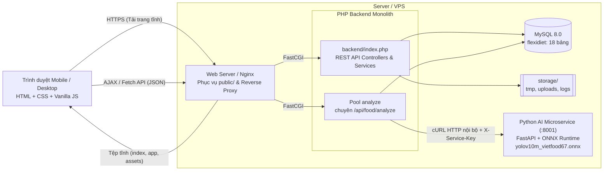
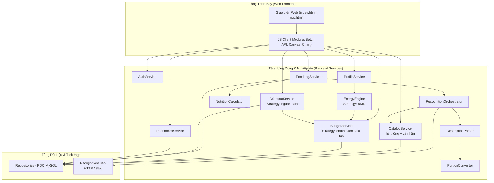
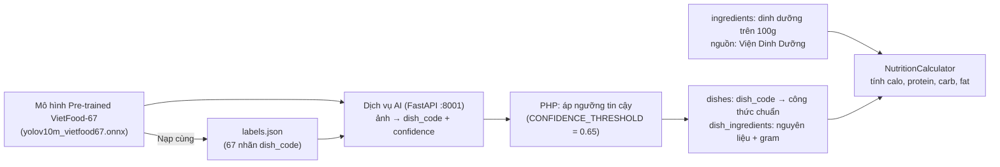
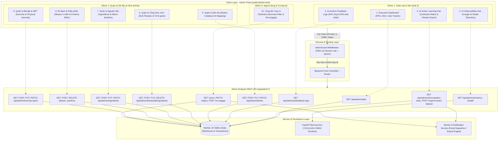

# FlexiDiet: Thiết Kế Kiến Trúc (Architecture Design) – Bản nháp

> **Pha 2 – Elaboration, E1/E2.** Nguồn: `01_business_modeling.md` (v1.1), `02_srs_requirements_v1.1.md`, `02_usecase_specifications_v1.1.md`, `02_database_design.md`, `02_ai_service_poc.md`.
> **Trạng thái:** Đã đồng bộ với thiết kế PoC. Các thông số tích hợp AI (kích thước ảnh, timeout 10.0s, ánh xạ nhãn động) đã được chốt. Kết quả đo kiểm PoC thực tế sẽ được bổ sung sau giai đoạn Construction (C1/C2).
> Phần mô hình dữ liệu chi tiết (ERD, cột, khóa) nằm ở `02_database_design.md`; phần kiểm chứng kỹ thuật AI nằm ở `02_ai_service_poc.md`.

---

## 1. Mục đích và phạm vi

Tài liệu mô tả cấu trúc hệ thống FlexiDiet: các thành phần, cách chúng giao tiếp, cách triển khai, và các quyết định kiến trúc cùng lý do. Mục tiêu là để cả nhóm 3 người làm song song được (PHP, dịch vụ AI, giao diện) mà không vướng nhau, nhờ các **hợp đồng giao tiếp** cố định ở mục 10 và mục 14.

---

## 2. Yếu tố chi phối kiến trúc (Architecturally Significant Requirements)

| # | Yếu tố | Nguồn | Hệ quả thiết kế |
|---|---|---|---|
| AS1 | Suy luận AI chạy ở server, tách khỏi PHP | D14, D18, NFR-13 | Dịch vụ suy luận riêng, hợp đồng API cố định |
| AS2 | Nhiều người dùng đồng thời không làm sập hệ thống (điểm nhấn học tập) | D15, NFR-03 | Hàng chờ có giới hạn, rate limit, pool PHP riêng cho phân tích ảnh, load test |
| AS3 | AI lỗi thì phần còn lại vẫn dùng được | NFR-12, FR-03.15 | Lớp client có timeout và lỗi chuẩn hóa, lối thoát sang ghi thủ công (UC06) |
| AS4 | Calo/macro chỉ tính ở một nơi, server tự tính | FR-03.20, NFR-05 | Một thành phần `NutritionCalculator` duy nhất |
| AS5 | Nhật ký là snapshot; ngân sách lưu theo ngày; calo tập cộng ở cấp ngày | NFR-10, FR-02.1, FR-04.4, FR-04.7 | Cấu trúc dữ liệu và `BudgetService` (mục 8, 9) |
| AS6 | Công thức BMR, chính sách cộng calo tập, nguồn calo tập đổi được | FR-01.5, FR-04.4, NFR-13 | Mẫu Strategy (mục 8) |
| AS7 | Bảo mật cơ bản, dữ liệu cá nhân | NFR-06, NFR-07, NFR-08 | Middleware phiên/CSRF, mọi truy vấn gắn `user_id`, HTTPS (mục 13) |
| AS8 | PHP thuần, nhóm 3 người, đóng băng tính năng 22/10 | D16, D27 | Monolith module hóa đơn giản, không framework, chỉ tách riêng thứ bắt buộc phải tách (AI) |
| AS9 | Mobile-first, chụp ảnh bằng điện thoại | NFR-11 | Trang render ở server + JS nhẹ, thu nhỏ ảnh ở trình duyệt trước khi gửi |

---

## 3. Phong cách kiến trúc

**Monolith module hóa 3 tầng (PHP) + một dịch vụ suy luận độc lập (Python).**

- **Tầng trình bày:** trang PHP + Bootstrap + JavaScript gọi API JSON.
- **Tầng ứng dụng/nghiệp vụ:** Controller mỏng, Service chứa logic, các Strategy cho tính toán.
- **Tầng dữ liệu:** Repository dùng PDO, MySQL.
- **Dịch vụ AI:** tiến trình riêng, chỉ làm một việc là nhận ảnh và trả danh sách món dự đoán.

Không chọn microservices cho toàn hệ thống: nhóm 3 người, 23 ngày, và chỉ có **một** thành phần cần cô lập tải là suy luận ảnh. Các lựa chọn đã loại nằm ở mục 18.

---

## 4. Góc nhìn Container



---

## 5. Góc nhìn triển khai

| Thành phần | Chạy ở đâu | Ghi chú |
|---|---|---|
| Nginx | Server | Kết thúc HTTPS (Let's Encrypt khi có domain), phục vụ tệp tĩnh, chuyển FastCGI |
| PHP-FPM, pool `web` | Server | Phục vụ trang và các API thường |
| PHP-FPM, pool `analyze` | Server | **Chỉ** xử lý `/api/food/analyze`. Tách riêng để các request chờ AI không làm nghẽn các trang khác |
| MySQL | Server (hoặc dịch vụ DB riêng nếu hosting có) | Một schema |
| Dịch vụ AI | Server, cổng nội bộ (ví dụ `127.0.0.1:8001`) | **Không mở ra Internet**; chỉ PHP gọi, kèm khóa dịch vụ |
| `storage/` | Server, **ngoài** thư mục web | Ảnh tạm, ảnh được giữ, nhật ký ứng dụng |

**Ràng buộc từ kiến trúc lên hosting (D21):** cần **VPS hoặc cloud VM** (chạy được tiến trình Python và cấu hình Nginx/PHP-FPM). Shared hosting PHP thông thường **không đáp ứng được** vì không chạy được dịch vụ AI. Máy tham chiếu: 2 – 4 vCPU, không GPU.

**Đóng gói:** khuyến nghị `docker compose` (nginx, php-fpm, mysql, ai-service) để cả nhóm chạy giống nhau ở local và server. Nếu nhóm chưa quen Docker thì cài trực tiếp cũng được, nhưng cần ghi lại các bước. **[CẦN CHỐT]**

**Cấp phát khởi điểm** (chỉnh sau load test C2, **[CẦN CHỐT]**):

| Thông số | Giá trị khởi điểm | Quan hệ |
|---|---|---|
| Số suy luận đồng thời của dịch vụ AI (W) | 2 | Gần bằng số lõi CPU dành cho AI |
| Hàng chờ tối đa của dịch vụ AI (Q) | 20 | NFR-03; đầy thì trả `429` |
| Pool `analyze`, `pm.max_children` | Q + 4 = 24 | Đủ để số request đang chờ AI **không vượt** pool, nên `429` sinh ra có kiểm soát ở dịch vụ AI chứ không dồn thành hàng đợi mờ ở FastCGI |
| Pool `web`, `pm.max_children` | 8 | Độc lập với analyze |
| Rate limit mỗi người dùng | 10 lần/phút | NFR-03 |

Lưu ý bộ nhớ: mỗi tiến trình PHP-FPM chỉ chờ I/O ở pool `analyze` nên nhẹ, nhưng 24 tiến trình vẫn cần đo RAM thật trên server dùng thử. Nếu RAM hạn chế thì giảm Q, không giảm pool xuống dưới Q.

---

## 6. Cấu trúc ứng dụng PHP

### 6.1. Cây thư mục thực tế của dự án (`FlexiDiet`)

Cấu trúc thư mục thực tế được module hóa rõ ràng, phân tách rạch ròi giữa **Giao diện Web Client (`public/`)**, **Mã nguồn REST API Backend (`backend/`)**, **Dịch vụ AI Microservice (`ai_service/`)** và **Cơ sở dữ liệu (`database/`)**:

```
FlexiDiet/
├── ai_service/                 # Dịch vụ Python AI Microservice độc lập (FastAPI + ONNX Runtime)
│   ├── models/                 # Chứa mô hình pre-trained và cấu hình nhãn món ăn
│   │   ├── yolov10m_vietfood67.onnx  # Model pre-trained VietFood-67 (30.8 MB, mAP50 = 0.92)
│   │   └── labels.json         # Danh mục 67 nhãn món ăn chuẩn khớp 1-1 với dishes.dish_code
│   ├── app.py                  # Ứng dụng FastAPI chính (POST /v1/recognize, GET /health)
│   ├── requirements.txt        # Thư viện: onnxruntime, fastapi, uvicorn, pillow, numpy
│   └── Dockerfile              # Đóng gói container chạy độc lập cổng 8001
├── backend/                    # Toàn bộ mã nguồn PHP Monolith Backend (phục vụ REST API JSON)
│   ├── api/                    # Bộ định tuyến endpoint (auth, food, workout, budget, dashboard...)
│   ├── config/                 # Cấu hình hệ thống (database.php, app.php, đọc từ .env)
│   ├── controllers/            # Controller mỏng: nhận request, validate, gọi Service, trả JSON
│   ├── models/                 # Data Models & Entities (User, MealEntry, Workout, Ingredient...)
│   ├── services/               # Lớp nghiệp vụ chuyên sâu:
│   │   ├── EnergyEngine.php    # Tính BMR, Baseline, Ngân sách calo (áp sàn calo)
│   │   ├── BudgetService.php   # Quản lý ngân sách ngày, tính calo tập được cộng, calo còn lại
│   │   ├── FoodLogService.php  # Quản lý nhật ký ăn uống dạng snapshot bất biến (DD2)
│   │   ├── NutritionCalculator.php # Nơi duy nhất tính kcal/macro từ gram (FR-03.20)
│   │   ├── DescriptionParser.php   # Tách mô tả khẩu phần bằng Regex (số lượng, đơn vị, tên)
│   │   ├── PortionConverter.php    # Quy đổi đơn vị dân gian sang gram qua portion_units (3 nấc)
│   │   ├── CatalogService.php  # Tra cứu món/nguyên liệu (hỗ trợ bí danh qua ingredient_aliases)
│   │   ├── WorkoutService.php  # Ghi bài tập, tính calo thô theo MET / thiết bị
│   │   └── RecognitionClient.php   # Giao tiếp HTTP nội bộ với ai_service (:8001), có Stub
│   └── index.php               # Front Controller tiếp nhận request API và điều phối middleware
├── database/                   # Lược đồ DDL và bộ dữ liệu Seed thực tế (Hoàn thành 100%)
│   ├── schema.sql              # Lược đồ DDL chính thức 18 bảng (InnoDB, utf8mb4, CHECK constraints)
│   ├── seeds/                  # Bộ 5 file script SQL nạp dữ liệu hoàn chỉnh
│   │   ├── 01_dishes.sql            # 67 món ăn chuẩn VietFood-67
│   │   ├── 02_ingredients.sql       # 446 nguyên liệu chuẩn Viện Dinh Dưỡng & USDA
│   │   ├── 03_dish_ingredients.sql  # 421 công thức thành phần định lượng cho 67 món
│   │   ├── 04_ingredient_aliases.sql # 360 bí danh đồng nghĩa 3 miền Bắc - Trung - Nam
│   │   └── 05_portion_units.sql     # 732 quy đổi khẩu phần dân gian (3 nấc kèm note dải gram)
│   └── *.csv                   # Dữ liệu nguồn CSV đối soát (dishes, ingredients, aliases, portions)
├── public/                     # Thư mục Web gốc (Document Root) phục vụ giao diện người dùng
│   ├── index.html              # Landing Page: Giới thiệu giải pháp, tính thử TDEE/BMR, modal đăng nhập/đăng ký
│   ├── app.html                # Web App SPA-like: Dashboard, Nhật ký ăn (camera/AI), Bài tập, Gợi ý, Hồ sơ
│   ├── admin.html              # (Should) Admin Panel SPA-like: CRUD nguyên liệu, món, khẩu phần, MET (UC11)
│   ├── assets/                 # Tài nguyên tĩnh phục vụ giao diện
│   │   ├── css/                # app.css, home.css, admin.css (Should), theme.css
│   │   └── js/                 # app.js, home.js, admin.js (Should), theme.js (ES Modules, fetch API)
│   └── uploads/                # Thư mục lưu trữ tạm thời ảnh upload / ảnh chụp món ăn
└── storage/                    # Thư mục lưu trữ nội bộ (logs/, tmp/) ngoài Document Root
```

### 6.2. Quy tắc phân tầng

1. **Controller mỏng:** Chỉ nhận HTTP request, xác thực định dạng đầu vào (input validation), ủy quyền xử lý cho Service tương ứng và trả JSON chuẩn.
2. **Repository & Models:** Chỉ tầng này được phép tương tác trực tiếp với PDO MySQL; 100% truy vấn dùng prepared statements chống SQL Injection (NFR-06).
3. **Chốt chặn phân quyền dữ liệu:** Mọi truy vấn đọc/ghi dữ liệu cá nhân (`meal_entries`, `workouts`, `weight_logs`, `daily_budgets`) đều bắt buộc kèm điều kiện `user_id` lấy từ **Session đã xác thực**, tuyệt đối không nhận `user_id` từ tham số do client gửi lên (NFR-07).
4. **Hàm thuần trong tính toán:** Các lớp tính toán nghiệp vụ lõi (`EnergyEngine`, `NutritionCalculator`, `PortionConverter`) là các hàm thuần (Pure Functions) nhận tham số đầu vào và trả kết quả tính toán, không truy vấn CSDL trực tiếp, giúp việc viết unit test cực kỳ đơn giản và tin cậy.

### 6.3. Vòng đời một request

```
Trình duyệt Web (public/index.html hoặc app.html hoặc admin.html)
   │
   ▼ Gọi Fetch API (kèm X-CSRF-Token, Cookie Session)
Nginx / Web Server
   │
   ▼ Điều hướng request /api/*
backend/index.php (Front Controller)
   │
   ▼ Pipeline Middleware: SessionManager → Authenticator → CsrfProtector → RateLimiter
   │                      (nếu /api/admin/*: thêm → AdminGuard kiểm tra role = 'admin')
Controllers (API Endpoints)
   │
   ▼ Gọi nghiệp vụ
Services (EnergyEngine, FoodLogService, CatalogService...)
   │
   ├── Truy vấn dữ liệu: Models / PDO MySQL (Prepared Statements)
   └── Phân tích ảnh: RecognitionClient ──(HTTP JSON)──> ai_service:8001 (ONNX Runtime)
   │
   ▼ Chuẩn hóa dữ liệu trả về
Response JSON (HTTP 200/400/401/422/500) ──> Client cập nhật DOM thời gian thực (Zero Page Reload)
```

### 6.4. Quy ước API

- Dữ liệu JSON, mã trạng thái HTTP chuẩn. Lỗi trả dạng thống nhất:

```json
{ "error": { "code": "AI_BUSY", "message": "Hệ thống đang bận, thử lại sau hoặc ghi thủ công.", "request_id": "..." } }
```

- Mọi request mang `X-Request-Id` (PHP tạo nếu thiếu) và ghi vào nhật ký, chuyển tiếp sang dịch vụ AI để truy vết hai phía.
- Mọi request thay đổi dữ liệu mang mã CSRF.
- **Quy ước thời gian:** toàn hệ thống dùng một múi giờ (`Asia/Ho_Chi_Minh`) để xác định "ngày", vì ngân sách và nhật ký được lưu theo ngày.

---

## 7. Thành phần và trách nhiệm



| Thành phần | Trách nhiệm | UC chính |
|---|---|---|
| `AuthService` | Đăng ký, đăng nhập, phiên, đăng xuất | UC01, UC02 |
| `ProfileService`, `EnergyEngine` | Hồ sơ; BMR → Baseline → ngân sách mục tiêu (áp sàn calo) | UC01, UC03 |
| `BudgetService` | Ngân sách của ngày: tạo khi cần, tính calo tập được cộng ở cấp ngày, tính "còn lại" | UC03, UC07, UC08 |
| `RecognitionOrchestrator` | Điều phối đường nhận diện hoặc đường nguyên liệu; gọi `RecognitionClient`; áp ngưỡng tin cậy; ghép công thức với mô tả (FR-03.17) | UC04 |
| `DescriptionParser` | Tách chuỗi mô tả thành (số lượng, đơn vị, tên) bằng quy tắc regex hỗ trợ nhập nhanh | UC04 |
| `PortionConverter` | Quy đổi đơn vị Việt sang gram, xét sống/chín | UC04, UC06, UC12 |
| `NutritionCalculator` | **Nơi duy nhất** tính kcal/macro từ nguyên liệu + gram (FR-03.20) | UC04, 05, 06, 12, 14 |
| `FoodLogService` | Ghi, sửa, xóa mục nhật ký dạng snapshot; áp quy tắc FR-03.19 | UC05, UC06, UC14 |
| `CatalogService` | Tìm kiếm nguyên liệu/món (hỗ trợ tên địa phương 3 miền qua chỉ mục `ingredient_aliases` khi custom món gốc hoặc tự tạo món cá nhân); quản lý danh mục hệ thống và "Món đã lưu" | UC06, UC12, UC13 |
| `WorkoutService` | Ghi buổi tập, chọn MET, tính calo thô | UC07 |
| `DashboardService` | Tổng hợp thanh năng lượng, macro, nước, cân nặng, tuân thủ ngân sách | UC09 |
| `RecognitionClient` | Giao tiếp HTTP với dịch vụ AI; chuẩn hóa lỗi; có bản `Stub` | UC04 |

---

## 8. Mẫu thiết kế và các luồng tính toán cốt lõi

### 8.1. Strategy (AS6)

| Điểm biến đổi | Interface | Các bản cài đặt |
|---|---|---|
| Công thức BMR | `BmrFormula` | `MifflinStJeor` (mặc định), `KatchMcArdle` |
| Chính sách cộng calo tập | `ExerciseCreditPolicy` | `FullCredit` (Σ), `PartialCredit` (0,5 × Σ, mặc định), `CappedCredit` (min(Σ, 500)) |
| Nguồn calo tập | `CalorieSource` | `MetSource` (MET × cân nặng × giờ), `DeviceSource` (nhập tay, active calories) |
| Nhận diện món | `RecognitionClient` | `HttpRecognitionClient`, `StubRecognitionClient` (dùng khi dev và khi AI chưa xong) |

`StubRecognitionClient` là phần giữ cho nhóm không bị chặn: PHP và giao diện làm xong luồng UC04 trước khi mô hình thật sẵn sàng, chỉ cần đổi cấu hình `RECOGNITION_DRIVER=stub|http`.

### 8.2. Ngân sách ngày (AS5)

```
ensureDay(user, date):          # tạo dòng ngân sách nếu chưa có (UC08 E1)
    nếu chưa có dòng → target = EnergyEngine(hồ sơ, cân nặng mới nhất)
                       chính sách = chính sách mặc định trong hồ sơ

recalcDay(user, date):          # chạy khi thêm/sửa/xóa buổi tập hoặc đổi chính sách
    Σ = tổng calo thô các buổi tập trong ngày
    credit = policy_của_ngày.apply(Σ)
    lưu credit trên dòng ngân sách của ngày

remaining(user, date) = target + credit − Σ calo đã nạp (từ mục nhật ký)
```

- Buổi tập chỉ lưu **calo thô** (FR-04.7); phần được cộng là giá trị **dẫn xuất ở cấp ngày**.
- Đổi chính sách chỉ cập nhật dòng ngân sách **hôm nay**, các ngày đã qua giữ nguyên.
- `recalcDay` và việc ghi buổi tập nằm trong cùng một transaction.
- Chính sách mặc định của người dùng nằm ở hồ sơ; dòng ngân sách của ngày mới sao chép từ đó. *(Đây là quyết định thiết kế cần ghi nhận để ERD có cột tương ứng.)*

### 8.3. Ghi món và snapshot (FR-03.19, FR-03.20)

```
POST /api/meals  (client chỉ gửi: mã nguyên liệu/món, gram hoặc hệ số, buổi, ngày, mã dòng đã lưu nếu là sửa)
  → FoodLogService:
      với mỗi dòng:
         dòng đã lưu, nguyên liệu và gram không đổi → giữ nguyên giá trị dinh dưỡng đã lưu
         dòng mới hoặc bị sửa gram              → NutritionCalculator(giá trị hiện hành trong danh mục)
      tính tổng, lưu meal_entry + meal_entry_items trong một transaction
  → trả mục đã lưu + ngân sách còn lại
```

Trình duyệt **không bao giờ** gửi kcal hay macro.

### 8.4. Luồng nhận diện (UC04), phần điều phối ở server

```
RecognitionOrchestrator.analyze(ảnh?, mô tả?):
    nếu có ảnh:
        kết quả = RecognitionClient.recognize(ảnh)       # lỗi → ném AiUnavailable
        nếu top1.confidence >= NGƯỠNG (cấu hình PHP) và không phải "unknown":
            → đường nhận diện: công thức chuẩn + ghép mô tả (FR-03.17)
        ngược lại → đường nguyên liệu
    nếu không có ảnh → đường nguyên liệu
    đường nguyên liệu: thanh tìm kiếm nguyên liệu (hỗ trợ từ địa phương qua ingredient_aliases) / DescriptionParser → PortionConverter → tra nguyên liệu (hệ thống + cá nhân)
    trả bản nháp (chưa ghi gì)
```

**Ngưỡng độ tin cậy nằm ở PHP, không nằm trong dịch vụ AI**, để chỉnh theo kết quả PoC mà không phải triển khai lại mô hình.

---

## 9. Kiến trúc dữ liệu (tổng quan)

Chi tiết cột và khóa ở `02_database_design.md`. Các quyết định kiến trúc ảnh hưởng thiết kế bảng:

| Nhóm | Bảng (dự kiến) | Quy tắc quan trọng |
|---|---|---|
| Người dùng | `users`, `user_profiles`, `weight_logs` | `user_profiles` **không** có cột cân nặng; cân nặng hiện tại = bản ghi mới nhất của `weight_logs`, mỗi ngày một bản ghi |
| Ngân sách | `daily_budgets` | Mỗi (user, ngày) một dòng: mục tiêu, chính sách và hệ số của ngày, calo tập được cộng. Khóa duy nhất theo (user, ngày) |
| Danh mục | `ingredients`, `dishes`, `dish_ingredients`, `portion_units` | Dùng chung một bảng cho mục hệ thống và mục cá nhân, phân biệt bằng cột chủ sở hữu (rỗng = hệ thống); có trạng thái ngưng dùng thay vì xóa cứng; `dish_code` duy nhất cho món hệ thống để khớp nhãn AI |
| Danh mục cá nhân | (cùng bảng trên) | "Món đã lưu" và "món tự tạo" là cùng một loại bản ghi, lưu theo nguyên liệu + gram |
| Nhật ký ăn | `meal_entries`, `meal_entry_items` | **Snapshot**: `meal_entry_items` lưu sẵn gram, kcal, macro và tên tại thời điểm ghi; tham chiếu nguồn chỉ để truy vết, có thể mất khi mục nguồn bị xóa |
| Tập luyện | `workouts`, `exercise_types` | `workouts` lưu calo thô, nguồn, MET, cân nặng đã dùng; không lưu hệ số cộng |
| Khác | `water_logs`, `draft_images`, `rate_limit_hits`, `ai_feedback` (Could) | `draft_images` giữ ảnh tạm gắn với bản nháp kèm hạn xóa; `ai_feedback` chỉ ghi khi Member đồng ý |

**Nguồn dinh dưỡng:** `ingredients` được nạp bằng script seed từ *Bảng thành phần thực phẩm Việt Nam* (Viện Dinh dưỡng); mỗi nguyên liệu có cột nguồn (hệ thống / tự nhập) để hiển thị nhãn nguồn (NFR-05). Món hoàn chỉnh **không** có số liệu trực tiếp: calo của món luôn suy ra từ công thức chuẩn (nguyên liệu + gram). Điều khoản sử dụng của bảng dữ liệu nguồn cần được kiểm tra, cùng đợt với giấy phép các bộ ảnh.

Giao dịch (transaction) bắt buộc cho: ghi hoặc sửa mục nhật ký, đăng ký tài khoản, lưu hồ sơ kèm ngân sách, ghi buổi tập kèm `recalcDay`, và các script seed (NFR-10).

---

## 10. Hợp đồng dịch vụ AI

Đây là hợp đồng cố định giữa PHP và dịch vụ suy luận (NFR-13). Người làm PHP dùng `Stub` theo đúng hợp đồng này, người làm AI hiện thực phía thật.

### 10.1. Nguyên tắc

- **Không trạng thái**, không lưu ảnh, không ghi ảnh ra đĩa; xử lý trong bộ nhớ rồi bỏ (FR-03.18, NFR-08).
- Chỉ nhận request từ PHP: nghe cổng nội bộ và yêu cầu khóa dịch vụ trong header.
- Chỉ trả danh sách món dự đoán và độ tin cậy; **không** trả calo (calo do server tính từ CSDL dinh dưỡng).
- Phiên bản hóa đường dẫn (`/v1`) để đổi mô hình mà không phá hợp đồng.

### 10.2. `POST /v1/recognize`

**Request:** `multipart/form-data`

| Trường | Kiểu | Ghi chú |
|---|---|---|
| `image` | tệp JPEG/PNG | Dung lượng tối đa **≤ 2 MB** (ảnh client thu nhỏ cạnh dài nhất **≤ 1024 px**, theo PoC) |
| `top_k` | số nguyên, tùy chọn | Mặc định 3 |

**Header:** `X-Service-Key` (bắt buộc), `X-Request-Id` (khuyến nghị).

**Response `200`:**

```json
{
  "model_version": "v1.0.0",
  "is_unknown": false,
  "predictions": [
    { "dish_code": "com_tam_suon", "confidence": 0.82 },
    { "dish_code": "com_ga",       "confidence": 0.09 },
    { "dish_code": "bun_cha",      "confidence": 0.04 }
  ],
  "inference_ms": 118
}
```

- `is_unknown = true` khi độ tin cậy thấp hơn ngưỡng an toàn của dịch vụ AI (`UNKNOWN_THRESHOLD`, mặc định 0.40) hoặc khi mô hình xếp ảnh vào lớp "không nhận ra" nếu được huấn luyện với lớp này (FR-03.5); khi đó PHP đi đường nguyên liệu bất kể độ tin cậy. Ngưỡng phân luồng đường nhận diện / đường nguyên liệu (`CONFIDENCE_THRESHOLD`, mặc định 0.65) được áp **ở PHP** (AD7).
- `dish_code` được nạp động từ tệp `labels.json` đi kèm mô hình pre-trained YOLOv10m và khớp 100% với `dish_code` của món trong bảng `dishes` (MySQL). Cơ chế ánh xạ nhãn động và quy trình kiểm thử chi tiết thuộc `02_ai_service_poc.md`.

**Lỗi:**

| Mã | Ý nghĩa | PHP xử lý |
|---|---|---|
| `400` | Ảnh hỏng hoặc không đọc được | Báo lỗi ảnh (UC04 E1) |
| `401` | Sai khóa dịch vụ | Lỗi cấu hình, ghi nhật ký, báo "dịch vụ không khả dụng" |
| `413` / `415` | Quá lớn / sai định dạng | Như `400` |
| `429` + `Retry-After` | Hàng chờ đầy | Báo bận, gợi ý UC06 (UC04 E3) |
| `503` | Mô hình chưa tải xong hoặc đang lỗi | Như `429` |
| Hết thời gian | Không phản hồi trong ngưỡng | Như `503` |

### 10.3. `GET /health`

```json
{ "status": "ok", "model_version": "v0.1", "workers": 2, "queue_depth": 3, "queue_max": 20 }
```

Dùng cho kiểm tra sức khỏe, và cho load test đọc độ sâu hàng chờ.

### 10.4. Mô hình đồng thời của dịch vụ AI

```
request → [kiểm tra khóa, hợp lệ ảnh] → hàng chờ (tối đa Q)
                                          └─ đầy → trả 429 ngay
        → W worker suy luận song song (ONNX Runtime, CPU)
        → trả kết quả
```

- `W` suy luận cùng lúc, hàng chờ chứa tối đa `Q` request đang đợi; vượt thì từ chối ngay thay vì để treo.
- Thời gian chờ tối đa phía PHP: **10.0 giây** (theo NFR-02 và PoC); quá thời gian thì coi như `503`, ném `AiUnavailableException` để chuyển sang UC06 (ghi thủ công).

### 10.5. Chế độ Stub

`StubRecognitionClient` (phía PHP) và cờ `STUB=1` (phía dịch vụ AI) trả kết quả giả cố định theo tên tệp hoặc mã băm ảnh, kèm tùy chọn mô phỏng độ trễ và lỗi `429/503`. Có thể dùng chính chế độ này để thử đường lỗi và load test hạ tầng trước khi mô hình thật xong.

### 10.6. Vòng đời mô hình: Tích hợp mô hình Pre-trained (VietFood-67)

Để tối ưu hóa thời gian và nguồn lực trong phạm vi đồ án, nhóm **lược bỏ khâu tự huấn luyện từ đầu (training from scratch / fine-tuning)**. Thay vào đó, hệ thống tích hợp trực tiếp **mô hình Pre-trained chuyên biệt cho ẩm thực Việt Nam (VietFood-67)** định dạng **ONNX** (`yolov10m_vietfood67.onnx` ~30.8 MB, $mAP_{50} = 0.92$), nhận diện chính xác 67 món ăn truyền thống.

```
Mô hình Pre-trained (VietFood-67 ONNX) + labels.json → Tích hợp vào ai_service/models/ → Khởi tạo InferenceSession (ONNX Runtime) → Phục vụ API /v1/recognize
```

| Bước | Thành phần thực hiện | Ghi chú kỹ thuật |
|---|---|---|
| Tuyển chọn mô hình Pre-trained | Bộ mô hình `yolov10m_vietfood67.onnx` | Đạt độ chính xác cao ($mAP_{50} = 0.92$), bao phủ 67 món ăn Việt Nam |
| Chuẩn hóa danh mục nhãn (`labels.json`) | File cấu hình `ai_service/models/labels.json` | 67 nhãn định dạng chuẩn khớp 1-1 với `dish_code` trong CSDL |
| Tích hợp vào Dịch vụ AI Microservice | Tiến trình FastAPI + ONNX Runtime (`ai_service/`) | Dịch vụ nạp `model_version` và danh mục nhãn vào RAM lúc khởi động |
| Đo kiểm hiệu năng & Độ trễ suy luận | Môi trường máy chủ web | Kiểm chứng độ trễ $\le 500$ ms trên CPU và không rò rỉ bộ nhớ (NFR-02) |

Server hoàn toàn **không cần môi trường huấn luyện (PyTorch/TensorFlow nặng hàng GB)**; CPU của server chỉ dành riêng cho tiến trình suy luận tốc độ cao với ONNX Runtime.

### 10.7. Chuỗi ánh xạ từ nhãn đến dinh dưỡng



Nguyên tắc thiết kế cốt lõi:
- **Ánh xạ nhãn đồng bộ 100%:** 67 nhãn của mô hình Pre-trained đã được chuẩn hóa trùng khớp hoàn toàn với `dish_code` của 67 món ăn trong bảng `dishes` (MySQL), dịch vụ AI trả thẳng `dish_code` và PHP tra cứu trực tiếp mà không cần qua tầng chuyển đổi trung gian.
- **Tính toán dinh dưỡng toàn vẹn:** Mọi `dish_code` mà mô hình Pre-trained trả về đều có công thức chuẩn đầy đủ trong `dish_ingredients` và thành phần trong `ingredients`. Do đó, bất kỳ món nào nhận diện thành công đều được tính calo và macro chuẩn xác.
- **Bảo vệ bằng ngưỡng nhận diện:** Ảnh không phải thức ăn hoặc ảnh mờ ngoài danh mục 67 món sẽ bị gán `is_unknown = true` (dưới `UNKNOWN_THRESHOLD = 0.40`) để kích hoạt đường dự phòng (UC06 hoặc nhập liệu thủ công).

Cần một script kiểm tra **độ phủ nhãn** (`scripts/check_label_coverage`) chạy khi triển khai: mọi nhãn trong `labels.json` phải khớp một món đang hoạt động có công thức đầy đủ. Lệch thì dừng triển khai, tránh lỗi chỉ lộ ra khi người dùng gặp món đó.

---

## 11. Xử lý quá tải và tính sẵn sàng (AS2, AS3)

| Lớp | Cơ chế | Mục đích |
|---|---|---|
| Nginx | Giới hạn dung lượng body upload | Chặn ảnh quá lớn từ sớm |
| Trình duyệt | Thu nhỏ ảnh (ví dụ cạnh dài tối đa 1024 px, JPEG) trước khi gửi **[CẦN CHỐT]** | Giảm băng thông và thời gian suy luận |
| PHP | Rate limit 10 lần/phút/người dùng, lưu trong bảng `rate_limit_hits` (cửa sổ trượt) | Chặn một người dùng chiếm hết năng lực |
| PHP-FPM | **Pool `analyze` riêng** | Request chờ AI không làm cạn tiến trình phục vụ các trang khác |
| Dịch vụ AI | Hàng chờ giới hạn Q, `429` khi đầy | Từ chối rõ ràng thay vì treo |
| PHP client | Timeout kết nối và tổng thời gian | Không giữ tiến trình PHP vô hạn |
| Ứng dụng | Khi AI lỗi hoặc bận: trả lỗi chuẩn + gợi ý UC06, giữ ngày và buổi đã chọn | Phần còn lại vẫn dùng được (NFR-12) |

**Giới hạn đã biết của thiết kế:** gọi AI đồng bộ nghĩa là mỗi phân tích giữ một tiến trình `analyze` trong lúc chờ. Chính vì thế pool `analyze` phải ≥ Q (mục 5). Phương án gửi-việc-rồi-poll (không giữ tiến trình) tốt hơn khi tải lớn nhưng thêm bảng việc, worker nền và poll ở giao diện; để dành làm mở rộng nếu load test cho thấy cần.

**Điểm đơn lỗi:** một server duy nhất. Với mục tiêu học tập và demo thì chấp nhận; ghi vào báo cáo như một giới hạn đã biết.

---

## 12. Xử lý ảnh tải lên (FR-03.18)

```
Trình duyệt: thu nhỏ → gửi POST /api/food/analyze (kèm 2 tùy chọn mặc định tắt: lưu ảnh vào nhật ký; cho phép dùng ảnh cải thiện mô hình)
PHP: kiểm tra loại tệp thật (không tin phần mở rộng), kích thước
     → lưu tạm storage/tmp (tên ngẫu nhiên, ngoài docroot) → gọi AI
     → trả bản nháp → XÓA ảnh tạm ngay
     nếu Member đã chọn giữ: ghi draft_images (hạn xóa), ảnh chờ xác nhận ở UC05
UC05 xác nhận: chuyển ảnh sang storage/images (nếu chọn lưu vào nhật ký) hoặc kèm bản ghi phản hồi AI (nếu chọn cho phép)
cleanup_tmp.php (cron): xóa ảnh tạm hết hạn không được xác nhận
```

Ảnh được giữ chỉ phục vụ qua một route PHP **có kiểm tra quyền sở hữu**, không cho truy cập trực tiếp bằng đường dẫn tĩnh.

---

## 13. Bảo mật

| Hạng mục | Cách làm | Yêu cầu |
|---|---|---|
| Mật khẩu | `password_hash` / `password_verify` | NFR-06 |
| SQL injection | Chỉ PDO prepared statements, trong Repository | NFR-06 |
| Phiên | Cookie `HttpOnly`, `SameSite`, thêm `Secure` khi chạy HTTPS; có thời hạn | NFR-07 |
| CSRF | Mã chống CSRF cho mọi thao tác thay đổi dữ liệu | NFR-06 |
| Phân quyền dữ liệu | Mọi truy vấn cá nhân gắn `user_id` từ phiên | NFR-07 |
| **Phân quyền Admin** | Middleware `AdminGuard` kiểm tra `$_SESSION['role'] === 'admin'` trước khi cho truy cập nhóm `/api/admin/*`. Request từ tài khoản không phải Admin → trả `403 Forbidden` ngay. Không dùng cơ chế phân quyền dựa trên URL client-side (FR-07.4) | FR-07.4 |
| Upload | Kiểm tra loại tệp thật, giới hạn kích thước, đặt tên ngẫu nhiên, lưu ngoài docroot | NFR-06 |
| Dịch vụ AI | Chỉ nghe nội bộ, khóa dịch vụ trong header, không nhận request từ Internet | AS1 |
| Bí mật cấu hình | Khóa dịch vụ, mật khẩu CSDL đọc từ biến môi trường, **không** commit vào Git | NFR-06 |
| HTTPS | Nginx, chứng chỉ Let's Encrypt khi có domain | NFR-06 |
| Quyền Admin (v1) | Script seed chạy trên server (Must); giao diện quản trị web bảo vệ bằng `AdminGuard` middleware (Should) | FR-07 |
| Xóa dữ liệu | Xóa toàn bộ dữ liệu của người dùng gồm cả ảnh đã lưu (NFR-08) | NFR-08 |

---

## 14. API nội bộ (PHP, tổng quan)

Chi tiết tham số và phản hồi sẽ viết khi bắt đầu C1, theo từng UC.

| Nhóm | Endpoint | UC |
|---|---|---|
| Xác thực | `POST /api/auth/register`, `/login`, `/logout` | UC01, UC02 |
| Hồ sơ | `GET`, `PUT /api/profile`; `POST /api/weights` | UC03, UC09 |
| Ngân sách | `GET /api/budget?date=` | UC08 |
| Món ăn | `POST /api/food/analyze`; `GET /api/foods/search?q=` | UC04, UC06 |
| Nhật ký ăn | `GET /api/meals?date=`; `POST /api/meals`; `PUT`, `DELETE /api/meals/{id}` | UC05, UC06, UC14 |
| Danh mục cá nhân | `GET/POST/PUT/DELETE /api/my/ingredients`, `/api/my/dishes`; `POST /api/my/dishes/from-meal/{id}` | UC12, UC13 |
| Tập luyện | `POST /api/workouts/estimate`; `GET/POST/PUT/DELETE /api/workouts` | UC07 |
| Dashboard | `GET /api/dashboard/summary?date=`, `/series?type=&range=`; `POST /api/water` | UC09 |
| Gợi ý (Could) | `GET /api/suggestions` | UC10 |
| Quản trị (Should) | Xem bảng chi tiết bên dưới | UC11 |

**Nhóm API Quản trị Admin (`/api/admin/*`) – Should (FR-07.3, FR-07.4, MLOps & User Lifecycle):**

Tất cả endpoint dưới đây yêu cầu phiên đăng nhập với `role = 'admin'`; middleware `AdminGuard` chặn trước khi vào Controller. Response chuẩn JSON, phân trang mặc định 50 bản ghi/trang.



| Phân hệ | Endpoint | Phương thức | Mô tả ngắn & Tham số |
|---|---|---|---|
| **Executive Stats** | `/api/admin/stats` | `GET` | Thống kê tổng quan: DAU/WAU, tổng món, nguyên liệu, nhật ký bữa ăn, tỷ lệ đạt mục tiêu calo |
| **AI Observability** | `/api/admin/ai/metrics` | `GET` | Chỉ số luồng AI (phong cách Google AI Studio): volume hôm nay/tuần/tháng, số request in-flight đang chờ/xử lý, error rate, p50/p95 latency (ms) |
| | `/api/admin/ai/health` | `GET` | Live telemetry container AI: FastAPI ping, uptime, tải CPU/RAM, trạng thái model ONNX |
| **AI Active Learning** | `/api/admin/ai/recognition-stats` | `GET` | Phân tích nhận diện: top món được phát hiện, phân bổ 67 nhãn, tỷ lệ chấp thuận (acceptance rate), danh sách món hay bị sửa đổi (confusion pairs), cảnh báo món confidence < 0.45 |
| | `/api/admin/ai/feedback-logs` | `GET` | Danh sách lịch sử ảnh chụp: ảnh thumbnail, nhãn AI dự đoán, nhãn người dùng chốt thực tế, độ tin cậy `?page=&dish_code=` |
| | `/api/admin/ai/export-retrain-dataset` | `POST` | Kết xuất gói dữ liệu mẫu đã xác thực (ZIP file gồm ảnh nén và nhãn chuẩn YOLO format) để phục vụ tái huấn luyện mô hình ở phiên bản sau |
| **Nguyên liệu** | `/api/admin/ingredients` | `GET` | Danh sách nguyên liệu hệ thống, hỗ trợ `?q=`, `?page=`, `?status=active\|inactive` |
| | `/api/admin/ingredients` | `POST` | Thêm nguyên liệu mới (tên, dinh dưỡng/100g, nguồn, trạng thái sống/chín) |
| | `/api/admin/ingredients/{id}` | `PUT` | Sửa thông tin nguyên liệu (giá trị mới áp dụng cho lần dùng sau, snapshot cũ không đổi – FR-07.2) |
| | `/api/admin/ingredients/{id}` | `PATCH` | Ngưng dùng / kích hoạt lại (`is_active`); không xóa cứng (UC11 A2) |
| **Bí danh NL** | `/api/admin/ingredients/{id}/aliases` | `GET` | Danh sách bí danh 3 miền của một nguyên liệu |
| | `/api/admin/ingredients/{id}/aliases` | `POST` | Thêm bí danh mới cho nguyên liệu (alias_name, region) |
| | `/api/admin/aliases/{alias_id}` | `DELETE` | Xóa một bí danh |
| **Quy đổi khẩu phần** | `/api/admin/ingredients/{id}/portions` | `GET` | Danh sách quy đổi 3 nấc (S/M/L) của nguyên liệu |
| | `/api/admin/ingredients/{id}/portions` | `POST` | Thêm đơn vị quy đổi mới (unit_name, size_label, grams_per_unit, note) |
| | `/api/admin/portions/{portion_id}` | `PUT` | Sửa quy đổi khẩu phần |
| | `/api/admin/portions/{portion_id}` | `DELETE` | Xóa quy đổi khẩu phần |
| **Món ăn hệ thống** | `/api/admin/dishes` | `GET` | Danh sách món hệ thống, hỗ trợ `?q=`, `?page=` |
| | `/api/admin/dishes` | `POST` | Thêm món hệ thống mới (tên, dish_code khớp nhãn AI, serving_label) |
| | `/api/admin/dishes/{id}` | `PUT` | Sửa thông tin món |
| | `/api/admin/dishes/{id}` | `PATCH` | Ngưng dùng / kích hoạt lại |
| **Công thức món** | `/api/admin/dishes/{id}/ingredients` | `GET` | Danh sách nguyên liệu cấu thành món |
| | `/api/admin/dishes/{id}/ingredients` | `POST` | Thêm nguyên liệu vào công thức (ingredient_id, grams, sort_order) |
| | `/api/admin/dishes/{id}/ingredients/{di_id}` | `PUT` | Sửa gram / thứ tự thành phần trong món |
| | `/api/admin/dishes/{id}/ingredients/{di_id}` | `DELETE` | Xóa nguyên liệu khỏi công thức |
| **Bảng MET** | `/api/admin/exercise-types` | `GET` | Danh sách loại bài tập và MET rules |
| | `/api/admin/exercise-types` | `POST` | Thêm loại bài tập mới |
| | `/api/admin/exercise-types/{id}` | `PUT` | Sửa thông tin loại bài tập |
| | `/api/admin/exercise-types/{id}` | `PATCH` | Ngưng dùng / kích hoạt lại |
| **User & Retention** | `/api/admin/users` | `GET` | Danh sách người dùng, lọc `?status=active\|banned\|dormant`, lọc theo số ngày offline `?inactive_days=7\|14\|30` |
| | `/api/admin/users/{id}/status` | `PATCH` | Khóa / mở khóa tài khoản (`status`), điều chỉnh quyền (`role = 'admin'\|'member'`) |
| | `/api/admin/users/retention-stats` | `GET` | Phân tích phễu người dùng: tỷ lệ người dùng duy trì thói quen vs người dùng có nguy cơ rời bỏ (churn risk) |
| | `/api/admin/users/re-engage` | `POST` | Kích hoạt chiến dịch gửi email/thông báo nhắc nhở quay lại cho phân nhóm người dùng offline nhiều ngày |

---

## 15. Kiến trúc giao diện (Frontend Architecture)

Giao diện FlexiDiet được thiết kế theo mô hình **Client-Side SPA-like nhẹ nhàng bằng Vanilla HTML5 / CSS3 / ES Modules** (không phụ thuộc vào framework cồng kềnh như React/Vue), giao tiếp với Backend qua REST API JSON:

1. **Phân chia trang giao diện chính (`public/`):**
   * **`public/index.html` (Landing Page):** Giới thiệu sản phẩm, giải thích cơ chế Ngân sách Calo Động, công cụ tính nhanh TDEE/BMR cho khách vãng lai (Guest), tích hợp modal đăng nhập/đăng ký đa bước (UC01, UC02).
   * **`public/app.html` (Main Application):** Giao diện làm việc trung tâm của Member sau khi đăng nhập, tổ chức theo kiến trúc Single-Page Application (SPA) điều hướng chuyển đổi tab mượt mà không tải lại trang:
     * *Tab Dashboard (UC09):* Thanh đo năng lượng ngân sách động ngày (FR-02.2), vòng tròn phân bổ macro (P/C/F), theo dõi lượng nước uống (FR-06.4) và biểu đồ cân nặng.
     * *Tab Nhật ký ăn uống (UC04, UC05, UC06):* Tích hợp camera chụp ảnh hoặc tải ảnh món ăn, gọi AI phân tích, bảng bản nháp nguyên liệu trực quan với **thanh trượt 3 dải màu phân vùng (Small/Medium/Large)** đồng bộ 2 chiều với ô nhập gram, hỗ trợ tìm kiếm bổ sung nguyên liệu (tra bí danh 3 miền).
     * *Tab Nhật ký tập luyện (UC07):* Ghi nhận buổi tập, tính calo tiêu hao theo MET hoặc thiết bị, áp chính sách cộng thưởng calo vào ngân sách ngày.
     * *Tab Gợi ý món ăn (UC10 - Could):* Gợi ý món ăn thông minh dựa trên lượng calo và protein còn thiếu trong ngày.
     * *Tab Hồ sơ cá nhân (UC03):* Cập nhật chỉ số thể chất, mục tiêu cân nặng, thay đổi công thức BMR và chính sách cộng calo tập.

2. **Quy chuẩn mã nguồn JavaScript (`public/assets/js/`):**
   * **`home.js`:** Quản lý tương tác trang chủ, tính thử TDEE, form validation đăng ký 4 bước, AJAX modal đăng nhập.
   * **`app.js`:** Điều phối trạng thái ứng dụng (State Management), định tuyến tab view, gọi API `fetch()` kèm mã chống CSRF và xử lý phản hồi JSON, đồng bộ thanh trượt khẩu phần 3 màu với ô nhập gram.
   * **`theme.js`:** Hỗ trợ chuyển đổi giao diện Sáng / Tối (Light / Dark Mode).
   * **Xử lý ảnh client-side:** Sử dụng HTML5 `<input type="file" accept="image/*" capture>` để mở trực tiếp camera trên điện thoại; tự động thu nhỏ ảnh bằng HTML5 Canvas (cạnh dài tối đa $\le 1024$ px, nén JPEG 85%) trước khi gửi lên server, giúp tiết kiệm băng thông và giảm tối đa độ trễ truyền tải (NFR-11).

3. **Giao diện quản trị Admin (`public/admin.html`) – Should (UC11, FR-07.3, FR-07.4, MLOps & Retention):**

   Trang quản trị là một ứng dụng SPA riêng biệt (`admin.html`) phục vụ **chỉ cho người dùng có vai trò Admin**, thiết kế giao diện dạng **Dashboard Sidebar cố định bên trái + Main Content động bên phải**, chuyển đổi mượt mà giữa **6 cụm giao diện chuyên biệt**:

   * **Kiểm tra quyền truy cập:** Khi nạp trang, `admin.js` lập tức gửi `GET /api/profile`. Nếu người dùng chưa đăng nhập hoặc `role !== 'admin'`, hệ thống hiển thị thông báo lỗi và tự động điều hướng về `app.html` hoặc `index.html`. Toàn bộ hành vi thao tác dữ liệu đều được bảo vệ 2 lớp nhờ middleware `AdminGuard` phía PHP Backend.
   * **Cấu trúc 6 phân hệ giao diện chính:**

     | STT | Phân hệ (Tab) | Mô tả chi tiết giao diện & Trải nghiệm người dùng (UX) | API kết nối |
     |:---:|---|---|---|
     | **1** | **Executive Dashboard** | **Tổng quan vận hành:** Hiển thị Metric Cards (DAU/WAU, tổng số bữa ăn ghi nhận, tổng năng lượng kcal tiêu thụ toàn hệ thống). Biểu đồ xu hướng tăng trưởng người dùng mới, biểu đồ tròn phân bổ mục tiêu thể chất (Tăng/Giảm/Duy trì cân nặng). | `GET /api/admin/stats` |
     | **2** | **AI Observability Hub** | **Giám sát luồng AI (phong cách Google AI Studio):**<br>• Metric Cards: Thống kê số lượng request hôm nay, tuần này, tháng này.<br>• Live Counter: Số request đang xử lý / đang xếp hàng (In-flight Queue).<br>• Tỷ lệ lỗi (Error / Failure Rate %) và phân bổ mã lỗi HTTP (422, 500, 504).<br>• Biểu đồ độ trễ: Latency p50 / p95 theo thời gian thực.<br>• System Health: Trạng thái container FastAPI, dung lượng RAM/VRAM và thời gian uptime. | `GET /api/admin/ai/metrics`<br>`GET /api/admin/ai/health` |
     | **3** | **AI Insights & Retraining Hub** | **Phân tích mô hình & Vòng lặp tái huấn luyện (Active Learning):**<br>• Top món ăn xuất hiện nhiều nhất và biểu đồ phân bổ 67 nhãn lớp.<br>• Tỷ lệ người dùng chấp nhận nhãn gợi ý (Acceptance Rate) vs tỷ lệ sửa món.<br>• Ma trận nhầm lẫn (Confusion Pairs): Thống kê cặp món AI hay đoán sai nhất.<br>• Cảnh báo món ăn có độ tin cậy thấp (`confidence < 0.45`).<br>• Audit Logs: Xem danh sách ảnh chụp của người dùng, nhãn AI dự đoán vs nhãn người dùng chốt thực tế.<br>• Nút thao tác một chạm: **"Export Retrain Dataset"** kết xuất gói ZIP (ảnh + nhãn chuẩn YOLO) để chuẩn bị train model version tiếp theo. | `GET /api/admin/ai/recognition-stats`<br>`GET /api/admin/ai/feedback-logs`<br>`POST /api/admin/ai/export-retrain-dataset` |
     | **4** | **Data Management Studio** | **Quản lý dữ liệu dinh dưỡng CSDL (CRUD trực quan):**<br>• *Quản lý Món ăn (`dishes`):* Thêm món mới, sửa tên, gán ảnh đại diện, kiểm tra mã `dish_code` khớp với `labels.json` của AI model.<br>• *Công thức món (`dish_ingredients`):* Click vào món sẽ mở drawer/modal chi tiết công thức, cho phép thêm/bớt nguyên liệu và cấu hình gram chuẩn.<br>• *Nguyên liệu nền (`ingredients`):* Bảng quản lý 446 nguyên liệu, tìm kiếm debounce 300ms, chỉnh sửa macro (Carb/Pro/Fat/Fiber) trên 100g.<br>• *Bí danh (`ingredient_aliases`):* Quản lý từ đồng nghĩa 3 miền cho nguyên liệu.<br>• *Khẩu phần (`portion_units`):* Cấu hình quy đổi 3 nấc (Small/Medium/Large) ra gram thực tế. | `GET/POST/PUT/PATCH /api/admin/dishes/*`<br>`GET/POST/PUT/DELETE /api/admin/dishes/{id}/ingredients`<br>`GET/POST/PUT/PATCH /api/admin/ingredients/*`<br>`GET/POST/DELETE /api/admin/ingredients/{id}/aliases`<br>`GET/POST/PUT/DELETE /api/admin/portions/*` |
     | **5** | **Exercise & MET Catalog** | **Từ điển bài tập thể lực:** Danh sách bài tập, bảng hệ số MET chuẩn y khoa theo các cấp độ vận động (Nhẹ, Vừa, Nặng). Cho phép thêm bài tập mới hoặc tinh chỉnh hệ số tiêu hao năng lượng. | `GET/POST/PUT/PATCH /api/admin/exercise-types/*` |
     | **6** | **User Lifecycle & Retention** | **Quản lý & Chăm sóc giữ chân người dùng:**<br>• Bảng danh sách người dùng kèm bộ lọc trạng thái: `Active`, `Banned`, `Dormant (Offline > 7 ngày, > 30 ngày)`.<br>• Thao tác quản trị: Khóa / mở khóa tài khoản vi phạm, cấp quyền Admin.<br>• Sub-system Re-engagement: Xem danh sách người dùng bỏ quên nhật ký và kích hoạt chiến dịch gửi email nhắc nhở động viên quay lại với hệ thống. | `GET /api/admin/users`<br>`PATCH /api/admin/users/{id}/status`<br>`GET /api/admin/users/retention-stats`<br>`POST /api/admin/users/re-engage` |

   * **Quy chuẩn mã nguồn Admin Frontend:**
     * **`admin.js`:** Module JS điều phối giao diện quản trị, xây dựng theo hướng Event-Driven, quản lý state cho từng tab, phân trang AJAX, debounce tìm kiếm, xử lý modal confirm trước các thao tác ngưng dùng (soft-delete), vẽ biểu đồ giám sát bằng Canvas/SVG nhẹ.
     * **`admin.css`:** Hệ thống CSS chuyên dụng cho Admin Panel, hỗ trợ Dark/Light Theme đồng bộ với FlexiDiet, tối ưu hóa hiển thị bảng dữ liệu (Data Table), Badge màu trạng thái, chỉ báo Real-time Telemetry (xanh/vàng/đỏ) và Drawer side-panel.

   * **Nguyên tắc nghiệp vụ & An toàn dữ liệu trong Admin Panel:**
     * **Ngăn chặn xóa cứng (Soft Delete Only):** Admin không thể xóa cứng (Hard Delete) nguyên liệu hoặc món ăn đã phát sinh dữ liệu trong các bảng nhật ký bữa ăn (`meal_entry_items`) hoặc công thức (`dish_ingredients`). Hệ thống chỉ cho phép ngưng dùng (`is_active = 0`) để bảo toàn tính toàn vẹn lịch sử (UC11 A2).
     * **Snapshot nguyên vẹn (Snapshot Immutability):** Mọi điều chỉnh về chỉ số dinh dưỡng (kcal, macro) của nguyên liệu chỉ có hiệu lực cho các lần ghi nhận nhật ký sau thời điểm cập nhật; dữ liệu dinh dưỡng trong nhật ký quá khứ của người dùng được giữ nguyên trạng nhờ cơ chế snapshot (FR-07.2).
     * **Kiểm tra tương thích mã nhãn AI:** Khi tạo mới hoặc cập nhật món ăn có `dish_code`, hệ thống sẽ đối chiếu với danh mục 67 nhãn trong `labels.json`. Nếu mã không tồn tại, giao diện sẽ hiển thị cảnh báo để tránh xung đột với module AI nhận diện.

---

## 16. Kế hoạch kiểm chứng kiến trúc (Milestone Status)

| Hạng mục kiểm chứng | Thời hạn | Trạng thái hiện tại | Kết quả & Ghi chú kỹ thuật |
|---|:---:|:---:|---|
| **Đặc tả SRS, Use Case, CSDL & Hợp đồng AI** | **07/10** | ✅ **HOÀN THÀNH** | Đã chốt 14 Use Case, hợp đồng API AI `/v1/recognize` và 7 Quyết định thiết kế CSDL (DD1-DD7). |
| **Lược đồ CSDL 18 bảng & Seed dinh dưỡng** | **08/10** | ✅ **HOÀN THÀNH** | Đã nạp thành công 67 món (`dishes`), 446 nguyên liệu (`ingredients`), 421 công thức (`dish_ingredients`), 360 bí danh (`ingredient_aliases`) và 732 quy đổi khẩu phần (`portion_units`) vào MySQL thật. |
| **Tích hợp mô hình Pre-trained YOLOv10m ONNX** | **08/10 – 11/10** | 🔄 **ĐANG TIẾN HÀNH** | Đã có model `yolov10m_vietfood67.onnx` (30.8MB) và `labels.json`. Đang dựng FastAPI microservice (`ai_service/`) phục vụ `/v1/recognize`. |
| **Khung kết nối PHP Backend ↔ AI & CSDL** | **09/10 – 11/10** | 🔄 **ĐANG TIẾN HÀNH** | Dựng Front Controller, PDO connection, `RecognitionClient` gọi sang AI microservice để hoàn thành **Executable Architectural Baseline**. |
| **Tích hợp toàn diện & Load Test** | **Pha C1/C2** | ⏳ *Kế hoạch* | Kiểm thử tải đồng thời, đo latency $p50/p95$, tinh chỉnh hàng chờ Q, worker W và hoàn tất Web App. |

Kịch bản load test: tăng dần số người dùng ảo gọi `/api/food/analyze` (có rate limit), ghi lại ngưỡng bắt đầu xuất hiện `429` và thời gian phản hồi. Chính các con số này là nội dung để trình bày điểm nhấn "quản lý nhiều người dùng gọi mô hình".

---

## 17. Truy vết NFR → kiến trúc

| NFR | Đáp ứng bằng |
|---|---|
| NFR-01 (ghi một bữa < 30 giây) | Thu nhỏ ảnh ở client, UC14 ghi nhanh, Stub để tách thời gian AI khi đo |
| NFR-02 | Timeout PHP, đo ở PoC và load test |
| NFR-03 | Rate limit, hàng chờ Q, pool `analyze` (mục 5, 11) |
| NFR-04 | Đo benchmark VietFood67 (mAP50 ≥ 0.85), ánh xạ CSDL 100%, ngưỡng tin cậy ở PHP (0.65 / 0.40) |
| NFR-05 | Mọi con số kèm nhãn nguồn do `NutritionCalculator` và dữ liệu bản ghi |
| NFR-06, 07 | Mục 13 |
| NFR-08 | Dịch vụ AI không lưu ảnh; ảnh tạm xóa ngay; chức năng xóa dữ liệu |
| NFR-09 | `EnergyEngine` áp sàn calo; disclaimer ở giao diện |
| NFR-10 | Snapshot, transaction (mục 8, 9) |
| NFR-11 | Mục 15 |
| NFR-12 | `RecognitionClient` chuẩn hóa lỗi, lối thoát UC06, pool riêng |
| NFR-13 | Hợp đồng AI mục 10; Strategy mục 8 |
| NFR-15 | Mục 5 |

---

## 18. Quyết định kiến trúc và phương án đã loại

| # | Quyết định | Phương án đã loại | Lý do |
|---|---|---|---|
| AD1 | Monolith PHP module hóa + 1 dịch vụ AI riêng | Microservices toàn bộ; nhúng mô hình vào PHP (chạy lệnh ngoài) | Nhóm nhỏ, thời gian ngắn; chỉ AI cần cô lập tải và có runtime khác |
| AD2 | PHP gọi AI bằng HTTP đồng bộ có timeout | Hàng đợi tin nhắn hoặc gửi-việc-rồi-poll ngay từ v1 | Đơn giản hơn nhiều; giữ làm mở rộng nếu load test đòi hỏi |
| AD3 | Pool PHP-FPM `analyze` riêng, kích thước ≥ Q | Dùng chung một pool | Tránh để request chờ AI làm nghẽn toàn site |
| AD4 | Rate limit bằng bảng MySQL | Bộ nhớ chia sẻ của PHP | Chạy đúng qua nhiều tiến trình/pool, kết quả tái lập được; tải ở mức này chịu được |
| AD5 | `NutritionCalculator` là nơi tính calo duy nhất, tính ở server | Tính ở trình duyệt hoặc rải rác | Nhất quán, không tin dữ liệu client (FR-03.20) |
| AD6 | Calo tập luyện cộng ở cấp ngày, buổi tập chỉ lưu calo thô | Lưu hệ số trên từng buổi | Không còn câu hỏi cắt trần theo buổi; đổi chính sách rõ ràng |
| AD7 | Ngưỡng độ tin cậy cấu hình ở PHP | Đặt trong dịch vụ AI | Chỉnh theo PoC không cần triển khai lại mô hình |
| AD8 | Render trang ở server + JS gọi API JSON | SPA framework (React/Vue); chỉ form tải lại trang | SPA ngoài stack đã chốt; form tải lại trang kém cho luồng ghi món |
| AD9 | Router nhỏ tự viết + front controller, không framework | Laravel và tương tự | Đã chốt PHP thuần (D16) |
| AD10 | Dịch vụ AI không trạng thái, không lưu ảnh | Lưu ảnh ở dịch vụ AI | Quyền riêng tư (NFR-08), dễ nhân bản |
| AD11 | Sử dụng mô hình Pre-trained YOLOv10m ONNX (VietFood-67) chuyên biệt cho ẩm thực Việt; nạp nhãn động qua `labels.json` khớp 1-1 với `dishes`; không tự huấn luyện từ đầu | Huấn luyện từ đầu (train from scratch / fine-tuning); Gọi API thương mại bên ngoài | Tiết kiệm chi phí GPU, loại bỏ rủi ro trễ hạn đồ án; mô hình pre-trained đạt $mAP_{50} = 0.92$ hoàn toàn đáp ứng xuất sắc yêu cầu; calo luôn tính được |

---

## 19. Vấn đề còn mở

| # | Vấn đề | Gợi ý |
|---|---|---|
| K1 | Có dùng **Composer** (chỉ để autoload PSR-4) không, hay tự viết autoloader ngắn | Autoloader tự viết khoảng chục dòng nếu muốn "PHP thuần" nghiêm ngặt |
| K2 | **Nginx + PHP-FPM** (cần để tách pool `analyze`) hay Apache. Hosting chưa chốt | Chốt Nginx; nếu hosting buộc Apache thì tách pool khó hơn |
| K3 | `docker compose` hay cài trực tiếp | Docker compose, nếu cả nhóm dùng được |
| K4 | Giới hạn upload (≤ 2MB), kích thước ảnh sau thu nhỏ (≤ 1024px), timeout gọi AI (10.0s) | **Đã chốt** theo `02_ai_service_poc.md` |
| K5 | W, Q, pool `analyze`, rate limit | Giữ giá trị khởi điểm ở mục 5, chỉnh sau load test C2 |
| K6 | Hosting phải là VPS/cloud VM (mục 5) | Nhóm xác nhận phương án thuê dùng thử |
| K7 | Môi trường huấn luyện và ai phụ trách `ml/` | **[ĐÃ ĐÓNG]** Lược bỏ khâu huấn luyện; chuyển sang tích hợp trực tiếp mô hình pre-trained `yolov10m_vietfood67.onnx` có sẵn |

**Việc tiếp theo:** Hoàn thành Pha Elaboration, sẵn sàng bước vào Pha Construction (dựng khung Architectural Skeleton: PHP Front Controller, Router, PDO Repository, Docker Compose và FastAPI skeleton).