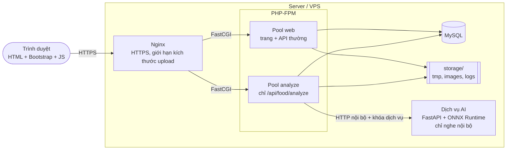
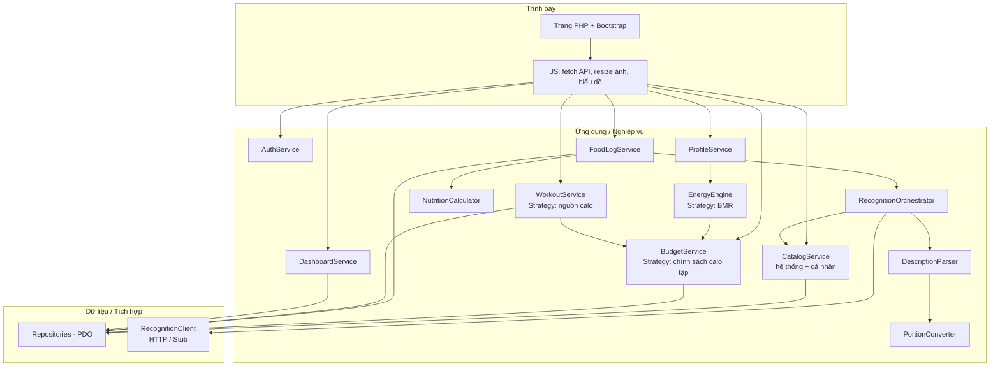
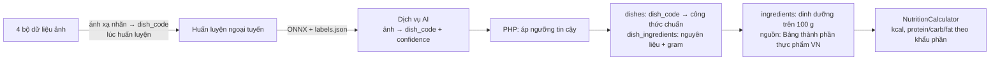

# FlexiDiet: Thiết Kế Kiến Trúc (Architecture Design) – Bản nháp

> **Pha 2 – Elaboration, E1/E2.** Nguồn: `01_business_modeling.md` (v1.1), `02_srs_requirements_v1.1.md`, `02_usecase_specifications_v1.1.md`, `02_database_design.md`, `02_ai_service_poc.md`.
> **Trạng thái:** Đã đồng bộ với thiết kế PoC. Các thông số tích hợp AI (kích thước ảnh, timeout 10.0s, ánh xạ nhãn động) đã được chốt. Kết quả đo kiểm PoC thực tế sẽ được bổ sung sau giai đoạn Construction (C1/C2).
> Phần mô hình dữ liệu chi tiết (ERD, cột, khóa) nằm ở `02_database_design.md`; phần kiểm chứng kỹ thuật AI nằm ở `02_ai_service_poc.md`.

---

## 1. Mục đích và phạm vi

Tài liệu mô tả cấu trúc hệ thống FlexiDiet: các thành phần, cách chúng giao tiếp, cách triển khai, và các quyết định kiến trúc cùng lý do. Mục tiêu là để cả nhóm 3 người làm song song được (PHP, dịch vụ AI, giao diện) mà không vướng nhau, nhờ các **hợp đồng giao tiếp** cố định ở mục 10 và mục 14.

---

## 2. Yếu tố chi phối kiến trúc (Architecturally Significant Requirements)

| # | Yếu tố | Nguồn | Hệ quả thiết kế |
|---|---|---|---|
| AS1 | Suy luận AI chạy ở server, tách khỏi PHP | D14, D18, NFR-13 | Dịch vụ suy luận riêng, hợp đồng API cố định |
| AS2 | Nhiều người dùng đồng thời không làm sập hệ thống (điểm nhấn học tập) | D15, NFR-03 | Hàng chờ có giới hạn, rate limit, pool PHP riêng cho phân tích ảnh, load test |
| AS3 | AI lỗi thì phần còn lại vẫn dùng được | NFR-12, FR-03.15 | Lớp client có timeout và lỗi chuẩn hóa, lối thoát sang ghi thủ công (UC06) |
| AS4 | Calo/macro chỉ tính ở một nơi, server tự tính | FR-03.20, NFR-05 | Một thành phần `NutritionCalculator` duy nhất |
| AS5 | Nhật ký là snapshot; ngân sách lưu theo ngày; calo tập cộng ở cấp ngày | NFR-10, FR-02.1, FR-04.4, FR-04.7 | Cấu trúc dữ liệu và `BudgetService` (mục 8, 9) |
| AS6 | Công thức BMR, chính sách cộng calo tập, nguồn calo tập đổi được | FR-01.5, FR-04.4, NFR-13 | Mẫu Strategy (mục 8) |
| AS7 | Bảo mật cơ bản, dữ liệu cá nhân | NFR-06, NFR-07, NFR-08 | Middleware phiên/CSRF, mọi truy vấn gắn `user_id`, HTTPS (mục 13) |
| AS8 | PHP thuần, nhóm 3 người, đóng băng tính năng 22/10 | D16, D27 | Monolith module hóa đơn giản, không framework, chỉ tách riêng thứ bắt buộc phải tách (AI) |
| AS9 | Mobile-first, chụp ảnh bằng điện thoại | NFR-11 | Trang render ở server + JS nhẹ, thu nhỏ ảnh ở trình duyệt trước khi gửi |

---

## 3. Phong cách kiến trúc

**Monolith module hóa 3 tầng (PHP) + một dịch vụ suy luận độc lập (Python).**

- **Tầng trình bày:** trang PHP + Bootstrap + JavaScript gọi API JSON.
- **Tầng ứng dụng/nghiệp vụ:** Controller mỏng, Service chứa logic, các Strategy cho tính toán.
- **Tầng dữ liệu:** Repository dùng PDO, MySQL.
- **Dịch vụ AI:** tiến trình riêng, chỉ làm một việc là nhận ảnh và trả danh sách món dự đoán.

Không chọn microservices cho toàn hệ thống: nhóm 3 người, 23 ngày, và chỉ có **một** thành phần cần cô lập tải là suy luận ảnh. Các lựa chọn đã loại nằm ở mục 18.

---

## 4. Góc nhìn Container



---

## 5. Góc nhìn triển khai

| Thành phần | Chạy ở đâu | Ghi chú |
|---|---|---|
| Nginx | Server | Kết thúc HTTPS (Let's Encrypt khi có domain), phục vụ tệp tĩnh, chuyển FastCGI |
| PHP-FPM, pool `web` | Server | Phục vụ trang và các API thường |
| PHP-FPM, pool `analyze` | Server | **Chỉ** xử lý `/api/food/analyze`. Tách riêng để các request chờ AI không làm nghẽn các trang khác |
| MySQL | Server (hoặc dịch vụ DB riêng nếu hosting có) | Một schema |
| Dịch vụ AI | Server, cổng nội bộ (ví dụ `127.0.0.1:8001`) | **Không mở ra Internet**; chỉ PHP gọi, kèm khóa dịch vụ |
| `storage/` | Server, **ngoài** thư mục web | Ảnh tạm, ảnh được giữ, nhật ký ứng dụng |

**Ràng buộc từ kiến trúc lên hosting (D21):** cần **VPS hoặc cloud VM** (chạy được tiến trình Python và cấu hình Nginx/PHP-FPM). Shared hosting PHP thông thường **không đáp ứng được** vì không chạy được dịch vụ AI. Máy tham chiếu: 2 – 4 vCPU, không GPU.

**Đóng gói:** khuyến nghị `docker compose` (nginx, php-fpm, mysql, ai-service) để cả nhóm chạy giống nhau ở local và server. Nếu nhóm chưa quen Docker thì cài trực tiếp cũng được, nhưng cần ghi lại các bước. **[CẦN CHỐT]**

**Cấp phát khởi điểm** (chỉnh sau load test C2, **[CẦN CHỐT]**):

| Thông số | Giá trị khởi điểm | Quan hệ |
|---|---|---|
| Số suy luận đồng thời của dịch vụ AI (W) | 2 | Gần bằng số lõi CPU dành cho AI |
| Hàng chờ tối đa của dịch vụ AI (Q) | 20 | NFR-03; đầy thì trả `429` |
| Pool `analyze`, `pm.max_children` | Q + 4 = 24 | Đủ để số request đang chờ AI **không vượt** pool, nên `429` sinh ra có kiểm soát ở dịch vụ AI chứ không dồn thành hàng đợi mờ ở FastCGI |
| Pool `web`, `pm.max_children` | 8 | Độc lập với analyze |
| Rate limit mỗi người dùng | 10 lần/phút | NFR-03 |

Lưu ý bộ nhớ: mỗi tiến trình PHP-FPM chỉ chờ I/O ở pool `analyze` nên nhẹ, nhưng 24 tiến trình vẫn cần đo RAM thật trên server dùng thử. Nếu RAM hạn chế thì giảm Q, không giảm pool xuống dưới Q.

---

## 6. Cấu trúc ứng dụng PHP

### 6.1. Cây thư mục đề xuất

```
flexidiet/
├── public/                 # document root: index.php (front controller), assets/
├── src/
│   ├── Http/               # Router, Request, Response, Middleware/
│   ├── Controllers/        # mỏng: nhận request, gọi Service, trả JSON/HTML
│   ├── Services/           # EnergyEngine, BudgetService, FoodLogService, ...
│   ├── Domain/
│   │   ├── Strategies/     # BMR, ExerciseCreditPolicy, CalorieSource
│   │   └── ...             # NutritionCalculator, PortionConverter, ...
│   ├── Repositories/       # chỉ lớp này chạm PDO
│   └── Clients/            # RecognitionClient (HTTP + Stub)
├── views/                  # mẫu trang PHP
├── config/                 # cấu hình, đọc từ biến môi trường
├── database/               # schema.sql, seeds/
├── scripts/                # seed_*.php, cleanup_tmp.php
├── storage/                # tmp/, images/, logs/  (ngoài docroot)
├── ai-service/             # dịch vụ suy luận: chỉ chạy mô hình đã huấn luyện + Dockerfile
└── ml/                     # huấn luyện ngoại tuyến: gộp dữ liệu, ánh xạ nhãn, huấn luyện, đánh giá, xuất ONNX
                            # (không triển khai lên server web)
```

### 6.2. Quy tắc phân tầng

1. Controller không chứa logic nghiệp vụ; chỉ kiểm tra đầu vào, gọi Service, định dạng kết quả.
2. Chỉ **Repository** được dùng PDO; luôn dùng prepared statements (NFR-06).
3. Mọi truy vấn dữ liệu cá nhân phải kèm điều kiện `user_id` lấy từ **phiên**, không lấy từ tham số do client gửi. Đây là chốt chặn chính chống truy cập chéo dữ liệu người dùng.
4. Các lớp tính toán (`EnergyEngine`, `NutritionCalculator`, các Strategy) là **hàm thuần**, không đọc CSDL, để kiểm thử đơn vị dễ.

### 6.3. Vòng đời một request

```
Nginx → public/index.php (front controller) → Router
      → Middleware: Session → Auth → CSRF → RateLimit (route nhạy cảm)
      → Controller → Service → Repository (PDO) / Client (AI)
      → Response (HTML hoặc JSON)
```

### 6.4. Quy ước API

- Dữ liệu JSON, mã trạng thái HTTP chuẩn. Lỗi trả dạng thống nhất:

```json
{ "error": { "code": "AI_BUSY", "message": "Hệ thống đang bận, thử lại sau hoặc ghi thủ công.", "request_id": "..." } }
```

- Mọi request mang `X-Request-Id` (PHP tạo nếu thiếu) và ghi vào nhật ký, chuyển tiếp sang dịch vụ AI để truy vết hai phía.
- Mọi request thay đổi dữ liệu mang mã CSRF.
- **Quy ước thời gian:** toàn hệ thống dùng một múi giờ (`Asia/Ho_Chi_Minh`) để xác định "ngày", vì ngân sách và nhật ký được lưu theo ngày.

---

## 7. Thành phần và trách nhiệm



| Thành phần | Trách nhiệm | UC chính |
|---|---|---|
| `AuthService` | Đăng ký, đăng nhập, phiên, đăng xuất | UC01, UC02 |
| `ProfileService`, `EnergyEngine` | Hồ sơ; BMR → Baseline → ngân sách mục tiêu (áp sàn calo) | UC01, UC03 |
| `BudgetService` | Ngân sách của ngày: tạo khi cần, tính calo tập được cộng ở cấp ngày, tính "còn lại" | UC03, UC07, UC08 |
| `RecognitionOrchestrator` | Điều phối đường nhận diện hoặc đường nguyên liệu; gọi `RecognitionClient`; áp ngưỡng tin cậy; ghép công thức với mô tả (FR-03.17) | UC04 |
| `DescriptionParser` | Tách chuỗi mô tả thành (số lượng, đơn vị, tên) bằng quy tắc regex hỗ trợ nhập nhanh | UC04 |
| `PortionConverter` | Quy đổi đơn vị Việt sang gram, xét sống/chín | UC04, UC06, UC12 |
| `NutritionCalculator` | **Nơi duy nhất** tính kcal/macro từ nguyên liệu + gram (FR-03.20) | UC04, 05, 06, 12, 14 |
| `FoodLogService` | Ghi, sửa, xóa mục nhật ký dạng snapshot; áp quy tắc FR-03.19 | UC05, UC06, UC14 |
| `CatalogService` | Tìm kiếm nguyên liệu/món (hỗ trợ tên địa phương 3 miền qua chỉ mục `ingredient_aliases` khi custom món gốc hoặc tự tạo món cá nhân); quản lý danh mục hệ thống và "Món đã lưu" | UC06, UC12, UC13 |
| `WorkoutService` | Ghi buổi tập, chọn MET, tính calo thô | UC07 |
| `DashboardService` | Tổng hợp thanh năng lượng, macro, nước, cân nặng, tuân thủ ngân sách | UC09 |
| `RecognitionClient` | Giao tiếp HTTP với dịch vụ AI; chuẩn hóa lỗi; có bản `Stub` | UC04 |

---

## 8. Mẫu thiết kế và các luồng tính toán cốt lõi

### 8.1. Strategy (AS6)

| Điểm biến đổi | Interface | Các bản cài đặt |
|---|---|---|
| Công thức BMR | `BmrFormula` | `MifflinStJeor` (mặc định), `KatchMcArdle` |
| Chính sách cộng calo tập | `ExerciseCreditPolicy` | `FullCredit` (Σ), `PartialCredit` (0,5 × Σ, mặc định), `CappedCredit` (min(Σ, 500)) |
| Nguồn calo tập | `CalorieSource` | `MetSource` (MET × cân nặng × giờ), `DeviceSource` (nhập tay, active calories) |
| Nhận diện món | `RecognitionClient` | `HttpRecognitionClient`, `StubRecognitionClient` (dùng khi dev và khi AI chưa xong) |

`StubRecognitionClient` là phần giữ cho nhóm không bị chặn: PHP và giao diện làm xong luồng UC04 trước khi mô hình thật sẵn sàng, chỉ cần đổi cấu hình `RECOGNITION_DRIVER=stub|http`.

### 8.2. Ngân sách ngày (AS5)

```
ensureDay(user, date):          # tạo dòng ngân sách nếu chưa có (UC08 E1)
    nếu chưa có dòng → target = EnergyEngine(hồ sơ, cân nặng mới nhất)
                       chính sách = chính sách mặc định trong hồ sơ

recalcDay(user, date):          # chạy khi thêm/sửa/xóa buổi tập hoặc đổi chính sách
    Σ = tổng calo thô các buổi tập trong ngày
    credit = policy_của_ngày.apply(Σ)
    lưu credit trên dòng ngân sách của ngày

remaining(user, date) = target + credit − Σ calo đã nạp (từ mục nhật ký)
```

- Buổi tập chỉ lưu **calo thô** (FR-04.7); phần được cộng là giá trị **dẫn xuất ở cấp ngày**.
- Đổi chính sách chỉ cập nhật dòng ngân sách **hôm nay**, các ngày đã qua giữ nguyên.
- `recalcDay` và việc ghi buổi tập nằm trong cùng một transaction.
- Chính sách mặc định của người dùng nằm ở hồ sơ; dòng ngân sách của ngày mới sao chép từ đó. *(Đây là quyết định thiết kế cần ghi nhận để ERD có cột tương ứng.)*

### 8.3. Ghi món và snapshot (FR-03.19, FR-03.20)

```
POST /api/meals  (client chỉ gửi: mã nguyên liệu/món, gram hoặc hệ số, buổi, ngày, mã dòng đã lưu nếu là sửa)
  → FoodLogService:
      với mỗi dòng:
         dòng đã lưu, nguyên liệu và gram không đổi → giữ nguyên giá trị dinh dưỡng đã lưu
         dòng mới hoặc bị sửa gram              → NutritionCalculator(giá trị hiện hành trong danh mục)
      tính tổng, lưu meal_entry + meal_entry_items trong một transaction
  → trả mục đã lưu + ngân sách còn lại
```

Trình duyệt **không bao giờ** gửi kcal hay macro.

### 8.4. Luồng nhận diện (UC04), phần điều phối ở server

```
RecognitionOrchestrator.analyze(ảnh?, mô tả?):
    nếu có ảnh:
        kết quả = RecognitionClient.recognize(ảnh)       # lỗi → ném AiUnavailable
        nếu top1.confidence >= NGƯỠNG (cấu hình PHP) và không phải "unknown":
            → đường nhận diện: công thức chuẩn + ghép mô tả (FR-03.17)
        ngược lại → đường nguyên liệu
    nếu không có ảnh → đường nguyên liệu
    đường nguyên liệu: thanh tìm kiếm nguyên liệu (hỗ trợ từ địa phương qua ingredient_aliases) / DescriptionParser → PortionConverter → tra nguyên liệu (hệ thống + cá nhân)
    trả bản nháp (chưa ghi gì)
```

**Ngưỡng độ tin cậy nằm ở PHP, không nằm trong dịch vụ AI**, để chỉnh theo kết quả PoC mà không phải triển khai lại mô hình.

---

## 9. Kiến trúc dữ liệu (tổng quan)

Chi tiết cột và khóa ở `02_database_design.md`. Các quyết định kiến trúc ảnh hưởng thiết kế bảng:

| Nhóm | Bảng (dự kiến) | Quy tắc quan trọng |
|---|---|---|
| Người dùng | `users`, `user_profiles`, `weight_logs` | `user_profiles` **không** có cột cân nặng; cân nặng hiện tại = bản ghi mới nhất của `weight_logs`, mỗi ngày một bản ghi |
| Ngân sách | `daily_budgets` | Mỗi (user, ngày) một dòng: mục tiêu, chính sách và hệ số của ngày, calo tập được cộng. Khóa duy nhất theo (user, ngày) |
| Danh mục | `ingredients`, `dishes`, `dish_ingredients`, `portion_units` | Dùng chung một bảng cho mục hệ thống và mục cá nhân, phân biệt bằng cột chủ sở hữu (rỗng = hệ thống); có trạng thái ngưng dùng thay vì xóa cứng; `dish_code` duy nhất cho món hệ thống để khớp nhãn AI |
| Danh mục cá nhân | (cùng bảng trên) | "Món đã lưu" và "món tự tạo" là cùng một loại bản ghi, lưu theo nguyên liệu + gram |
| Nhật ký ăn | `meal_entries`, `meal_entry_items` | **Snapshot**: `meal_entry_items` lưu sẵn gram, kcal, macro và tên tại thời điểm ghi; tham chiếu nguồn chỉ để truy vết, có thể mất khi mục nguồn bị xóa |
| Tập luyện | `workouts`, `exercise_types` | `workouts` lưu calo thô, nguồn, MET, cân nặng đã dùng; không lưu hệ số cộng |
| Khác | `water_logs`, `draft_images`, `rate_limit_hits`, `ai_feedback` (Could) | `draft_images` giữ ảnh tạm gắn với bản nháp kèm hạn xóa; `ai_feedback` chỉ ghi khi Member đồng ý |

**Nguồn dinh dưỡng:** `ingredients` được nạp bằng script seed từ *Bảng thành phần thực phẩm Việt Nam* (Viện Dinh dưỡng); mỗi nguyên liệu có cột nguồn (hệ thống / tự nhập) để hiển thị nhãn nguồn (NFR-05). Món hoàn chỉnh **không** có số liệu trực tiếp: calo của món luôn suy ra từ công thức chuẩn (nguyên liệu + gram). Điều khoản sử dụng của bảng dữ liệu nguồn cần được kiểm tra, cùng đợt với giấy phép các bộ ảnh.

Giao dịch (transaction) bắt buộc cho: ghi hoặc sửa mục nhật ký, đăng ký tài khoản, lưu hồ sơ kèm ngân sách, ghi buổi tập kèm `recalcDay`, và các script seed (NFR-10).

---

## 10. Hợp đồng dịch vụ AI

Đây là hợp đồng cố định giữa PHP và dịch vụ suy luận (NFR-13). Người làm PHP dùng `Stub` theo đúng hợp đồng này, người làm AI hiện thực phía thật.

### 10.1. Nguyên tắc

- **Không trạng thái**, không lưu ảnh, không ghi ảnh ra đĩa; xử lý trong bộ nhớ rồi bỏ (FR-03.18, NFR-08).
- Chỉ nhận request từ PHP: nghe cổng nội bộ và yêu cầu khóa dịch vụ trong header.
- Chỉ trả danh sách món dự đoán và độ tin cậy; **không** trả calo (calo do server tính từ CSDL dinh dưỡng).
- Phiên bản hóa đường dẫn (`/v1`) để đổi mô hình mà không phá hợp đồng.

### 10.2. `POST /v1/recognize`

**Request:** `multipart/form-data`

| Trường | Kiểu | Ghi chú |
|---|---|---|
| `image` | tệp JPEG/PNG | Dung lượng tối đa **≤ 2 MB** (ảnh client thu nhỏ cạnh dài nhất **≤ 1024 px**, theo PoC) |
| `top_k` | số nguyên, tùy chọn | Mặc định 3 |

**Header:** `X-Service-Key` (bắt buộc), `X-Request-Id` (khuyến nghị).

**Response `200`:**

```json
{
  "model_version": "v1.0.0",
  "is_unknown": false,
  "predictions": [
    { "dish_code": "com_tam_suon", "confidence": 0.82 },
    { "dish_code": "com_ga",       "confidence": 0.09 },
    { "dish_code": "bun_cha",      "confidence": 0.04 }
  ],
  "inference_ms": 118
}
```

- `is_unknown = true` khi độ tin cậy thấp hơn ngưỡng an toàn của dịch vụ AI (`UNKNOWN_THRESHOLD`, mặc định 0.40) hoặc khi mô hình xếp ảnh vào lớp "không nhận ra" nếu được huấn luyện với lớp này (FR-03.5); khi đó PHP đi đường nguyên liệu bất kể độ tin cậy. Ngưỡng phân luồng đường nhận diện / đường nguyên liệu (`CONFIDENCE_THRESHOLD`, mặc định 0.65) được áp **ở PHP** (AD7).
- `dish_code` được nạp động từ tệp `labels.json` (sinh ra sau khi huấn luyện) và phải khớp `dish_code` của món trong bảng `dishes` (MySQL). Cơ chế ánh xạ nhãn động và quy trình kiểm thử chi tiết thuộc `02_ai_service_poc.md`.

**Lỗi:**

| Mã | Ý nghĩa | PHP xử lý |
|---|---|---|
| `400` | Ảnh hỏng hoặc không đọc được | Báo lỗi ảnh (UC04 E1) |
| `401` | Sai khóa dịch vụ | Lỗi cấu hình, ghi nhật ký, báo "dịch vụ không khả dụng" |
| `413` / `415` | Quá lớn / sai định dạng | Như `400` |
| `429` + `Retry-After` | Hàng chờ đầy | Báo bận, gợi ý UC06 (UC04 E3) |
| `503` | Mô hình chưa tải xong hoặc đang lỗi | Như `429` |
| Hết thời gian | Không phản hồi trong ngưỡng | Như `503` |

### 10.3. `GET /health`

```json
{ "status": "ok", "model_version": "v0.1", "workers": 2, "queue_depth": 3, "queue_max": 20 }
```

Dùng cho kiểm tra sức khỏe, và cho load test đọc độ sâu hàng chờ.

### 10.4. Mô hình đồng thời của dịch vụ AI

```
request → [kiểm tra khóa, hợp lệ ảnh] → hàng chờ (tối đa Q)
                                          └─ đầy → trả 429 ngay
        → W worker suy luận song song (ONNX Runtime, CPU)
        → trả kết quả
```

- `W` suy luận cùng lúc, hàng chờ chứa tối đa `Q` request đang đợi; vượt thì từ chối ngay thay vì để treo.
- Thời gian chờ tối đa phía PHP: **10.0 giây** (theo NFR-02 và PoC); quá thời gian thì coi như `503`, ném `AiUnavailableException` để chuyển sang UC06 (ghi thủ công).

### 10.5. Chế độ Stub

`StubRecognitionClient` (phía PHP) và cờ `STUB=1` (phía dịch vụ AI) trả kết quả giả cố định theo tên tệp hoặc mã băm ảnh, kèm tùy chọn mô phỏng độ trễ và lỗi `429/503`. Có thể dùng chính chế độ này để thử đường lỗi và load test hạ tầng trước khi mô hình thật xong.

### 10.6. Vòng đời mô hình (huấn luyện ngoại tuyến → triển khai)

Mô hình do nhóm **tự huấn luyện** (D17), chạy ngoài server web. Server chỉ nhận **sản phẩm cuối** (tệp ONNX + danh sách nhãn).

```
Bộ dữ liệu ảnh → gộp, làm sạch, ánh xạ nhãn → huấn luyện → đánh giá → xuất ONNX + labels.json → triển khai vào ai-service
```

| Bước | Nơi chạy | Ghi chú |
|---|---|---|
| Gộp 4 bộ dữ liệu (VietFood67, 30VNFoods, VinaFood21, VNFood103), loại ảnh trùng giữa các bộ | Máy huấn luyện (thư mục `ml/`) | Bảng ánh xạ nhãn → `dish_code` thuộc `02_ai_service_poc.md`; kiểm tra giấy phép từng bộ (R5, NFR-14) |
| Huấn luyện, đánh giá | Nơi có GPU (máy cá nhân hoặc nền tảng notebook) **[CẦN CHỐT]** | Đánh giá riêng trên **ảnh tự chụp bằng điện thoại** (R4), tách khỏi tập kiểm thử lấy từ web |
| Xuất ONNX và `labels.json` | Máy huấn luyện | Gắn `model_version` |
| Triển khai | Server (`ai-service/`) | Chỉ chép tệp mô hình; dịch vụ đọc `model_version` và danh sách nhãn lúc khởi động |

Server **không** huấn luyện; CPU của server chỉ dùng để suy luận.

### 10.7. Chuỗi ánh xạ từ nhãn đến dinh dưỡng



Hai quyết định thiết kế (chờ bạn xác nhận):

- **Ánh xạ nhãn làm lúc huấn luyện.** Các lớp đầu ra của mô hình **đã là `dish_code`** của món trong danh mục hệ thống, nên dịch vụ AI trả thẳng `dish_code` và PHP không cần bảng ánh xạ lúc chạy.
- **Mô hình chỉ có lớp cho món đã có công thức chuẩn.** Ảnh thuộc món chưa có công thức (hoặc ngoài danh sách) sẽ bị dịch vụ AI gán `is_unknown = true` nhờ ngưỡng `UNKNOWN_THRESHOLD` (mặc định 0.40). Nếu dataset có ảnh không-phải-thức-ăn, có thể bổ sung lớp "unknown" khi huấn luyện để cải thiện; **quyết định này chờ kết quả huấn luyện thực tế**. Dù cách nào, mọi `dish_code` mô hình trả ra đều tính được calo; không có trường hợp nhận ra món nhưng không có số liệu.

Cần một script kiểm tra **độ phủ nhãn** (`scripts/check_label_coverage`) chạy khi triển khai: mọi nhãn trong `labels.json` phải khớp một món đang hoạt động có công thức đầy đủ. Lệch thì dừng triển khai, tránh lỗi chỉ lộ ra khi người dùng gặp món đó.

---

## 11. Xử lý quá tải và tính sẵn sàng (AS2, AS3)

| Lớp | Cơ chế | Mục đích |
|---|---|---|
| Nginx | Giới hạn dung lượng body upload | Chặn ảnh quá lớn từ sớm |
| Trình duyệt | Thu nhỏ ảnh (ví dụ cạnh dài tối đa 1024 px, JPEG) trước khi gửi **[CẦN CHỐT]** | Giảm băng thông và thời gian suy luận |
| PHP | Rate limit 10 lần/phút/người dùng, lưu trong bảng `rate_limit_hits` (cửa sổ trượt) | Chặn một người dùng chiếm hết năng lực |
| PHP-FPM | **Pool `analyze` riêng** | Request chờ AI không làm cạn tiến trình phục vụ các trang khác |
| Dịch vụ AI | Hàng chờ giới hạn Q, `429` khi đầy | Từ chối rõ ràng thay vì treo |
| PHP client | Timeout kết nối và tổng thời gian | Không giữ tiến trình PHP vô hạn |
| Ứng dụng | Khi AI lỗi hoặc bận: trả lỗi chuẩn + gợi ý UC06, giữ ngày và buổi đã chọn | Phần còn lại vẫn dùng được (NFR-12) |

**Giới hạn đã biết của thiết kế:** gọi AI đồng bộ nghĩa là mỗi phân tích giữ một tiến trình `analyze` trong lúc chờ. Chính vì thế pool `analyze` phải ≥ Q (mục 5). Phương án gửi-việc-rồi-poll (không giữ tiến trình) tốt hơn khi tải lớn nhưng thêm bảng việc, worker nền và poll ở giao diện; để dành làm mở rộng nếu load test cho thấy cần.

**Điểm đơn lỗi:** một server duy nhất. Với mục tiêu học tập và demo thì chấp nhận; ghi vào báo cáo như một giới hạn đã biết.

---

## 12. Xử lý ảnh tải lên (FR-03.18)

```
Trình duyệt: thu nhỏ → gửi POST /api/food/analyze (kèm 2 tùy chọn mặc định tắt: lưu ảnh vào nhật ký; cho phép dùng ảnh cải thiện mô hình)
PHP: kiểm tra loại tệp thật (không tin phần mở rộng), kích thước
     → lưu tạm storage/tmp (tên ngẫu nhiên, ngoài docroot) → gọi AI
     → trả bản nháp → XÓA ảnh tạm ngay
     nếu Member đã chọn giữ: ghi draft_images (hạn xóa), ảnh chờ xác nhận ở UC05
UC05 xác nhận: chuyển ảnh sang storage/images (nếu chọn lưu vào nhật ký) hoặc kèm bản ghi phản hồi AI (nếu chọn cho phép)
cleanup_tmp.php (cron): xóa ảnh tạm hết hạn không được xác nhận
```

Ảnh được giữ chỉ phục vụ qua một route PHP **có kiểm tra quyền sở hữu**, không cho truy cập trực tiếp bằng đường dẫn tĩnh.

---

## 13. Bảo mật

| Hạng mục | Cách làm | Yêu cầu |
|---|---|---|
| Mật khẩu | `password_hash` / `password_verify` | NFR-06 |
| SQL injection | Chỉ PDO prepared statements, trong Repository | NFR-06 |
| Phiên | Cookie `HttpOnly`, `SameSite`, thêm `Secure` khi chạy HTTPS; có thời hạn | NFR-07 |
| CSRF | Mã chống CSRF cho mọi thao tác thay đổi dữ liệu | NFR-06 |
| Phân quyền dữ liệu | Mọi truy vấn cá nhân gắn `user_id` từ phiên | NFR-07 |
| Upload | Kiểm tra loại tệp thật, giới hạn kích thước, đặt tên ngẫu nhiên, lưu ngoài docroot | NFR-06 |
| Dịch vụ AI | Chỉ nghe nội bộ, khóa dịch vụ trong header, không nhận request từ Internet | AS1 |
| Bí mật cấu hình | Khóa dịch vụ, mật khẩu CSDL đọc từ biến môi trường, **không** commit vào Git | NFR-06 |
| HTTPS | Nginx, chứng chỉ Let's Encrypt khi có domain | NFR-06 |
| Quyền Admin (v1) | Chỉ qua script chạy trên server; giao diện quản trị (Should) cần vai trò Admin | FR-07 |
| Xóa dữ liệu | Xóa toàn bộ dữ liệu của người dùng gồm cả ảnh đã lưu (NFR-08) | NFR-08 |

---

## 14. API nội bộ (PHP, tổng quan)

Chi tiết tham số và phản hồi sẽ viết khi bắt đầu C1, theo từng UC.

| Nhóm | Endpoint | UC |
|---|---|---|
| Xác thực | `POST /api/auth/register`, `/login`, `/logout` | UC01, UC02 |
| Hồ sơ | `GET`, `PUT /api/profile`; `POST /api/weights` | UC03, UC09 |
| Ngân sách | `GET /api/budget?date=` | UC08 |
| Món ăn | `POST /api/food/analyze`; `GET /api/foods/search?q=` | UC04, UC06 |
| Nhật ký ăn | `GET /api/meals?date=`; `POST /api/meals`; `PUT`, `DELETE /api/meals/{id}` | UC05, UC06, UC14 |
| Danh mục cá nhân | `GET/POST/PUT/DELETE /api/my/ingredients`, `/api/my/dishes`; `POST /api/my/dishes/from-meal/{id}` | UC12, UC13 |
| Tập luyện | `POST /api/workouts/estimate`; `GET/POST/PUT/DELETE /api/workouts` | UC07 |
| Dashboard | `GET /api/dashboard/summary?date=`, `/series?type=&range=`; `POST /api/water` | UC09 |
| Gợi ý (Could) | `GET /api/suggestions` | UC10 |
| Quản trị (Should) | `/admin/*` | UC11 |

---

## 15. Kiến trúc giao diện

- **Trang** (theo `idea.md`): `/` (landing + modal đăng nhập), `/register`, `/dashboard`, `/food-log`, `/workout-log`, `/suggestions`, `/profile`, và `/admin` (Should).
- **Render ở server** bằng PHP, khung Bootstrap 5 responsive, mobile-first.
- **JavaScript theo mô-đun** (ES modules, không bundler): gọi API bằng `fetch` kèm mã CSRF, xử lý chụp/chọn ảnh (`<input type="file" accept="image/*" capture>`), thu nhỏ ảnh bằng canvas, vẽ biểu đồ (thư viện biểu đồ nhẹ).
- Thao tác chính của UC04 (chụp, mô tả, xác nhận) làm được bằng một tay (NFR-11).
- Thanh "Còn lại" là thành phần dùng chung ở `/dashboard` và `/food-log`, gọi `GET /api/budget`, được giữ ngay cả khi rút gọn Dashboard (FR-02.2).

---

## 16. Kế hoạch kiểm chứng kiến trúc

| Việc | Khi nào | Kết quả cần có |
|---|---|---|
| Hợp đồng AI + `Stub` chạy được từ PHP | **07/10** | PHP và giao diện làm UC04 độc lập với mô hình thật |
| Tích hợp mô hình ONNX + kiểm thử pipeline | **07/10 – 11/10** | Kiểm chứng end-to-end từ ảnh → dish_code → CSDL calo; đáp ứng NFR-02, NFR-04 |
| Tích hợp PHP ↔ AI thật | C1 | Thay `Stub` bằng `Http`; kiểm thử tích hợp |
| Load test nhẹ | C2 | p50/p95 của `/v1/recognize`, tỉ lệ `429`, CPU/RAM; chỉnh W, Q, pool `analyze`, timeout |
| Thử đường lỗi | C2 | Tắt dịch vụ AI → các chức năng khác vẫn chạy (NFR-12) |

Kịch bản load test: tăng dần số người dùng ảo gọi `/api/food/analyze` (có rate limit), ghi lại ngưỡng bắt đầu xuất hiện `429` và thời gian phản hồi. Chính các con số này là nội dung để trình bày điểm nhấn "quản lý nhiều người dùng gọi mô hình".

---

## 17. Truy vết NFR → kiến trúc

| NFR | Đáp ứng bằng |
|---|---|
| NFR-01 (ghi một bữa < 30 giây) | Thu nhỏ ảnh ở client, UC14 ghi nhanh, Stub để tách thời gian AI khi đo |
| NFR-02 | Timeout PHP, đo ở PoC và load test |
| NFR-03 | Rate limit, hàng chờ Q, pool `analyze` (mục 5, 11) |
| NFR-04 | Đo benchmark VietFood67 (mAP50 ≥ 0.85), ánh xạ CSDL 100%, ngưỡng tin cậy ở PHP (0.65 / 0.40) |
| NFR-05 | Mọi con số kèm nhãn nguồn do `NutritionCalculator` và dữ liệu bản ghi |
| NFR-06, 07 | Mục 13 |
| NFR-08 | Dịch vụ AI không lưu ảnh; ảnh tạm xóa ngay; chức năng xóa dữ liệu |
| NFR-09 | `EnergyEngine` áp sàn calo; disclaimer ở giao diện |
| NFR-10 | Snapshot, transaction (mục 8, 9) |
| NFR-11 | Mục 15 |
| NFR-12 | `RecognitionClient` chuẩn hóa lỗi, lối thoát UC06, pool riêng |
| NFR-13 | Hợp đồng AI mục 10; Strategy mục 8 |
| NFR-15 | Mục 5 |

---

## 18. Quyết định kiến trúc và phương án đã loại

| # | Quyết định | Phương án đã loại | Lý do |
|---|---|---|---|
| AD1 | Monolith PHP module hóa + 1 dịch vụ AI riêng | Microservices toàn bộ; nhúng mô hình vào PHP (chạy lệnh ngoài) | Nhóm nhỏ, thời gian ngắn; chỉ AI cần cô lập tải và có runtime khác |
| AD2 | PHP gọi AI bằng HTTP đồng bộ có timeout | Hàng đợi tin nhắn hoặc gửi-việc-rồi-poll ngay từ v1 | Đơn giản hơn nhiều; giữ làm mở rộng nếu load test đòi hỏi |
| AD3 | Pool PHP-FPM `analyze` riêng, kích thước ≥ Q | Dùng chung một pool | Tránh để request chờ AI làm nghẽn toàn site |
| AD4 | Rate limit bằng bảng MySQL | Bộ nhớ chia sẻ của PHP | Chạy đúng qua nhiều tiến trình/pool, kết quả tái lập được; tải ở mức này chịu được |
| AD5 | `NutritionCalculator` là nơi tính calo duy nhất, tính ở server | Tính ở trình duyệt hoặc rải rác | Nhất quán, không tin dữ liệu client (FR-03.20) |
| AD6 | Calo tập luyện cộng ở cấp ngày, buổi tập chỉ lưu calo thô | Lưu hệ số trên từng buổi | Không còn câu hỏi cắt trần theo buổi; đổi chính sách rõ ràng |
| AD7 | Ngưỡng độ tin cậy cấu hình ở PHP | Đặt trong dịch vụ AI | Chỉnh theo PoC không cần triển khai lại mô hình |
| AD8 | Render trang ở server + JS gọi API JSON | SPA framework (React/Vue); chỉ form tải lại trang | SPA ngoài stack đã chốt; form tải lại trang kém cho luồng ghi món |
| AD9 | Router nhỏ tự viết + front controller, không framework | Laravel và tương tự | Đã chốt PHP thuần (D16) |
| AD10 | Dịch vụ AI không trạng thái, không lưu ảnh | Lưu ảnh ở dịch vụ AI | Quyền riêng tư (NFR-08), dễ nhân bản |
| AD11 | Mô hình tự huấn luyện ngoại tuyến; ánh xạ nhãn → `dish_code` lúc huấn luyện; chỉ huấn luyện cho món có công thức chuẩn; lớp "unknown" xác định sau khi huấn luyện | Gọi API ngoài làm bộ nhận diện chính; ánh xạ nhãn lúc chạy | Khớp UVP và D17; calo luôn tính được; API ngoài chỉ để so sánh trong PoC |

---

## 19. Vấn đề còn mở

| # | Vấn đề | Gợi ý |
|---|---|---|
| K1 | Có dùng **Composer** (chỉ để autoload PSR-4) không, hay tự viết autoloader ngắn | Autoloader tự viết khoảng chục dòng nếu muốn "PHP thuần" nghiêm ngặt |
| K2 | **Nginx + PHP-FPM** (cần để tách pool `analyze`) hay Apache. Hosting chưa chốt | Chốt Nginx; nếu hosting buộc Apache thì tách pool khó hơn |
| K3 | `docker compose` hay cài trực tiếp | Docker compose, nếu cả nhóm dùng được |
| K4 | Giới hạn upload (≤ 2MB), kích thước ảnh sau thu nhỏ (≤ 1024px), timeout gọi AI (10.0s) | **Đã chốt** theo `02_ai_service_poc.md` |
| K5 | W, Q, pool `analyze`, rate limit | Giữ giá trị khởi điểm ở mục 5, chỉnh sau load test C2 |
| K6 | Hosting phải là VPS/cloud VM (mục 5) | Nhóm xác nhận phương án thuê dùng thử |
| K7 | Môi trường huấn luyện (nơi có GPU) và ai phụ trách `ml/` | Bạn xác nhận; không ảnh hưởng thiết kế server |

**Việc tiếp theo:** Hoàn thành Pha Elaboration, sẵn sàng bước vào Pha Construction (dựng khung Architectural Skeleton: PHP Front Controller, Router, PDO Repository, Docker Compose và FastAPI skeleton).