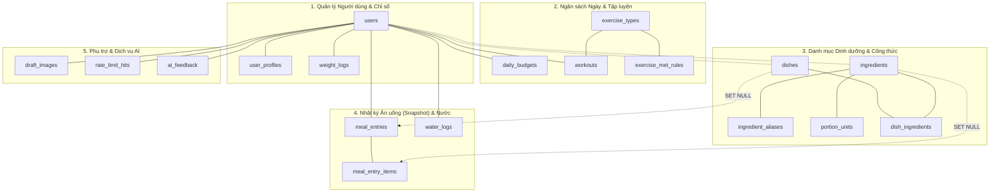
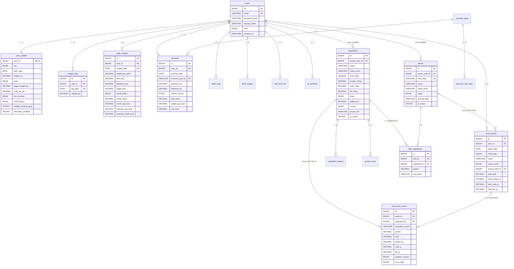

# FlexiDiet: Thiết Kế Cơ Sở Dữ Liệu (Database Design) – Bản Đặc Tả

> **Pha 2 – Elaboration (E1).**  
> **Nguồn tham chiếu:** `01_business_modeling.md` (v1.1), `02_srs_requirements_v1.1.md`, `02_usecase_specifications_v1.1.md`, `02_architecture_design.md`.  
> **Hệ quản trị CSDL mục tiêu:** MySQL >= 8.0.16 hoặc MariaDB >= 10.2.1 (đảm bảo mệnh đề `CHECK` có hiệu lực thực thi).  
> **Bộ mã & Định dạng:** Engine `InnoDB`, Collation `utf8mb4_unicode_ci`. Múi giờ chuẩn: Việt Nam `UTC+07:00` (`SET time_zone = '+07:00'` trong PDO).

---

## 1. Mục đích và Phạm vi

Tài liệu này đặc tả chi tiết toàn bộ thiết kế cơ sở dữ liệu quan hệ (RDBMS) của hệ thống **FlexiDiet**, phục vụ cho việc cài đặt CSDL ở tầng Data Layer (Repository/PDO). Tài liệu bao gồm:
- Các nguyên tắc thiết kế và quyết định kiến trúc cốt lõi tác động đến CSDL.
- Sơ đồ quan hệ thực thể (ERD) trực quan.
- Từ điển dữ liệu (Data Dictionary) chi tiết từng bảng, cột, khóa, index và ràng buộc kiểm tra (`CHECK`).
- Ranh giới giao dịch (Transaction boundaries) bảo đảm tính toàn vẹn ACID.
- Chiến lược dữ liệu khởi tạo (Data Seeding) và kịch bản DDL SQL hoàn chỉnh.

---

## 2. Các nguyên tắc & Quyết định thiết kế cốt lõi

| # | Quyết định thiết kế | Cơ sở yêu cầu (SRS / SAD) | Hiện thực trong CSDL |
|---|---|---|---|
| **DD1** | **Cân nặng: Một nguồn chân lý duy nhất (`weight_logs`)** | SRS FR-01.7, FR-06.5; SAD Mục 9 | Bảng `user_profiles` **không có cột cân nặng**. Mọi truy vấn cân nặng hiện tại đều đọc bản ghi mới nhất từ `weight_logs`. Ràng buộc `UNIQUE(user_id, log_date)` đảm bảo mỗi ngày 1 bản ghi duy nhất. |
| **DD2** | **Cơ chế Snapshot nhật ký ăn uống bất biến** | NFR-05, NFR-10, FR-03.19, FR-03.20 | `meal_entry_items` lưu cố định tên nguyên liệu, gram, kcal và từng macro tại thời điểm ghi. Khóa ngoại tới `ingredients` và `dishes` dùng `ON DELETE SET NULL`, đảm bảo xóa danh mục gốc không làm hỏng lịch sử calo đã nạp. |
| **DD3** | **Calo tập luyện phân tách: Calo thô vs Calo được cộng** | FR-04.4, FR-04.7, SAD Mục 8.2 | Bảng `workouts` **chỉ lưu calo thô** (`raw_kcal`) và MET. Phần calo được cộng (`exercise_credit_kcal`) được tính và lưu tại bảng cấp ngày `daily_budgets` theo chính sách của ngày đó. |
| **DD4** | **Không lưu dư thừa trường "Calo còn lại"** | SAD Mục 8.2 (AD5, AD6) | "Còn lại" = `target_kcal + exercise_credit_kcal - SUM(meal_entries.total_kcal)`, được tính động lúc hiển thị để tránh nguy cơ bất đồng bộ. |
| **DD5** | **Hợp nhất Danh mục hệ thống & Cá nhân** | FR-03.7, FR-03.8, FR-03.11, UC12 | Dùng chung bảng `ingredients` và `dishes`, phân biệt bằng `owner_user_id` (`NULL` = Hệ thống; `NOT NULL` = Cá nhân). Món ăn hệ thống có `dish_code` để ánh xạ nhãn AI. |
| **DD6** | **Chặn xóa cứng danh mục đang sử dụng** | UC12 (A4, E1) | Ràng buộc `fk_di_ingredient` trong `dish_ingredients` đặt `ON DELETE RESTRICT` để ngăn xóa nguyên liệu khi đang nằm trong công thức món ăn. |
| **DD7** | **Kiểm tra hợp lệ chặt chẽ ở cấp CSDL** | NFR-06, NFR-09 | Sử dụng `CHECK` constraints cho dải dữ liệu thực tế (chiều cao, cân nặng, tổng macro $\le 100g$, gram nguyên liệu $0.1 - 2000g$, số buổi tập $0 - 7$). |

---

## 3. Sơ đồ Quan hệ Thực thể (ERD)

### 3.1. Phân nhóm quan hệ tổng thể (Domain Cluster)

### 3.2. Lược đồ Thực thể Chi tiết (Mermaid erDiagram)

---

## 4. Từ Điển Dữ Liệu Chi Tiết (Data Dictionary)

### 4.1. Phân hệ 1: Tài khoản, Hồ sơ & Cân nặng

#### Bảng `users`
Lưu trữ định danh tài khoản đăng nhập và phân quyền hệ thống.

| Cột | Kiểu dữ liệu | Null | Mặc định | Ý nghĩa & Quy tắc |
|---|---|:---:|---|---|
| `id` | `BIGINT UNSIGNED` | No | AUTO_INCREMENT | Khóa chính |
| `email` | `VARCHAR(255)` | No | | Địa chỉ email đăng nhập (chuẩn hóa chữ thường, duy nhất) |
| `password_hash` | `VARCHAR(255)` | No | | Chuỗi băm mật khẩu (`password_hash()` BCRYPT/Argon2id của PHP) |
| `display_name` | `VARCHAR(100)` | No | | Tên hiển thị của người dùng |
| `role` | `ENUM('member','admin')` | No | `'member'` | Quyền hạn: Quản trị viên hệ thống hoặc Thành viên |
| `created_at` | `DATETIME` | No | `CURRENT_TIMESTAMP` | Thời điểm tạo tài khoản |
| `updated_at` | `DATETIME` | No | `CURRENT_TIMESTAMP ON UPDATE CURRENT_TIMESTAMP` | Thời điểm cập nhật cuối |

* **Khóa chính:** `PRIMARY KEY (id)`
* **Ràng buộc duy nhất:** `UNIQUE KEY uq_users_email (email)`

---

#### Bảng `user_profiles`
Lưu trữ thông tin sinh học, mục tiêu cân nặng, công thức BMR và chính sách calo mặc định.  
*(Ghi chú: Cột cân nặng đã được lược bỏ hoàn toàn; cân nặng hiện tại được truy vấn từ `weight_logs`).*

| Cột | Kiểu dữ liệu | Null | Mặc định | Ý nghĩa & Quy tắc |
|---|---|:---:|---|---|
| `user_id` | `BIGINT UNSIGNED` | No | | Khóa chính, tham chiếu tới `users.id` |
| `sex` | `ENUM('male','female')` | No | | Giới tính sinh học (phục vụ tính BMR) |
| `birth_date` | `DATE` | No | | Ngày sinh (dùng tính tuổi chính xác theo ngày) |
| `height_cm` | `DECIMAL(5,1)` | No | | Chiều cao tính bằng cm (phải > 0) |
| `goal` | `ENUM('lose','maintain','gain','build_muscle')` | No | | Mục tiêu vóc dáng |
| `target_weight_kg` | `DECIMAL(5,2)` | Yes | `NULL` | Cân nặng mục tiêu kỳ vọng (kg) |
| `body_fat_pct` | `DECIMAL(4,1)` | Yes | `NULL` | Tỷ lệ mỡ cơ thể % (bắt buộc nếu dùng Katch-McArdle) |
| `bmr_formula` | `ENUM('mifflin_st_jeor','katch_mcardle')` | No | `'mifflin_st_jeor'` | Công thức tính BMR được lựa chọn |
| `credit_policy` | `ENUM('full','partial','capped')` | No | `'partial'` | Chính sách cộng calo tập luyện mặc định |
| `weekly_workout_goal` | `TINYINT UNSIGNED` | No | | Số buổi tập mục tiêu mỗi tuần (0 đến 7) |
| `reminders_enabled` | `TINYINT(1)` | No | `1` | Cờ bật/tắt nhắc nhở ghi nhật ký |
| `created_at` | `DATETIME` | No | `CURRENT_TIMESTAMP` | Thời điểm tạo hồ sơ |
| `updated_at` | `DATETIME` | No | `CURRENT_TIMESTAMP ON UPDATE CURRENT_TIMESTAMP` | Thời điểm cập nhật cuối |

* **Khóa chính:** `PRIMARY KEY (user_id)`
* **Khóa ngoại:** `CONSTRAINT fk_profiles_user FOREIGN KEY (user_id) REFERENCES users (id) ON DELETE CASCADE`
* **Ràng buộc kiểm tra:**
  * `CONSTRAINT ck_profiles_height CHECK (height_cm > 0)`
  * `CONSTRAINT ck_profiles_goal_days CHECK (weekly_workout_goal BETWEEN 0 AND 7)`

---

#### Bảng `weight_logs`
Lưu vết lịch sử biến động cân nặng theo thời gian (vẽ biểu đồ tiến trình và xác định cân nặng hiện hành).

| Cột | Kiểu dữ liệu | Null | Mặc định | Ý nghĩa & Quy tắc |
|---|---|:---:|---|---|
| `id` | `BIGINT UNSIGNED` | No | AUTO_INCREMENT | Khóa chính |
| `user_id` | `BIGINT UNSIGNED` | No | | Mã người dùng |
| `log_date` | `DATE` | No | | Ngày ghi nhận cân nặng |
| `weight_kg` | `DECIMAL(5,2)` | No | | Cân nặng thực tế đo được (kg) |
| `created_at` | `DATETIME` | No | `CURRENT_TIMESTAMP` | Thời điểm ghi nhận |
| `updated_at` | `DATETIME` | No | `CURRENT_TIMESTAMP ON UPDATE CURRENT_TIMESTAMP` | Thời điểm cập nhật |

* **Khóa chính:** `PRIMARY KEY (id)`
* **Ràng buộc duy nhất:** `UNIQUE KEY uq_weight_user_date (user_id, log_date)` (Mỗi người dùng chỉ có 1 bản ghi mỗi ngày; ghi lại sẽ ghi đè).
* **Khóa ngoại:** `CONSTRAINT fk_weight_user FOREIGN KEY (user_id) REFERENCES users (id) ON DELETE CASCADE`
* **Ràng buộc kiểm tra:** `CONSTRAINT ck_weight_positive CHECK (weight_kg > 0)`

---

### 4.2. Phân hệ 2: Ngân sách Calo Động theo ngày

#### Bảng `daily_budgets`
Lưu trạng thái ngân sách năng lượng cố định và dẫn xuất cho từng ngày cụ thể của người dùng.

| Cột | Kiểu dữ liệu | Null | Mặc định | Ý nghĩa & Quy tắc |
|---|---|:---:|---|---|
| `id` | `BIGINT UNSIGNED` | No | AUTO_INCREMENT | Khóa chính |
| `user_id` | `BIGINT UNSIGNED` | No | | Mã người dùng |
| `budget_date` | `DATE` | No | | Ngày áp dụng ngân sách |
| `weight_kg_used` | `DECIMAL(5,2)` | No | | Cân nặng được dùng để tính BMR của ngày này |
| `bmr_formula` | `ENUM('mifflin_st_jeor','katch_mcardle')` | No | | Công thức BMR được áp dụng cho ngày |
| `bmr_kcal` | `DECIMAL(8,1)` | No | | Năng lượng chuyển hóa cơ bản (kcal) |
| `baseline_kcal` | `DECIMAL(8,1)` | No | | Calo duy trì cơ bản ($BMR \times 1.2$) |
| `goal_adjust_kcal` | `DECIMAL(8,1)` | No | `0` | Lượng calo bù trừ theo mục tiêu (ví dụ: -500 kcal) |
| `floor_applied` | `TINYINT(1)` | No | `0` | Cờ đánh dấu: 1 nếu ngân sách đã bị chặn ở sàn calo an toàn |
| `target_kcal` | `DECIMAL(8,1)` | No | | Ngân sách nạp mục tiêu ban đầu của ngày (sau khi xét sàn) |
| `credit_policy` | `ENUM('full','partial','capped')` | No | | Chính sách cộng calo tập áp dụng cho ngày này |
| `credit_factor` | `DECIMAL(4,2)` | No | | Hệ số nhân calo tập (1.00 hoặc 0.50) |
| `credit_cap_kcal` | `DECIMAL(8,1)` | Yes | `NULL` | Trần calo tập tối đa được cộng (500 kcal hoặc NULL) |
| `exercise_raw_kcal` | `DECIMAL(8,1)` | No | `0` | Tổng calo thô các buổi tập trong ngày (dẫn xuất từ `workouts`) |
| `exercise_credit_kcal` | `DECIMAL(8,1)` | No | `0` | Số calo tập thực tế được cộng thêm vào ngân sách |
| `created_at` | `DATETIME` | No | `CURRENT_TIMESTAMP` | Thời điểm tạo |
| `updated_at` | `DATETIME` | No | `CURRENT_TIMESTAMP ON UPDATE CURRENT_TIMESTAMP` | Thời điểm cập nhật (đồng bộ khi có buổi tập mới) |

* **Khóa chính:** `PRIMARY KEY (id)`
* **Ràng buộc duy nhất:** `UNIQUE KEY uq_budget_user_date (user_id, budget_date)`
* **Khóa ngoại:** `CONSTRAINT fk_budget_user FOREIGN KEY (user_id) REFERENCES users (id) ON DELETE CASCADE`
* **Ràng buộc kiểm tra:**
  * `CONSTRAINT ck_budget_target CHECK (target_kcal > 0)`
  * `CONSTRAINT ck_budget_credit CHECK (exercise_raw_kcal >= 0 AND exercise_credit_kcal >= 0)`

---

### 4.3. Phân hệ 3: Hoạt động Thể chất & MET

#### Bảng `exercise_types`
Danh mục loại hình vận động hỗ trợ trong hệ thống.

| Cột | Kiểu dữ liệu | Null | Mặc định | Ý nghĩa & Quy tắc |
|---|---|:---:|---|---|
| `id` | `SMALLINT UNSIGNED` | No | AUTO_INCREMENT | Khóa chính |
| `code` | `VARCHAR(40)` | No | | Mã định danh duy nhất (ví dụ: `running`, `cycling`) |
| `name_vi` | `VARCHAR(100)` | No | | Tên tiếng Việt hiển thị |
| `uses_distance` | `TINYINT(1)` | No | `0` | 1 nếu loại hình có đo quãng đường để tính tốc độ |
| `is_active` | `TINYINT(1)` | No | `1` | Trạng thái kích hoạt |

* **Khóa chính:** `PRIMARY KEY (id)`
* **Ràng buộc duy nhất:** `UNIQUE KEY uq_exercise_code (code)`

---

#### Bảng `exercise_met_rules`
Bảng tra chỉ số MET (Metabolic Equivalent of Task) theo tốc độ hoặc cường độ cố định.

| Cột | Kiểu dữ liệu | Null | Mặc định | Ý nghĩa & Quy tắc |
|---|---|:---:|---|---|
| `id` | `INT UNSIGNED` | No | AUTO_INCREMENT | Khóa chính |
| `exercise_type_id` | `SMALLINT UNSIGNED` | No | | Mã loại hình tập luyện |
| `speed_min_kmh` | `DECIMAL(4,1)` | Yes | `NULL` | Tốc độ tối thiểu (km/h); NULL nếu không chia dải tốc độ |
| `speed_max_kmh` | `DECIMAL(4,1)` | Yes | `NULL` | Tốc độ tối đa (km/h); NULL nếu không giới hạn trên |
| `met` | `DECIMAL(4,1)` | No | | Hệ số MET tra được |
| `source_ref` | `VARCHAR(100)` | Yes | `NULL` | Mã tham chiếu trong Compendium of Physical Activities |

* **Khóa chính:** `PRIMARY KEY (id)`
* **Chỉ mục:** `KEY ix_met_type (exercise_type_id)`
* **Khóa ngoại:** `CONSTRAINT fk_met_type FOREIGN KEY (exercise_type_id) REFERENCES exercise_types (id) ON DELETE CASCADE`
* **Ràng buộc kiểm tra:** `CONSTRAINT ck_met_positive CHECK (met > 0)`

---

#### Bảng `workouts`
Nhật ký các buổi tập luyện cá nhân của người dùng.

| Cột | Kiểu dữ liệu | Null | Mặc định | Ý nghĩa & Quy tắc |
|---|---|:---:|---|---|
| `id` | `BIGINT UNSIGNED` | No | AUTO_INCREMENT | Khóa chính |
| `user_id` | `BIGINT UNSIGNED` | No | | Mã người dùng |
| `workout_date` | `DATE` | No | | Ngày diễn ra buổi tập |
| `exercise_type_id` | `SMALLINT UNSIGNED` | No | | Loại hình tập |
| `duration_min` | `DECIMAL(6,1)` | No | | Thời lượng tập (phút) |
| `distance_km` | `DECIMAL(6,2)` | Yes | `NULL` | Quãng đường di chuyển (km) |
| `calorie_source` | `ENUM('met','device')` | No | | Nguồn số liệu calo: tự tính theo MET hoặc từ đồng hồ/thiết bị |
| `confidence` | `ENUM('high','medium','low')` | No | | Mức tin cậy (device = high, met = medium) |
| `met_value` | `DECIMAL(4,1)` | Yes | `NULL` | Giá trị MET đã áp dụng (bắt buộc nếu nguồn là `met`) |
| `weight_kg_used` | `DECIMAL(5,2)` | Yes | `NULL` | Cân nặng tại thời điểm tính (bắt buộc nếu nguồn là `met`) |
| `raw_kcal` | `DECIMAL(8,1)` | No | | Calo tiêu hao thô (chưa nhân hệ số chính sách) |
| `note` | `VARCHAR(255)` | Yes | `NULL` | Ghi chú thêm |
| `created_at` | `DATETIME` | No | `CURRENT_TIMESTAMP` | Thời điểm ghi |
| `updated_at` | `DATETIME` | No | `CURRENT_TIMESTAMP ON UPDATE CURRENT_TIMESTAMP` | Thời điểm cập nhật |

* **Khóa chính:** `PRIMARY KEY (id)`
* **Chỉ mục:** `KEY ix_workouts_user_date (user_id, workout_date)`
* **Khóa ngoại:**
  * `CONSTRAINT fk_workouts_user FOREIGN KEY (user_id) REFERENCES users (id) ON DELETE CASCADE`
  * `CONSTRAINT fk_workouts_type FOREIGN KEY (exercise_type_id) REFERENCES exercise_types (id) ON DELETE RESTRICT`
* **Ràng buộc kiểm tra:**
  * `CONSTRAINT ck_workouts_values CHECK (duration_min > 0 AND raw_kcal >= 0)`
  * `CONSTRAINT ck_workouts_met CHECK (calorie_source = 'device' OR (met_value IS NOT NULL AND weight_kg_used IS NOT NULL))`

---

### 4.4. Phân hệ 4: Danh mục Dinh dưỡng, Đơn vị & Món ăn

#### Bảng `ingredients`
Danh mục nguyên liệu thực phẩm (hệ thống và cá nhân dùng chung).

| Cột | Kiểu dữ liệu | Null | Mặc định | Ý nghĩa & Quy tắc |
|---|---|:---:|---|---|
| `id` | `BIGINT UNSIGNED` | No | AUTO_INCREMENT | Khóa chính |
| `owner_user_id` | `BIGINT UNSIGNED` | Yes | `NULL` | Chủ sở hữu: `NULL` là nguyên liệu hệ thống; khác NULL là của người dùng |
| `name` | `VARCHAR(150)` | No | | Tên nguyên liệu hiển thị (ví dụ: "Thịt lợn nạc") |
| `name_norm` | `VARCHAR(150)` | No | | Tên chuẩn hóa (chữ thường, không dấu, đ -> d) phục vụ tìm kiếm |
| `kcal_100g` | `DECIMAL(7,2)` | No | | Năng lượng trên 100g phần ăn được (kcal) |
| `protein_100g` | `DECIMAL(6,2)` | No | | Đạm (g) trên 100g |
| `carb_100g` | `DECIMAL(6,2)` | No | | Tinh bột (g) trên 100g |
| `fat_100g` | `DECIMAL(6,2)` | No | | Chất béo (g) trên 100g |
| `state` | `ENUM('raw','cooked','na')` | No | `'na'` | Trạng thái: sống / chín / không áp dụng |
| `edible_pct` | `DECIMAL(5,2)` | No | `100.00` | Tỷ lệ phần ăn được (%) |
| `source` | `ENUM('vdd','usda','manual','user')` | No | | Nguồn dữ liệu (VDD: Viện Dinh Dưỡng, USDA, Tự nhập) |
| `source_ref` | `VARCHAR(100)` | Yes | `NULL` | Mã tra cứu trong tài liệu nguồn (dùng đối soát và seed) |
| `is_active` | `TINYINT(1)` | No | `1` | 1: còn dùng; 0: ngưng dùng (soft disable, không xóa cứng) |
| `created_at` | `DATETIME` | No | `CURRENT_TIMESTAMP` | Thời điểm tạo |
| `updated_at` | `DATETIME` | No | `CURRENT_TIMESTAMP ON UPDATE CURRENT_TIMESTAMP` | Thời điểm cập nhật |

* **Khóa chính:** `PRIMARY KEY (id)`
* **Ràng buộc duy nhất:**
  * `UNIQUE KEY uq_ingredients_source_ref (source, source_ref)`
  * `UNIQUE KEY uq_ingredients_owner_name (owner_user_id, name_norm)`
* **Chỉ mục:** `KEY ix_ingredients_name_norm (name_norm)`
* **Khóa ngoại:** `CONSTRAINT fk_ingredients_owner FOREIGN KEY (owner_user_id) REFERENCES users (id) ON DELETE CASCADE`
* **Ràng buộc kiểm tra:**
  * `CONSTRAINT ck_ingredients_nonneg CHECK (kcal_100g >= 0 AND protein_100g >= 0 AND carb_100g >= 0 AND fat_100g >= 0)`
  * `CONSTRAINT ck_ingredients_macro_sum CHECK (protein_100g + carb_100g + fat_100g <= 100)`
  * `CONSTRAINT ck_ingredients_edible CHECK (edible_pct > 0 AND edible_pct <= 100)`

---

#### Bảng `ingredient_aliases`
Các từ đồng nghĩa / tên gọi địa phương của nguyên liệu (hỗ trợ bộ phân tích mô tả NLP).

| Cột | Kiểu dữ liệu | Null | Mặc định | Ý nghĩa & Quy tắc |
|---|---|:---:|---|---|
| `id` | `BIGINT UNSIGNED` | No | AUTO_INCREMENT | Khóa chính |
| `ingredient_id` | `BIGINT UNSIGNED` | No | | Mã nguyên liệu gốc |
| `alias` | `VARCHAR(150)` | No | | Tên đồng nghĩa (ví dụ: "hột vịt" -> "trứng vịt") |
| `alias_norm` | `VARCHAR(150)` | No | | Chuẩn hóa không dấu |

* **Khóa chính:** `PRIMARY KEY (id)`
* **Ràng buộc duy nhất:** `UNIQUE KEY uq_alias_ingredient (ingredient_id, alias_norm)`
* **Chỉ mục:** `KEY ix_alias_norm (alias_norm)`
* **Khóa ngoại:** `CONSTRAINT fk_alias_ingredient FOREIGN KEY (ingredient_id) REFERENCES ingredients (id) ON DELETE CASCADE`

---

#### Bảng `portion_units`
Bảng quy đổi ước lượng đơn vị dân gian Việt Nam sang gram theo từng nguyên liệu.

| Cột | Kiểu dữ liệu | Null | Mặc định | Ý nghĩa & Quy tắc |
|---|---|:---:|---|---|
| `id` | `BIGINT UNSIGNED` | No | AUTO_INCREMENT | Khóa chính |
| `ingredient_id` | `BIGINT UNSIGNED` | No | | Mã nguyên liệu |
| `unit_name` | `VARCHAR(40)` | No | | Tên đơn vị (bát, chén, quả, đùi, miếng...) |
| `unit_norm` | `VARCHAR(40)` | No | | Chuẩn hóa tên đơn vị |
| `size_label` | `ENUM('small','medium','large')` | No | `'medium'` | Kích thước (nhỏ, vừa, lớn) |
| `grams_per_unit` | `DECIMAL(7,1)` | No | | Số gram tương ứng |
| `note` | `VARCHAR(150)` | Yes | `NULL` | Ghi chú |

* **Khóa chính:** `PRIMARY KEY (id)`
* **Ràng buộc duy nhất:** `UNIQUE KEY uq_portion (ingredient_id, unit_norm, size_label)`
* **Khóa ngoại:** `CONSTRAINT fk_portion_ingredient FOREIGN KEY (ingredient_id) REFERENCES ingredients (id) ON DELETE CASCADE`
* **Ràng buộc kiểm tra:** `CONSTRAINT ck_portion_positive CHECK (grams_per_unit > 0)`

---

#### Bảng `dishes`
Danh mục món ăn hoàn chỉnh (hệ thống, món tự tạo, món đã lưu).

| Cột | Kiểu dữ liệu | Null | Mặc định | Ý nghĩa & Quy tắc |
|---|---|:---:|---|---|
| `id` | `BIGINT UNSIGNED` | No | AUTO_INCREMENT | Khóa chính |
| `owner_user_id` | `BIGINT UNSIGNED` | Yes | `NULL` | `NULL` là món hệ thống; khác `NULL` là món người dùng |
| `dish_code` | `VARCHAR(60)` | Yes | `NULL` | Mã món duy nhất ánh xạ trực tiếp nhãn AI (chỉ có ở món hệ thống) |
| `name` | `VARCHAR(150)` | No | | Tên món (ví dụ: "Cơm tấm sườn bì chả") |
| `name_norm` | `VARCHAR(150)` | No | | Tên chuẩn hóa không dấu |
| `origin` | `ENUM('system','custom','saved')` | No | | Nguồn gốc món: hệ thống, tự tạo mới, hoặc lưu từ nhật ký |
| `serving_label` | `VARCHAR(60)` | No | `'1 phần'` | Tên khẩu phần chuẩn ("1 dĩa", "1 tô", "1 ổ") |
| `is_active` | `TINYINT(1)` | No | `1` | Trạng thái sử dụng |
| `created_at` | `DATETIME` | No | `CURRENT_TIMESTAMP` | Thời điểm tạo |
| `updated_at` | `DATETIME` | No | `CURRENT_TIMESTAMP ON UPDATE CURRENT_TIMESTAMP` | Thời điểm cập nhật |

* **Khóa chính:** `PRIMARY KEY (id)`
* **Ràng buộc duy nhất:**
  * `UNIQUE KEY uq_dishes_code (dish_code)`
  * `UNIQUE KEY uq_dishes_owner_name (owner_user_id, name_norm)`
* **Chỉ mục:** `KEY ix_dishes_name_norm (name_norm)`
* **Khóa ngoại:** `CONSTRAINT fk_dishes_owner FOREIGN KEY (owner_user_id) REFERENCES users (id) ON DELETE CASCADE`

---

#### Bảng `dish_ingredients`
Công thức cấu thành món ăn (danh sách nguyên liệu và khối lượng cho 1 khẩu phần chuẩn).

| Cột | Kiểu dữ liệu | Null | Mặc định | Ý nghĩa & Quy tắc |
|---|---|:---:|---|---|
| `id` | `BIGINT UNSIGNED` | No | AUTO_INCREMENT | Khóa chính |
| `dish_id` | `BIGINT UNSIGNED` | No | | Mã món ăn |
| `ingredient_id` | `BIGINT UNSIGNED` | No | | Mã nguyên liệu cấu thành |
| `grams` | `DECIMAL(7,1)` | No | | Khối lượng nguyên liệu cho 1 suất chuẩn (g) |
| `sort_order` | `SMALLINT UNSIGNED` | No | `0` | Thứ tự hiển thị trong công thức |

* **Khóa chính:** `PRIMARY KEY (id)`
* **Ràng buộc duy nhất:** `UNIQUE KEY uq_dish_ingredient (dish_id, ingredient_id)`
* **Chỉ mục:** `KEY ix_di_ingredient (ingredient_id)`
* **Khóa ngoại:**
  * `CONSTRAINT fk_di_dish FOREIGN KEY (dish_id) REFERENCES dishes (id) ON DELETE CASCADE`
  * `CONSTRAINT fk_di_ingredient FOREIGN KEY (ingredient_id) REFERENCES ingredients (id) ON DELETE RESTRICT` (Ngăn xóa nguyên liệu khi còn trong công thức món ăn).
* **Ràng buộc kiểm tra:** `CONSTRAINT ck_di_grams CHECK (grams BETWEEN 0.1 AND 2000)`

---

### 4.5. Phân hệ 5: Nhật ký Ăn uống Snapshot (Bất biến)

#### Bảng `meal_entries`
Nhật ký bữa ăn tổng thể của người dùng theo từng bữa trong ngày.

| Cột | Kiểu dữ liệu | Null | Mặc định | Ý nghĩa & Quy tắc |
|---|---|:---:|---|---|
| `id` | `BIGINT UNSIGNED` | No | AUTO_INCREMENT | Khóa chính |
| `user_id` | `BIGINT UNSIGNED` | No | | Mã người dùng |
| `entry_date` | `DATE` | No | | Ngày ăn |
| `meal_type` | `ENUM('breakfast','lunch','dinner','snack')` | No | | Bữa ăn: Sáng, Trưa, Tối, Bữa phụ |
| `name` | `VARCHAR(150)` | No | | Tên món ăn hoặc tên bữa ăn ghi nhận |
| `source_kind` | `ENUM('ai','manual','saved')` | No | | Nguồn ghi nhận: Từ nhận diện AI, ghi thủ công, hay chọn từ món đã lưu |
| `source_dish_id` | `BIGINT UNSIGNED` | Yes | `NULL` | Tham chiếu món gốc (nếu có, chỉ để truy vết) |
| `serving_factor` | `DECIMAL(5,2)` | Yes | `NULL` | Hệ số khẩu phần lúc chọn (ví dụ: 1.5 suất) |
| `ai_dish_code` | `VARCHAR(60)` | Yes | `NULL` | Nhãn AI nhận diện nếu từ AI |
| `ai_confidence` | `DECIMAL(4,3)` | Yes | `NULL` | Độ tin cậy của AI |
| `image_path` | `VARCHAR(255)` | Yes | `NULL` | Đường dẫn lưu ảnh vĩnh viễn (nếu người dùng tích chọn lưu ảnh) |
| `total_kcal` | `DECIMAL(8,1)` | No | | Tổng calo của bữa (lưu cứng snapshot) |
| `total_protein_g` | `DECIMAL(8,1)` | No | | Tổng protein (g) |
| `total_carb_g` | `DECIMAL(8,1)` | No | | Tổng tinh bột (g) |
| `total_fat_g` | `DECIMAL(8,1)` | No | | Tổng chất béo (g) |
| `created_at` | `DATETIME` | No | `CURRENT_TIMESTAMP` | Thời điểm ghi |
| `updated_at` | `DATETIME` | No | `CURRENT_TIMESTAMP ON UPDATE CURRENT_TIMESTAMP` | Thời điểm sửa |

* **Khóa chính:** `PRIMARY KEY (id)`
* **Chỉ mục:** `KEY ix_meals_user_date (user_id, entry_date)`
* **Khóa ngoại:**
  * `CONSTRAINT fk_meals_user FOREIGN KEY (user_id) REFERENCES users (id) ON DELETE CASCADE`
  * `CONSTRAINT fk_meals_dish FOREIGN KEY (source_dish_id) REFERENCES dishes (id) ON DELETE SET NULL`
* **Ràng buộc kiểm tra:** `CONSTRAINT ck_meals_totals CHECK (total_kcal >= 0 AND total_protein_g >= 0 AND total_carb_g >= 0 AND total_fat_g >= 0)`

---

#### Bảng `meal_entry_items`
Chi tiết từng nguyên liệu thành phần trong bữa ăn đã lưu (Snapshot hoàn chỉnh).

| Cột | Kiểu dữ liệu | Null | Mặc định | Ý nghĩa & Quy tắc |
|---|---|:---:|---|---|
| `id` | `BIGINT UNSIGNED` | No | AUTO_INCREMENT | Khóa chính |
| `entry_id` | `BIGINT UNSIGNED` | No | | Mã bữa ăn nhật ký |
| `ingredient_id` | `BIGINT UNSIGNED` | Yes | `NULL` | Khóa ngoại mềm tới nguyên liệu gốc (chỉ để truy vết) |
| `ingredient_name` | `VARCHAR(150)` | No | | Tên nguyên liệu tại thời điểm ghi (bất biến) |
| `grams` | `DECIMAL(7,1)` | No | | Khối lượng nguyên liệu thực tế (g) |
| `kcal` | `DECIMAL(8,1)` | No | | Năng lượng của lượng gram này |
| `protein_g` | `DECIMAL(8,1)` | No | | Đạm (g) |
| `carb_g` | `DECIMAL(8,1)` | No | | Tinh bột (g) |
| `fat_g` | `DECIMAL(8,1)` | No | | Chất béo (g) |
| `nutrition_source` | `ENUM('vdd','usda','manual','user')` | No | | Nguồn dinh dưỡng dùng tính dòng này (NFR-05) |
| `line_origin` | `ENUM('recipe','description','manual')` | No | | Nguồn gốc dòng: từ công thức chuẩn, bóc tách từ mô tả, hay gõ tay |
| `sort_order` | `SMALLINT UNSIGNED` | No | `0` | Thứ tự hiển thị |

* **Khóa chính:** `PRIMARY KEY (id)`
* **Chỉ mục:** `KEY ix_items_entry (entry_id)`
* **Khóa ngoại:**
  * `CONSTRAINT fk_items_entry FOREIGN KEY (entry_id) REFERENCES meal_entries (id) ON DELETE CASCADE`
  * `CONSTRAINT fk_items_ingredient FOREIGN KEY (ingredient_id) REFERENCES ingredients (id) ON DELETE SET NULL`
* **Ràng buộc kiểm tra:**
  * `CONSTRAINT ck_items_grams CHECK (grams BETWEEN 0.1 AND 2000)`
  * `CONSTRAINT ck_items_nonneg CHECK (kcal >= 0 AND protein_g >= 0 AND carb_g >= 0 AND fat_g >= 0)`

---

### 4.6. Phân hệ 6: Tiện ích Nước, Ảnh tạm, Rate Limit & AI Feedback

#### Bảng `water_logs`
Lưu trữ nhật ký uống nước trong ngày.

| Cột | Kiểu dữ liệu | Null | Mặc định | Ý nghĩa & Quy tắc |
|---|---|:---:|---|---|
| `id` | `BIGINT UNSIGNED` | No | AUTO_INCREMENT | Khóa chính |
| `user_id` | `BIGINT UNSIGNED` | No | | Mã người dùng |
| `log_date` | `DATE` | No | | Ngày uống nước |
| `amount_ml` | `INT UNSIGNED` | No | | Lượng nước uống thêm mỗi lần (ml) |
| `logged_at` | `DATETIME` | No | `CURRENT_TIMESTAMP` | Thời điểm ghi |

* **Khóa chính:** `PRIMARY KEY (id)`
* **Chỉ mục:** `KEY ix_water_user_date (user_id, log_date)`
* **Khóa ngoại:** `CONSTRAINT fk_water_user FOREIGN KEY (user_id) REFERENCES users (id) ON DELETE CASCADE`
* **Ràng buộc kiểm tra:** `CONSTRAINT ck_water_positive CHECK (amount_ml > 0)`

---

#### Bảng `draft_images`
Quản lý ảnh tải lên tạm thời khi người dùng chọn "Giữ ảnh vào nhật ký" trong lúc chờ duyệt bản nháp (FR-03.18).

| Cột | Kiểu dữ liệu | Null | Mặc định | Ý nghĩa & Quy tắc |
|---|---|:---:|---|---|
| `id` | `BIGINT UNSIGNED` | No | AUTO_INCREMENT | Khóa chính |
| `draft_token` | `CHAR(32)` | No | | Token phiên nhận diện bản nháp |
| `user_id` | `BIGINT UNSIGNED` | No | | Người tải ảnh |
| `file_path` | `VARCHAR(255)` | No | | Đường dẫn tệp tạm trên đĩa |
| `keep_in_log` | `TINYINT(1)` | No | `0` | 1 nếu người dùng muốn lưu ảnh vào nhật ký |
| `consent_training` | `TINYINT(1)` | No | `0` | 1 nếu người dùng đồng ý đóng góp ảnh huấn luyện AI |
| `created_at` | `DATETIME` | No | `CURRENT_TIMESTAMP` | Thời điểm tạo |
| `expires_at` | `DATETIME` | No | | Thời điểm hết hạn (cron xóa tệp sau hạn này) |

* **Khóa chính:** `PRIMARY KEY (id)`
* **Ràng buộc duy nhất:** `UNIQUE KEY uq_draft_token (draft_token)`
* **Chỉ mục:** `KEY ix_draft_expires (expires_at)`
* **Khóa ngoại:** `CONSTRAINT fk_draft_user FOREIGN KEY (user_id) REFERENCES users (id) ON DELETE CASCADE`

---

#### Bảng `rate_limit_hits`
Theo dõi tần suất gọi API (ví dụ: giới hạn số lần gọi phân tích ảnh AI chống spam/quá tải, NFR-03).

| Cột | Kiểu dữ liệu | Null | Mặc định | Ý nghĩa & Quy tắc |
|---|---|:---:|---|---|
| `id` | `BIGINT UNSIGNED` | No | AUTO_INCREMENT | Khóa chính |
| `user_id` | `BIGINT UNSIGNED` | No | | Người dùng thực hiện request |
| `bucket` | `VARCHAR(40)` | No | | Tên bucket giới hạn tốc độ (ví dụ: `'analyze'`) |
| `hit_at` | `DATETIME(3)` | No | `CURRENT_TIMESTAMP(3)` | Thời điểm thực hiện (độ chính xác mili giây) |

* **Khóa chính:** `PRIMARY KEY (id)`
* **Chỉ mục:** `KEY ix_rl_lookup (user_id, bucket, hit_at)`
* **Khóa ngoại:** `CONSTRAINT fk_rl_user FOREIGN KEY (user_id) REFERENCES users (id) ON DELETE CASCADE`

---

#### Bảng `ai_feedback`
Thu thập phản hồi đính chính kết quả AI khi người dùng đồng ý đóng góp (FR-03.16 - Yêu cầu Could).

| Cột | Kiểu dữ liệu | Null | Mặc định | Ý nghĩa & Quy tắc |
|---|---|:---:|---|---|
| `id` | `BIGINT UNSIGNED` | No | AUTO_INCREMENT | Khóa chính |
| `user_id` | `BIGINT UNSIGNED` | No | | Người dùng gửi góp ý |
| `model_version` | `VARCHAR(40)` | No | | Phiên bản model AI đã dự đoán |
| `predicted_dish_code` | `VARCHAR(60)` | Yes | `NULL` | Nhãn AI đã dự đoán |
| `predicted_confidence` | `DECIMAL(4,3)` | Yes | `NULL` | Độ tin cậy AI đã đưa ra |
| `corrected_dish_code` | `VARCHAR(60)` | Yes | `NULL` | Nhãn chuẩn do người dùng sửa lại |
| `corrected_items` | `JSON` | Yes | `NULL` | Chi tiết nguyên liệu chỉnh sửa (định dạng JSON) |
| `image_path` | `VARCHAR(255)` | Yes | `NULL` | Đường dẫn ảnh đóng góp nếu được cho phép |
| `created_at` | `DATETIME` | No | `CURRENT_TIMESTAMP` | Thời điểm ghi nhận |

* **Khóa chính:** `PRIMARY KEY (id)`
* **Chỉ mục:** `KEY ix_feedback_user (user_id)`
* **Khóa ngoại:** `CONSTRAINT fk_feedback_user FOREIGN KEY (user_id) REFERENCES users (id) ON DELETE CASCADE`

---

## 5. Ranh giới Giao dịch & Toàn vẹn Dữ liệu (ACID)

Theo tiêu chuẩn **NFR-10**, các luồng nghiệp vụ sau đây **bắt buộc** phải được thực thi trong một Database Transaction duy nhất (`PDO::beginTransaction()` $\rightarrow$ `commit()` / `rollBack()`):

```mermaid
flowchart TD
    subgraph T1["Transaction 1: Đăng ký & Khảo sát (UC01)"]
        T1A["INSERT users"] --> T1B["INSERT user_profiles"]
        T1B --> T1C["INSERT weight_logs (Cân nặng ban đầu)"]
        T1C --> T1D["INSERT daily_budgets (Ngân sách ngày đầu)"]
    end

    subgraph T2["Transaction 2: Ghi / Sửa Nhật ký Ăn (UC04/05/06/07)"]
        T2A["INSERT/UPDATE meal_entries (Tổng calo/macro)"] --> T2B["DELETE cũ (nếu sửa) & INSERT meal_entry_items"]
        T2B --> T2C["UPDATE/DELETE draft_images (Dọn ảnh tạm)"]
    end

    subgraph T3["Transaction 3: Ghi Buổi tập & Tái tính Calo ngày (UC08/10)"]
        T3A["INSERT/UPDATE/DELETE workouts"] --> T3B["SELECT SUM(raw_kcal) FROM workouts"]
        T3B --> T3C["Áp chính sách ngày & UPDATE daily_budgets (raw + credit)"]
    end

    subgraph T4["Transaction 4: Cập nhật Hồ sơ & Tái lập Ngân sách hôm nay (UC03)"]
        T4A["UPDATE user_profiles"] --> T4B["INSERT weight_logs (nếu có nhập cân nặng mới)"]
        T4B --> T4C["Tính lại BMR & UPDATE daily_budgets hôm nay"]
    end
```

---

## 6. Chiến lược Dữ liệu Khởi tạo (Database Seeding)

1. **Bảng phân loại bài tập & MET (`exercise_types`, `exercise_met_rules`):**
   - Nguồn: *2011 Compendium of Physical Activities*.
   - Khởi tạo sẵn: Đi bộ (dải tốc độ 3 - 6.5 km/h), Chạy bộ (dải 6.5 - 12 km/h), Đạp xe (15 - 25 km/h), Bơi lội, Tập tạ/Kháng lực, Yoga/Giãn cơ.
2. **Nguyên liệu thực phẩm hệ thống (`ingredients` với `owner_user_id = NULL`):**
   - Nguồn: *Bảng thành phần thực phẩm Việt Nam (Viện Dinh Dưỡng Quốc Gia)* kết hợp USDA.
   - Nhập trước khoảng 200 - 300 nguyên liệu cơ bản phổ biến trong ẩm thực Việt Nam (thịt heo nạc, thịt bò, ức gà, trứng gà/vịt, cơm trắng, bún tươi, bánh phở, các loại rau muống, cải thìa, dưa leo...).
3. **Quy đổi khẩu phần dân gian (`portion_units`):**
   - Seed các đơn vị thân thuộc: bát con cơm (150g), thìa canh dầu ăn (10g), quả trứng vừa (50g), lát cá, đùi gà...
4. **Món ăn hệ thống & Công thức (`dishes`, `dish_ingredients`):**
   - Seed danh sách món khớp chuẩn danh mục nhãn của AI Vision Service (`dish_code` như `com_tam_suon`, `pho_bo`, `bun_bo_hue`, `banh_mi_thit`, `goi_cuon`...).
   - Mỗi món liên kết với đúng các nguyên liệu chuẩn và gram thực tế để máy chủ tự động tính calo/macro chuẩn.

---

## 7. Kịch bản DDL Triển khai

Toàn bộ kịch bản DDL SQL chính thức được lưu trữ độc lập tại mã nguồn CSDL để phục vụ khởi tạo môi trường phát triển và kiểm thử:
👉 [`schema.sql`](file:///d:/record_by_me/tdtu/WEB/Midterm/repo/FlexiDiet/database/schema.sql)

