```mermaid
flowchart TD
    subgraph T1["Transaction 1: Đăng ký & Khảo sát (UC01)"]
        T1A["INSERT users"] --> T1B["INSERT user_profiles"]
        T1B --> T1C["INSERT weight_logs (Cân nặng ban đầu)"]
        T1C --> T1D["INSERT daily_budgets (Ngân sách ngày đầu)"]
    end

    subgraph T2["Transaction 2: Ghi / Sửa Nhật ký Ăn (UC05/UC06/UC14)"]
        T2A["INSERT/UPDATE meal_entries"] --> T2B["DELETE cũ (nếu sửa) & INSERT meal_entry_items"]
        T2B --> T2C["UPDATE/DELETE draft_images (Dọn ảnh tạm)"]
    end

    subgraph T3["Transaction 3: Ghi Buổi tập & Tái tính Calo ngày (UC07)"]
        T3A["INSERT/UPDATE/DELETE workouts"] --> T3B["SELECT SUM(raw_kcal) FROM workouts"]
        T3B --> T3C["Áp chính sách ngày & UPDATE daily_budgets (raw + credit)"]
    end

    subgraph T4["Transaction 4: Cập nhật Hồ sơ & Tái lập Ngân sách hôm nay (UC03)"]
        T4A["UPDATE user_profiles"] --> T4B["INSERT weight_logs (nếu có nhập cân mới)"]
        T4B --> T4C["Tính lại BMR & UPDATE daily_budgets hôm nay"]
    end
```

# FlexiDiet: Thiết Kế Cơ Sở Dữ Liệu (Database Design) – Bản Đặc Tả Tổng Thể

> **Pha 2 – Elaboration (E1).**  
> **Nguồn tham chiếu:** `01_business_modeling.md` (v1.1), `02_srs_requirements_v1.1.md`, `02_usecase_specifications_v1.1.md`, `02_architecture_design.md`.  
> **Hệ quản trị CSDL mục tiêu:** MySQL >= 8.0.16 hoặc MariaDB >= 10.2.1 (đảm bảo mệnh đề `CHECK` có hiệu lực thực thi).  
> **Bộ mã & Định dạng:** Engine `InnoDB`, Collation `utf8mb4_unicode_ci`. Múi giờ chuẩn: Việt Nam `UTC+07:00` (`SET time_zone = '+07:00'` trong PDO).  
> **Kịch bản DDL nguồn:** [`../../database/schema.sql`](../../database/schema.sql)  
> **Hồ sơ chi tiết phân hệ:** Đã module hóa thành 5 file chuyên biệt trong thư mục [`database_design/`](./database_design/) để tối ưu hiệu năng đọc, chống giật lag khi render.

---

## Hướng Dẫn Cách Đọc Hồ Sơ Thiết Kế CSDL

Hồ sơ CSDL FlexiDiet gồm **18 bảng** và được tổ chức theo mô hình **Tổng quan $\rightarrow$ Chi tiết**:

1. **Đọc tài liệu này (`02_database_design.md`) trước:**
   * Nắm **7 Quyết định thiết kế cốt lõi (DD1–DD7)** chi phối toàn bộ kiến trúc dữ liệu.
   * Xem **Bản đồ liên kết chuỗi bảng tổng thể (Domain Clusters)** để thấy rõ các luồng khóa ngoại (`FOREIGN KEY`) và cách các bảng kết nối với nhau.
   * Xem **Ma trận tra cứu 5 phân hệ** bên dưới để biết mỗi bảng nằm ở đâu.
   * Nắm **Ranh giới giao dịch ACID** và **Chiến lược nạp dữ liệu Seed (Seeding Strategy)**.

2. **Khi cần tra cứu chi tiết kỹ thuật từng bảng (Cột, Kiểu dữ liệu, Index, Ràng buộc `CHECK`):**
   * Nhấp trực tiếp vào liên kết của phân hệ tương ứng trong bảng tra cứu ở **Mục 2**. Mỗi file phân hệ chỉ chứa 3–5 bảng kèm sơ đồ ERD riêng, giúp mở tức thì và đọc mượt mà.

3. **Khi cần chạy kịch bản tạo bảng trên MySQL:**
   * Sử dụng trực tiếp file DDL duy nhất tại [`database/schema.sql`](../../database/schema.sql).

---

## 1. Các Quyết Định Thiết Kế Cốt Lõi (DD1 – DD7)

| # | Quyết định thiết kế | Cơ sở yêu cầu (SRS / SAD) | Hiện thực trong CSDL |
|---|---|---|---|
| **DD1** | **Cân nặng: Một nguồn chân lý duy nhất (`weight_logs`)** | SRS FR-01.7, FR-06.5; SAD Mục 9 | Bảng `user_profiles` **không có cột cân nặng**. Mọi truy vấn cân nặng hiện tại đều đọc bản ghi mới nhất từ `weight_logs`. Ràng buộc `UNIQUE(user_id, log_date)` đảm bảo mỗi ngày 1 bản ghi duy nhất. |
| **DD2** | **Cơ chế Snapshot nhật ký ăn uống bất biến** | NFR-05, NFR-10, FR-03.19, FR-03.20 | `meal_entry_items` lưu cố định tên nguyên liệu, gram, kcal và từng macro tại thời điểm ghi. Khóa ngoại tới `ingredients` và `dishes` dùng `ON DELETE SET NULL`, đảm bảo xóa danh mục gốc không làm hỏng lịch sử calo đã nạp. |
| **DD3** | **Calo tập luyện phân tách: Calo thô vs Calo được cộng** | FR-04.4, FR-04.7, SAD Mục 8.2 | Bảng `workouts` **chỉ lưu calo thô** (`raw_kcal`) và MET. Phần calo được cộng (`exercise_credit_kcal`) được tính và lưu tại bảng cấp ngày `daily_budgets` theo chính sách của ngày đó. |
| **DD4** | **Không lưu dư thừa trường "Calo còn lại"** | SAD Mục 8.2 (AD5, AD6) | "Còn lại" = `target_kcal + exercise_credit_kcal - SUM(meal_entries.total_kcal)`, được tính động lúc hiển thị để tránh nguy cơ bất đồng bộ. |
| **DD5** | **Hợp nhất Danh mục hệ thống & Cá nhân** | FR-03.7, FR-03.8, FR-03.11, UC12 | Dùng chung bảng `ingredients` và `dishes`, phân biệt bằng `owner_user_id` (`NULL` = Hệ thống; `NOT NULL` = Cá nhân). Món ăn hệ thống có `dish_code` để ánh xạ nhãn AI. |
| **DD6** | **Chặn xóa cứng danh mục đang sử dụng** | UC12 (A4, E1) | Ràng buộc `fk_di_ingredient` trong `dish_ingredients` đặt `ON DELETE RESTRICT` để ngăn xóa nguyên liệu khi đang nằm trong công thức món ăn. |
| **DD7** | **Kiểm tra hợp lệ chặt chẽ ở cấp CSDL** | NFR-06, NFR-09 | Sử dụng `CHECK` constraints cho dải dữ liệu thực tế (chiều cao, cân nặng, tổng macro $\le 100g$, gram nguyên liệu $0.1 - 2000g$, số buổi tập $0 - 7$). |

---

## 2. Ma Trận Tra Cứu 5 Phân Hệ Dữ Liệu (18 Bảng)

| STT | Phân hệ dữ liệu & Liên kết chi tiết | Số bảng | Danh sách bảng trực thuộc | Trách nhiệm & Nội dung trọng tâm |
| :---: | :--- | :---: | :--- | :--- |
| **01** | 👉 **[01_user_management.md](./database_design/01_user_management.md)** | **3** | `users` `user_profiles` `weight_logs` | Quản lý tài khoản đăng nhập, mật khẩu băm, quyền hạn, hồ sơ BMR, mục tiêu vóc dáng và nguyên tắc **cân nặng 1 nguồn chân lý**. |
| **02** | 👉 **[02_budget_and_workouts.md](./database_design/02_budget_and_workouts.md)** | **4** | `daily_budgets` `exercise_types` `exercise_met_rules` `workouts` | Quản lý ngân sách calo động từng ngày, danh mục môn tập, hệ số MET theo cường độ/tốc độ, calo tập thô vs calo được cộng thưởng. |
| **03** | 👉 **[03_nutrition_and_dishes.md](./database_design/03_nutrition_and_dishes.md)** | **5** | `ingredients` `ingredient_aliases` `portion_units` `dishes` `dish_ingredients` | Thành phần dinh dưỡng 100g (Viện Dinh Dưỡng/USDA), tên đồng nghĩa, quy đổi đơn vị dân gian, công thức món & `dish_code` **khớp nhãn AI Microservice**. |
| **04** | 👉 **[04_meal_and_water_logs.md](./database_design/04_meal_and_water_logs.md)** | **3** | `meal_entries` `meal_entry_items` `water_logs` | Cơ chế **Snapshot bất biến** cho bữa ăn theo bữa (Sáng/Trưa/Tối), lưu vết chi tiết từng gram nguyên liệu, theo dõi lượng nước uống. |
| **05** | 👉 **[05_auxiliary_and_ai.md](./database_design/05_auxiliary_and_ai.md)** | **3** | `draft_images` `rate_limit_hits` `ai_feedback` | Vòng đời ảnh upload tạm thời (FR-03.18), bộ đếm giới hạn tốc độ Rate Limit chống spam AI (NFR-03), thu thập phản hồi sửa nhãn AI (FR-03.16). |

---

## 3. Bản Đồ Liên Kết Chuỗi Bảng Tổng Thể (Domain Clusters)

Sơ đồ thể hiện chuỗi liên kết logic và luồng dữ liệu giữa 18 bảng qua các khóa ngoại:

```mermaid
flowchart TB
    %% 5 Phân hệ
    subgraph U_GRP["1. Quản lý Người dùng & Chỉ số"]
        users["users\n(Tài khoản gốc)"]
        user_profiles["user_profiles\n(Hồ sơ thể chất)"]
        weight_logs["weight_logs\n(Nguồn duy nhất cân nặng)"]
        users --- user_profiles
        users --- weight_logs
    end

    subgraph B_GRP["2. Ngân sách Ngày & Tập luyện"]
        daily_budgets["daily_budgets\n(Ngân sách calo ngày)"]
        workouts["workouts\n(Nhật ký tập luyện)"]
        exercise_types["exercise_types\n(Môn tập)"]
        exercise_met_rules["exercise_met_rules\n(Hệ số MET)"]
        exercise_types --- exercise_met_rules
        exercise_types --- workouts
    end

    subgraph C_GRP["3. Danh mục Dinh dưỡng & Công thức"]
        ingredients["ingredients\n(Nguyên liệu 100g)"]
        ingredient_aliases["ingredient_aliases\n(Tên đồng nghĩa)"]
        portion_units["portion_units\n(Quy đổi chén/bát)"]
        dishes["dishes\n(Món ăn + dish_code AI)"]
        dish_ingredients["dish_ingredients\n(Công thức chuẩn)"]
        ingredients --- ingredient_aliases
        ingredients --- portion_units
        dishes --- dish_ingredients
        ingredients --- dish_ingredients
    end

    subgraph M_GRP["4. Nhật ký Ăn uống & Nước"]
        meal_entries["meal_entries\n(Bữa ăn: Sáng/Trưa/Tối)"]
        meal_entry_items["meal_entry_items\n(Snapshot nguyên liệu & calo)"]
        water_logs["water_logs\n(Nhật ký uống nước)"]
        meal_entries --- meal_entry_items
    end

    subgraph S_GRP["5. Phụ trợ & Dịch vụ AI"]
        draft_images["draft_images\n(Ảnh tạm upload)"]
        rate_limit_hits["rate_limit_hits\n(Chặn spam API AI)"]
        ai_feedback["ai_feedback\n(Đánh giá kết quả AI)"]
    end

    %% Chuỗi liên kết ngoại (Foreign Keys & Soft Links)
    users -->|1-N| daily_budgets
    users -->|1-N| workouts
    users -->|1-N| water_logs
    users -->|1-N| meal_entries
    users -.->|Sở hữu món/nguyên liệu cá nhân| ingredients
    users -.->|Sở hữu món/nguyên liệu cá nhân| dishes
    users -->|1-N| draft_images
    users -->|1-N| rate_limit_hits
    users -->|1-N| ai_feedback

    workouts -->|Đồng bộ calo tập| daily_budgets
    dishes -.->|SET NULL khi xóa món gốc| meal_entries
    ingredients -.->|SET NULL khi xóa nguyên liệu| meal_entry_items
```

---

## 4. Ranh Giới Giao Dịch & Toàn Vẹn ACID

Theo tiêu chuẩn **NFR-10**, 4 luồng nghiệp vụ sau bắt buộc thực thi trong một Database Transaction duy nhất (`PDO::beginTransaction()` → `commit()` / `rollBack()`):

---

## 5. Chiến Lược Dữ Liệu Khởi Tạo (Database Seeding Strategy)

Dữ liệu khởi tạo được chuẩn bị qua các file CSV và nạp theo thứ tự ràng buộc khóa ngoại:

1. **Bảng phân loại bài tập & MET (`exercise_types`, `exercise_met_rules`):**
   * Nguồn: *2011 Compendium of Physical Activities*.
   * Khởi tạo sẵn: Đi bộ (dải tốc độ 3 – 6.5 km/h), Chạy bộ (dải 6.5 – 12 km/h), Đạp xe (15 – 25 km/h), Bơi lội, Tập tạ/Gym, Yoga/Giãn cơ.
2. **Nguyên liệu thực phẩm hệ thống (`ingredients` với `owner_user_id = NULL`):**
   * Nguồn: *Bảng thành phần thực phẩm Việt Nam (Viện Dinh Dưỡng Quốc Gia)* kết hợp USDA.
   * Ưu tiên nạp trước các nguyên liệu cần thiết cho 15–20 món ăn mục tiêu của mô hình AI (cơm trắng, bún tươi, bánh phở, thịt bò, thịt heo nạc, ức gà, trứng, rau mùi, dầu ăn, nước mắm...).
3. **Quy đổi khẩu phần dân gian (`portion_units`):**
   * Seed các đơn vị thân thuộc: bát con cơm (150g), thìa canh dầu ăn (10g), quả trứng vừa (50g), lát cá, đùi gà...
4. **Món ăn hệ thống & Công thức (`dishes`, `dish_ingredients`):**
   * Seed 15–20 món chuẩn khớp danh mục nhãn của AI Vision Service (`dish_code` như `com_tam_suon`, `pho_bo`, `bun_bo_hue`, `banh_mi_thit`, `goi_cuon`...).
   * Mỗi món liên kết với danh sách nguyên liệu và gram tương ứng để hệ thống tự động bung công thức và tính calo/macro chuẩn.

---

## 6. Kịch Bản DDL Triển Khai Thực Tế

Toàn bộ kịch bản DDL SQL chính thức (gồm đầy đủ cú pháp tạo bảng, chỉ mục, khóa ngoại và ràng buộc kiểm tra `CHECK`) được quản lý độc lập tại:
👉 [`database/schema.sql`](../../database/schema.sql)
