# FlexiDiet: Thiết Kế Cơ Sở Dữ Liệu (Database Design) – Bản Đặc Tả

> **Pha 2 – Elaboration (E1).**  
> **Nguồn tham chiếu:** `01_business_modeling.md` (v1.1), `02_srs_requirements_v1.1.md`, `02_usecase_specifications_v1.1.md`, `02_architecture_design.md`.  
> **Hệ quản trị CSDL mục tiêu:** MySQL >= 8.0.16 hoặc MariaDB >= 10.2.1 (đảm bảo mệnh đề `CHECK` có hiệu lực thực thi).  
> **Bộ mã & Định dạng:** Engine `InnoDB`, Collation `utf8mb4_unicode_ci`. Múi giờ chuẩn: Việt Nam `UTC+07:00` (`SET time_zone = '+07:00'` trong PDO).  
> **Kịch bản DDL nguồn:** [`../../database/schema.sql`](../../database/schema.sql)  
> **Hồ sơ chi tiết phân hệ:** Đã được chia nhỏ tại thư mục `database_design/` gồm 5 file tương ứng với 5 phân hệ dữ liệu.

---

## 1. Mục Đích & Cấu Trúc Hồ Sơ Thiết Kế

Tài liệu này đặc tả kiến trúc cơ sở dữ liệu quan hệ (RDBMS) gồm **18 bảng** của **FlexiDiet**, phục vụ cho việc cài đặt tầng Data Layer (Repository/PDO). Để đảm bảo trải nghiệm đọc mượt mà và tránh quá tải hiển thị, hồ sơ chi tiết được module hóa thành 5 phân hệ chuyên biệt:

```
docs/02_elaboration/
├── 02_database_design.md               <-- Tài liệu tổng quan kiến trúc & chuỗi liên kết bảng
└── database_design/                     <-- Thư mục chi tiết từng phân hệ
    ├── 01_user_management.md           <-- Phân hệ 1: Tài khoản, Hồ sơ BMR & Cân nặng (3 bảng)
    ├── 02_budget_and_workouts.md       <-- Phân hệ 2: Ngân sách Calo Ngày & Tập luyện (4 bảng)
    ├── 03_nutrition_and_dishes.md      <-- Phân hệ 3: Dinh dưỡng, Quy đổi & Món ăn AI (5 bảng)
    ├── 04_meal_and_water_logs.md       <-- Phân hệ 4: Nhật ký Bữa ăn Snapshot & Nước (3 bảng)
    └── 05_auxiliary_and_ai.md          <-- Phân hệ 5: Ảnh tạm, Rate Limit & AI Feedback (3 bảng)
```

---

## 2. Các Quyết Định Thiết Kế Cốt Lõi (DD1 – DD7)

| # | Quyết định thiết kế | Cơ sở yêu cầu (SRS / SAD) | Hiện thực trong CSDL |
|---|---|---|---|
| **DD1** | **Cân nặng: Một nguồn chân lý duy nhất (`weight_logs`)** | SRS FR-01.7, FR-06.5; SAD Mục 9 | Bảng `user_profiles` **không có cột cân nặng**. Mọi truy vấn cân nặng hiện tại đều đọc bản ghi mới nhất từ `weight_logs`. Ràng buộc `UNIQUE(user_id, log_date)` đảm bảo mỗi ngày 1 bản ghi duy nhất. |
| **DD2** | **Cơ chế Snapshot nhật ký ăn uống bất biến** | NFR-05, NFR-10, FR-03.19, FR-03.20 | `meal_entry_items` lưu cố định tên nguyên liệu, gram, kcal và từng macro tại thời điểm ghi. Khóa ngoại tới `ingredients` và `dishes` dùng `ON DELETE SET NULL`, đảm bảo xóa danh mục gốc không làm hỏng lịch sử calo đã nạp. |
| **DD3** | **Calo tập luyện phân tách: Calo thô vs Calo được cộng** | FR-04.4, FR-04.7, SAD Mục 8.2 | Bảng `workouts` **chỉ lưu calo thô** (`raw_kcal`) và MET. Phần calo được cộng (`exercise_credit_kcal`) được tính và lưu tại bảng cấp ngày `daily_budgets` theo chính sách của ngày đó. |
| **DD4** | **Không lưu dư thừa trường "Calo còn lại"** | SAD Mục 8.2 (AD5, AD6) | "Còn lại" = `target_kcal + exercise_credit_kcal - SUM(meal_entries.total_kcal)`, được tính động lúc hiển thị để tránh nguy cơ bất đồng bộ. |
| **DD5** | **Hợp nhất Danh mục hệ thống & Cá nhân** | FR-03.7, FR-03.8, FR-03.11, UC12 | Dùng chung bảng `ingredients` và `dishes`, phân biệt bằng `owner_user_id` (`NULL` = Hệ thống; `NOT NULL` = Cá nhân). Món ăn hệ thống có `dish_code` để ánh xạ nhãn AI. |
| **DD6** | **Chặn xóa cứng danh mục đang sử dụng** | UC12 (A4, E1) | Ràng buộc `fk_di_ingredient` trong `dish_ingredients` đặt `ON DELETE RESTRICT` để ngăn xóa nguyên liệu khi đang nằm trong công thức món ăn. |
| **DD7** | **Kiểm tra hợp lệ chặt chẽ ở cấp CSDL** | NFR-06, NFR-09 | Sử dụng `CHECK` constraints cho dải dữ liệu thực tế (chiều cao, cân nặng, tổng macro $\le 100g$, gram nguyên liệu $0.1 - 2000g$, số buổi tập $0 - 7$). |

---

## 3. Bản Đồ Liên Kết Chuỗi Bảng Tổng Thể (Domain Clusters)


---

## 4. Chi Tiết Các Phân Hệ Dữ Liệu

Nhấn vào từng liên kết bên dưới để xem chi tiết lược đồ ERD và Từ điển dữ liệu (Data Dictionary):

1. 👉 **[01. Quản lý Tài khoản, Hồ sơ BMR & Cân nặng (3 bảng)](./database_design/01_user_management.md):**
   * `users`: Tài khoản, mật khẩu băm, phân quyền (`member`/`admin`).
   * `user_profiles`: Thông tin nhân trắc học, mục tiêu vóc dáng, công thức BMR, chính sách calo.
   * `weight_logs`: Nhật ký cân nặng theo ngày (nguồn chân lý duy nhất).

2. 👉 **[02. Ngân sách Calo Động & Tập luyện Thể chất (4 bảng)](./database_design/02_budget_and_workouts.md):**
   * `daily_budgets`: Quản lý ngân sách nạp động theo từng ngày (BMR, baseline, thưởng calo tập).
   * `exercise_types`: Danh mục môn vận động (chạy bộ, đạp xe, gym, bơi lội...).
   * `exercise_met_rules`: Quy tắc hệ số MET theo dải tốc độ hoặc cường độ.
   * `workouts`: Nhật ký buổi tập luyện thực tế của hội viên.

3. 👉 **[03. Danh mục Dinh dưỡng, Đơn vị Đo & Món ăn AI (5 bảng)](./database_design/03_nutrition_and_dishes.md):**
   * `ingredients`: Danh mục nguyên liệu chuẩn (macro/100g, nguồn VDD/USDA, phân tách hệ thống vs cá nhân).
   * `ingredient_aliases`: Tên đồng nghĩa, tên gọi địa phương của nguyên liệu.
   * `portion_units`: Quy đổi ước lượng đơn vị dân gian (bát, chén, quả, miếng $\rightarrow$ gram).
   * `dishes`: Danh mục món ăn (`dish_code` dùng để khớp trực tiếp với nhãn AI).
   * `dish_ingredients`: Công thức cấu thành món ăn (danh sách nguyên liệu và gram chuẩn).

4. 👉 **[04. Nhật ký Ăn uống Snapshot & Theo dõi Nước (3 bảng)](./database_design/04_meal_and_water_logs.md):**
   * `meal_entries`: Nhật ký bữa ăn (Sáng/Trưa/Tối/Phụ, lưu snapshot tổng calo/macro).
   * `meal_entry_items`: Chi tiết nguyên liệu bất biến tại thời điểm ăn (bảo toàn lịch sử khi sửa danh mục).
   * `water_logs`: Nhật ký uống nước trong ngày.

5. 👉 **[05. Hạ tầng Phụ trợ, Rate Limit & AI Feedback (3 bảng)](./database_design/05_auxiliary_and_ai.md):**
   * `draft_images`: Quản lý ảnh upload tạm thời (tự động dọn sau khi lưu hoặc hết hạn).
   * `rate_limit_hits`: Giới hạn tốc độ gọi API AI (chống spam/DDoS).
   * `ai_feedback`: Thu thập dữ liệu phản hồi đúng/sai từ người dùng để tái đào tạo AI.

---

## 5. Ranh Giới Giao Dịch & Toàn Vẹn ACID

Theo tiêu chuẩn **NFR-10**, 4 luồng nghiệp vụ cốt lõi sau bắt buộc thực thi trong một Database Transaction duy nhất (`PDO::beginTransaction()` → `commit()` / `rollBack()`):

```mermaid
flowchart TD
    subgraph T1["Transaction 1: Đăng ký & Khảo sát (UC01)"]
        T1A["INSERT users"] --> T1B["INSERT user_profiles"]
        T1B --> T1C["INSERT weight_logs (Cân nặng ban đầu)"]
        T1C --> T1D["INSERT daily_budgets (Ngân sách ngày đầu)"]
    end

    subgraph T2["Transaction 2: Ghi / Sửa Nhật ký Ăn (UC05/UC06/UC14)"]
        T2A["INSERT/UPDATE meal_entries"] --> T2B["DELETE cũ (nếu sửa) & INSERT meal_entry_items"]
        T2B --> T2C["UPDATE/DELETE draft_images (Dọn ảnh tạm)"]
    end

    subgraph T3["Transaction 3: Ghi Buổi tập & Tái tính Calo ngày (UC07)"]
        T3A["INSERT/UPDATE/DELETE workouts"] --> T3B["SELECT SUM(raw_kcal) FROM workouts"]
        T3B --> T3C["Áp chính sách ngày & UPDATE daily_budgets (raw + credit)"]
    end

    subgraph T4["Transaction 4: Cập nhật Hồ sơ & Tái lập Ngân sách hôm nay (UC03)"]
        T4A["UPDATE user_profiles"] --> T4B["INSERT weight_logs (nếu có nhập cân mới)"]
        T4B --> T4C["Tính lại BMR & UPDATE daily_budgets hôm nay"]
    end
```



---

## 6. Kịch Bản DDL Triển Khai Thực Tế

Toàn bộ kịch bản DDL SQL chính thức (gồm đầy đủ cú pháp tạo bảng, chỉ mục, khóa ngoại và ràng buộc kiểm tra `CHECK`) được quản lý độc lập tại:
👉 [`database/schema.sql`](../../database/schema.sql)
