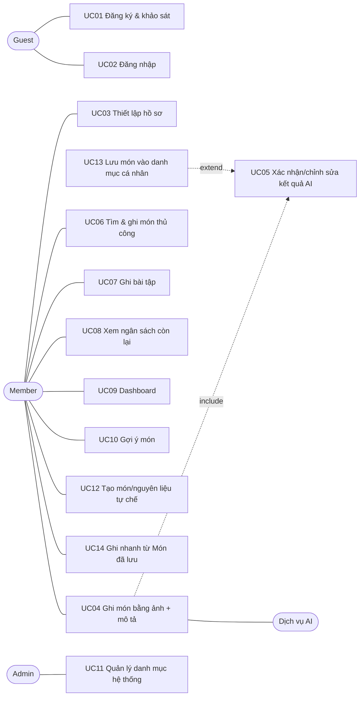
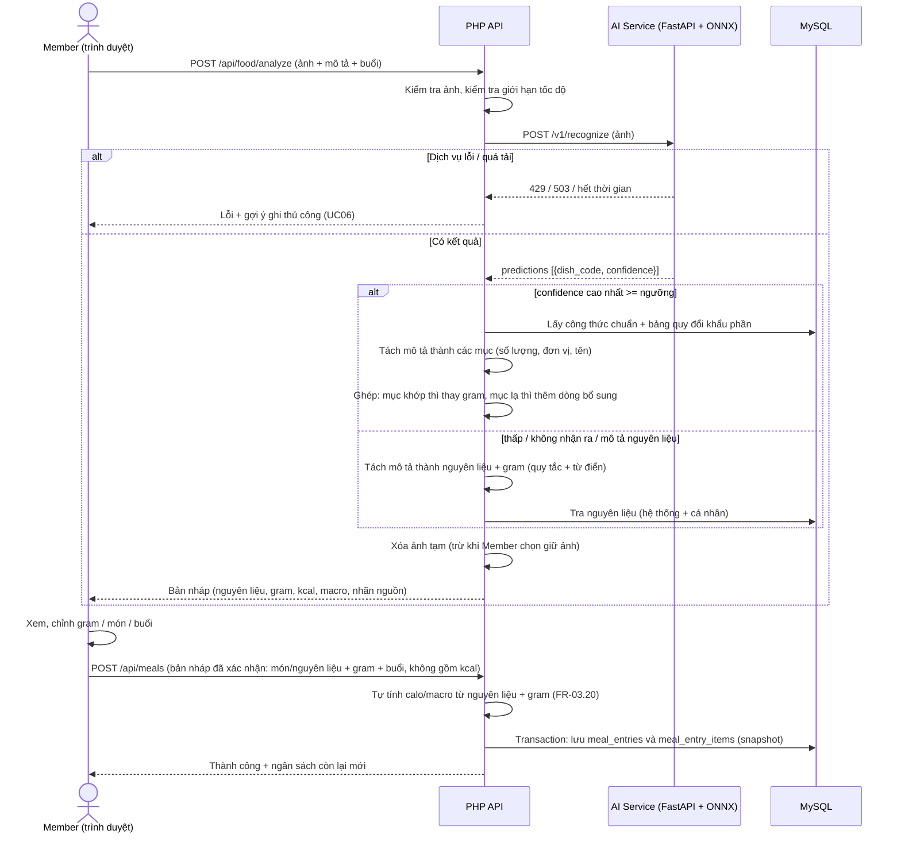
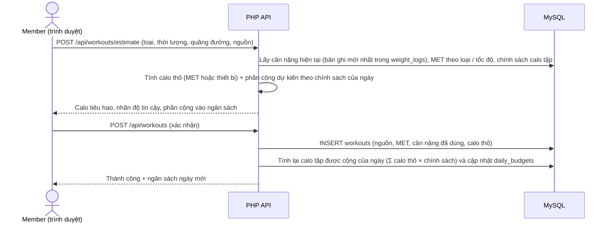

# FlexiDiet: Đặc Tả Use Case Chi Tiết – Bản nháp

> **Pha 2 – Elaboration, E1.** Nguồn: `01_business_modeling.md` (mục 8), `02_srs_requirements.md`.
> **Trạng thái:** Bản nháp. Cả 14 Use Case của 01 đều được đặc tả đầy đủ (mục 3). README Pha 2 ghi "6 Use Case cốt lõi"; UC03, UC04, UC05, UC07 là các UC *architecturally significant* theo 01 và có sequence diagram ở mục 4. Các vấn đề còn mở ghi ở SRS (mục 6).
> Giá trị gắn **[CẦN CHỐT]** chưa có căn cứ.
> **v1.1:** đồng bộ với SRS v1.1 (Baseline hệ số cố định, calo tập tính ở cấp ngày, quy tắc sửa mục nhật ký, server tự tính calo). Xem mục 5.

---

## 1. Sơ đồ Use Case (tổng quan)



---

---

## 2. Danh sách Use Case

Cả 14 Use Case của 01 đều được đặc tả đầy đủ ở mục 3; số mục 3.n trùng với số UC.

| ID | Use Case | Actor | Ưu tiên | Mô tả ngắn | Đặc tả |
|---|---|---|---|---|---|
| UC01 | Đăng ký và khảo sát | Guest | Must | Form 4 bước: tài khoản → thể chất → mục tiêu → hiển thị ngân sách và vào Dashboard. Tuổi phải từ 18 đến 80 | Mục 3.1 |
| UC02 | Đăng nhập (modal) | Guest | Must | Đăng nhập Email/Mật khẩu ngay trên trang chủ; sai thông tin thì báo lỗi chung, không nêu email hay mật khẩu sai | Mục 3.2 |
| UC03 | Thiết lập hồ sơ | Member | Must | Cập nhật chỉ số, mục tiêu, công thức BMR và chính sách calo tập | Mục 3.3 |
| UC04 | Ghi món bằng ảnh + mô tả | Member, Dịch vụ AI | Must | Ảnh và/hoặc mô tả → bản nháp món ăn | Mục 3.4 |
| UC05 | Xác nhận/chỉnh sửa kết quả AI | Member | Must | Duyệt bản nháp, sửa, ghi vào nhật ký dạng snapshot | Mục 3.5 |
| UC06 | Tìm và ghi món thủ công | Member | Must | Tìm trong danh mục hệ thống và cá nhân, chọn khẩu phần, chọn buổi, ghi snapshot. Đồng thời là đường dự phòng khi AI lỗi. Gồm sửa, xóa mục đã ghi | Mục 3.6 |
| UC07 | Ghi bài tập và quy đổi calo | Member | Must | Ghi buổi tập, tính calo tiêu hao, cộng vào ngân sách theo chính sách | Mục 3.7 |
| UC08 | Xem ngân sách còn lại | Member | Must | Hiển thị mục tiêu, calo tập được cộng, calo đã nạp và còn lại | Mục 3.8 |
| UC09 | Xem dashboard và tiến trình | Member | Should | Thanh năng lượng, macro, nước, cân nặng, tuân thủ ngân sách. Gồm ghi nước và cập nhật cân nặng | Mục 3.9 |
| UC10 | Xem gợi ý món bữa tiếp theo | Member | Could | Gợi ý theo calo/protein còn lại. Chỉ làm nếu còn dư | Mục 3.10 |
| UC11 | Quản lý danh mục hệ thống | Admin | Must (seed) / Should (UI) | Nạp và chỉnh nguyên liệu, công thức chuẩn, bảng quy đổi. Ở v1 chạy bằng script seed | Mục 3.11 |
| UC12 | Tạo món/nguyên liệu tự chế | Member | Must | Tạo nguyên liệu (gắn nhãn "tự nhập") hoặc món từ nguyên liệu + gram, lưu vào danh mục cá nhân | Mục 3.12 |
| UC13 | Lưu món vào danh mục cá nhân | Member | Must | Lưu món đã tính (từ AI, tạo tay hoặc từ nhật ký) dưới dạng nguyên liệu + gram | Mục 3.13 |
| UC14 | Ghi nhanh từ "Món đã lưu" | Member | Must | Ghi lại món đã lưu với hệ số khẩu phần | Mục 3.14 |

---

## 3. Đặc tả chi tiết

### 3.1. UC01 – Đăng ký và khảo sát

| Mục | Nội dung |
|---|---|
| Actor | Guest |
| Mục tiêu | Tạo tài khoản và hồ sơ thể chất, nhận ngân sách calo ngày đầu tiên |
| Tiền điều kiện | Guest chưa đăng nhập |
| Hậu điều kiện | Tài khoản, hồ sơ, cân nặng ban đầu và ngân sách của hôm nay được lưu; Guest trở thành Member đã đăng nhập và được chuyển vào Dashboard |
| Yêu cầu liên quan | FR-01.1, FR-01.2, FR-01.4 – FR-01.6, FR-01.10, FR-01.11, NFR-06 |

**Luồng chính**
1. Guest bấm "Đăng ký" ở trang chủ; hệ thống mở trang đăng ký nhiều bước.
2. **Bước 1 – Tài khoản:** Guest nhập email, mật khẩu, tên hiển thị. Hệ thống kiểm tra định dạng email, độ dài tối thiểu của mật khẩu và email chưa được dùng.
3. **Bước 2 – Chỉ số thể chất:** Guest nhập giới tính, ngày sinh, chiều cao, cân nặng hiện tại, số buổi tập mục tiêu mỗi tuần (0 – 7, chỉ dùng để nhắc nhở). Hệ thống kiểm tra khoảng hợp lệ, trong đó tuổi phải từ 18 đến 80.
4. **Bước 3 – Mục tiêu:** Guest chọn mục tiêu (giảm cân / duy trì / tăng cân / tăng cơ) và cân nặng mong muốn.
5. **Bước 4 – Khởi tạo:** hệ thống tính thử (chưa lưu) và hiển thị BMR, Baseline và ngân sách calo mục tiêu mỗi ngày, theo công thức Mifflin-St Jeor, hệ số sinh hoạt cố định (FR-01.6) và chính sách calo tập mặc định, kèm disclaimer y tế.
6. Guest xác nhận.
7. Hệ thống tính lại ở server, rồi trong một transaction tạo tài khoản (mật khẩu được băm), hồ sơ (không gồm cân nặng), bản ghi cân nặng ban đầu trong `weight_logs` và ngân sách của hôm nay (kèm chính sách calo tập của ngày).
8. Hệ thống tạo phiên đăng nhập và chuyển Guest vào Dashboard.

**Luồng thay thế**
- A1 (bước 2 – 5): Guest quay lại bước trước để sửa; dữ liệu đã nhập được giữ nguyên.
- A2 (bước 1): Guest đã có tài khoản → bấm "Đăng nhập" để mở modal (UC02).
- A3 (bước 5): ngân sách tính ra thấp hơn sàn calo → đặt bằng sàn và hiển thị cảnh báo an toàn (như UC03, E2).
- A4: Guest rời trang giữa chừng → chưa tạo gì, dữ liệu đã nhập bị bỏ.

**Luồng ngoại lệ**
- E1 (bước 2): email đã tồn tại → báo lỗi tại trường, ở lại bước 1.
- E2 (bước 2): mật khẩu không đạt độ dài tối thiểu → báo lỗi tại trường.
- E3 (bước 3): giá trị ngoài khoảng hợp lệ (kể cả tuổi ngoài 18 – 80) → báo lỗi tại trường và giải thích lý do; không cho sang bước kế.
- E4 (bước 7): lỗi CSDL → rollback, không tạo tài khoản, giữ dữ liệu đã nhập để thử lại.
- E5 (bước 7): email vừa bị người khác đăng ký trong lúc Guest đang điền → báo email đã tồn tại và quay lại bước 1.

---

### 3.2. UC02 – Đăng nhập (modal)

| Mục | Nội dung |
|---|---|
| Actor | Guest (đăng nhập); Member (đăng xuất) |
| Mục tiêu | Vào ứng dụng bằng tài khoản đã có, và thoát khỏi phiên khi xong |
| Tiền điều kiện | Guest đã có tài khoản và chưa đăng nhập |
| Hậu điều kiện | Phiên đăng nhập có thời hạn được tạo và Member được chuyển vào Dashboard; khi đăng xuất, phiên bị hủy |
| Yêu cầu liên quan | FR-01.3, NFR-06, NFR-07 |

**Luồng chính**
1. Guest bấm "Đăng nhập" trên trang chủ; hệ thống mở modal ngay trên trang, không chuyển trang.
2. Guest nhập email, mật khẩu và bấm "Đăng nhập".
3. Hệ thống kiểm tra định dạng đầu vào.
4. Hệ thống xác thực email và mật khẩu (so khớp với mật khẩu đã băm).
5. Hệ thống tạo phiên (cookie `HttpOnly`, `SameSite`, có thời hạn) và cấp mã chống CSRF.
6. Hệ thống đóng modal và chuyển Guest vào Dashboard.

**Luồng thay thế**
- A1 (bước 1): Guest chưa có tài khoản → bấm "Chưa có tài khoản? Đăng ký ngay" để sang UC01.
- A2: **Đăng xuất.** Member bấm "Đăng xuất" → hệ thống hủy phiên và chuyển về trang chủ.

**Luồng ngoại lệ**
- E1 (bước 4): sai thông tin → báo lỗi chung "Email hoặc mật khẩu không đúng", không nêu cái nào sai; modal giữ mở và giữ email đã nhập.
- E2: phiên hết hạn khi truy cập trang cần đăng nhập → chuyển về trang chủ và mở modal đăng nhập (NFR-07).
- E3 (bước 4 – 5): lỗi máy chủ → báo lỗi dễ hiểu và cho thử lại.

---

### 3.3. UC03 – Thiết lập hồ sơ, chọn công thức BMR và chính sách calo tập

| Mục | Nội dung |
|---|---|
| Actor | Member |
| Mục tiêu | Cập nhật chỉ số cơ thể, mục tiêu, công thức BMR và chính sách cộng calo tập, để hệ thống tính lại ngân sách |
| Tiền điều kiện | Member đã đăng nhập |
| Hậu điều kiện | Hồ sơ được lưu; ngân sách tính lại **từ ngày hôm nay trở đi**; ngân sách các ngày đã qua giữ nguyên |
| Yêu cầu liên quan | FR-01.4 – FR-01.11, FR-04.4 |

**Luồng chính**
1. Member mở trang Hồ sơ.
2. Hệ thống hiển thị thông tin hiện tại.
3. Member sửa chỉ số (giới tính, tuổi, chiều cao, cân nặng) và mục tiêu (kể cả số buổi tập mục tiêu mỗi tuần) (giảm / duy trì / tăng / tăng cơ, cân nặng mong muốn).
4. Member chọn công thức BMR (Mifflin-St Jeor mặc định hoặc Katch-McArdle).
5. Member chọn chính sách cộng calo tập (xem FR-04.4).
6. Member bấm Lưu.
7. Hệ thống kiểm tra tính hợp lệ.
8. Hệ thống tính BMR → Baseline → ngân sách mục tiêu (Strategy theo lựa chọn ở bước 4).
9. Hệ thống lưu hồ sơ (cân nặng qua `weight_logs`, không lưu trên `user_profiles`) và ghi ngân sách ngày hôm nay vào bảng ngân sách theo ngày, kèm chính sách calo tập đã chọn. Calo tập được cộng của hôm nay được tính lại theo chính sách mới; các ngày đã qua không đổi.
10. Hệ thống hiển thị ngân sách mới và thành phần tính toán.

**Luồng thay thế**
- A1 (bước 4): chọn Katch-McArdle nhưng chưa có % mỡ → yêu cầu nhập % mỡ, hoặc quay về Mifflin-St Jeor nếu Member từ chối.
- A2 (bước 3): Member cập nhật cân nặng → thêm một bản ghi cân nặng theo ngày để vẽ biểu đồ (UC09).

**Luồng ngoại lệ**
- E1 (bước 7): giá trị ngoài khoảng hợp lệ → báo lỗi tại trường, không lưu. Tuổi phải từ **18 đến 80** (công thức BMR dành cho người trưởng thành). Khoảng hợp lệ của chiều cao và cân nặng **[CẦN CHỐT]**.
- E2 (bước 8): ngân sách mục tiêu tính ra thấp hơn sàn calo (mặc định **1.500 kcal nam / 1.200 kcal nữ**) → đặt bằng sàn, hiển thị cảnh báo an toàn (R2).
- E3 (bước 9): lỗi CSDL → không lưu một phần (transaction), báo lỗi và cho thử lại.

---

### 3.4. UC04 – Ghi món ăn bằng ảnh + mô tả (AI)

| Mục | Nội dung |
|---|---|
| Actor | Member (chính), Dịch vụ AI (phụ) |
| Mục tiêu | Từ ảnh và mô tả ngắn, tạo bản nháp món ăn gồm nguyên liệu, gram, calo, macro |
| Tiền điều kiện | Member đã đăng nhập |
| Hậu điều kiện | Có **bản nháp** để xác nhận ở UC05. **Chưa ghi nhật ký** và chưa ảnh hưởng ngân sách |
| Yêu cầu liên quan | FR-03.1 – FR-03.6, FR-03.8, FR-03.15, FR-03.17, FR-03.18 |
| Rủi ro | R3, R4, R6, R8 |

**Luồng chính**
1. Member mở trang Nhật ký ăn uống, chọn buổi (sáng / trưa / tối / phụ).
2. Member chụp hoặc tải ảnh, nhập mô tả khẩu phần (ví dụ "1 bát cơm, 1 đùi gà, 1 trứng ốp la") và bấm "Phân tích AI". Member có thể chọn (mặc định tắt) "Lưu ảnh vào nhật ký" hoặc "Cho phép dùng ảnh để cải thiện mô hình".
3. Hệ thống kiểm tra ảnh (loại tệp, kích thước) và giới hạn tốc độ theo người dùng (mặc định 10 lần/phút).
4. Hệ thống gửi ảnh tới dịch vụ AI.
5. Dịch vụ AI trả danh sách món dự đoán kèm độ tin cậy.
6. **Nếu độ tin cậy cao nhất ≥ ngưỡng (giá trị chốt sau PoC):** hệ thống lấy công thức chuẩn của món (đường nhận diện).
7. Hệ thống tách mô tả thành các mục (số lượng + đơn vị + tên) và quy đổi sang gram (có xét sống/chín).
8. Hệ thống **ghép** công thức với mô tả: mục khớp nguyên liệu của công thức thì dùng gram từ mô tả thay cho gram công thức; nguyên liệu của công thức không được nhắc thì giữ gram chuẩn nhân hệ số khẩu phần món (mặc định ×1); mục không khớp công thức (ví dụ trứng ốp la) thì thêm thành dòng bổ sung gắn nhãn "từ mô tả".
9. Hệ thống trả bản nháp gồm món, nguyên liệu, gram, kcal, protein/carb/fat, nhãn nguồn, nhãn "từ mô tả" và độ tin cậy.
10. Chuyển sang UC05.

**Luồng thay thế**
- A1 (bước 6): độ tin cậy < ngưỡng, hoặc mô tả liệt kê nguyên liệu → **đường nguyên liệu**: tách mô tả thành nguyên liệu + gram bằng quy tắc và từ điển đồng nghĩa (D20), tra CSDL nguyên liệu, tổng hợp bản nháp.
- A2 (bước 2): Member chỉ có mô tả, không có ảnh → bỏ bước 4 – 6, đi thẳng đường nguyên liệu.
- A3 (bước 5): dịch vụ AI trả "không nhận ra" → gợi ý Member mô tả bằng nguyên liệu hoặc chuyển UC06.
- A4 (sau bước 9): ảnh tạm bị xóa ngay, trừ khi Member đã chọn giữ ảnh ở bước 2. Ảnh được giữ gắn với bản nháp và bị dọn khi quá hạn nếu Member không xác nhận.

**Luồng ngoại lệ**
- E1 (bước 3): tệp không hợp lệ → báo lỗi, không gọi AI.
- E2 (bước 3): vượt giới hạn tốc độ → báo thử lại sau, đồng thời đề xuất UC06.
- E3 (bước 4): dịch vụ AI hết thời gian hoặc quá tải (HTTP 429/503) → báo lỗi dễ hiểu và đề xuất UC06. Các chức năng khác vẫn dùng được (NFR-12).
- E4 (bước 7): đơn vị khẩu phần không có trong bảng quy đổi → hỏi Member nhập gram trực tiếp.

---

### 3.5. UC05 – Xác nhận / chỉnh sửa kết quả AI

| Mục | Nội dung |
|---|---|
| Actor | Member |
| Mục tiêu | Duyệt bản nháp, sửa nếu cần, rồi ghi vào nhật ký |
| Tiền điều kiện | Có bản nháp từ UC04 |
| Hậu điều kiện | Một mục nhật ký **dạng snapshot** được tạo; ngân sách còn lại cập nhật |
| Yêu cầu liên quan | FR-03.7, FR-03.10, FR-03.16, FR-03.18, NFR-05, NFR-10 |
| Ghi chú | Bước xác nhận **không được cắt** khỏi phạm vi (01, mục 11.3) |

**Luồng chính**
1. Hệ thống hiển thị bản nháp, mỗi dòng nguyên liệu kèm gram, calo và nhãn nguồn.
2. Member xem và chỉnh khi cần: đổi món, thêm/bớt nguyên liệu, sửa gram, đổi buổi.
3. Hệ thống tính lại tổng calo/macro ngay khi Member sửa.
4. Member bấm Xác nhận.
5. Hệ thống **tự tính lại** calo/macro từ nguyên liệu + gram (không dùng giá trị dinh dưỡng do trình duyệt gửi, FR-03.20), rồi ghi mục nhật ký trong một transaction: tổng calo/macro, tên món, từng nguyên liệu với gram và giá trị dinh dưỡng **tại thời điểm ghi**.
6. Hệ thống hiển thị ngân sách còn lại mới (UC08).

**Luồng thay thế**
- A1 (bước 4): Member chọn "Lưu vào Món đã lưu" → thực hiện UC13.
- A2 (bước 2): Member đổi sang món khác bằng cách tìm thủ công (UC06) hoặc thêm nguyên liệu tự chế (UC12).
- A3 (bước 2): Member sửa kết quả AI và đã đồng ý chia sẻ phản hồi → ghi cặp (món dự đoán, món đã sửa) để dùng ngoại tuyến (Could).
- A4: Member hủy → bản nháp bị bỏ, không ghi gì; ảnh tạm (nếu có) bị xóa.
- A5 (bước 5): nếu Member đã chọn lúc tải lên, ảnh tạm được chuyển thành ảnh lưu của mục nhật ký ("Lưu ảnh vào nhật ký") hoặc đi kèm bản ghi phản hồi AI ("Cho phép dùng ảnh để cải thiện mô hình"); nếu không, ảnh đã bị xóa từ UC04.

**Luồng ngoại lệ**
- E1 (bước 2): gram ngoài khoảng 0,1 – 2.000 g → báo lỗi tại trường, không cho xác nhận.
- E2 (bước 5): lỗi CSDL → transaction rollback, giữ bản nháp trên màn hình để Member thử lại.

---

### 3.6. UC06 – Tìm và ghi món thủ công

| Mục | Nội dung |
|---|---|
| Actor | Member |
| Mục tiêu | Ghi một món vào nhật ký mà không cần AI, đồng thời là đường dự phòng khi AI lỗi hoặc không nhận ra |
| Tiền điều kiện | Member đã đăng nhập |
| Hậu điều kiện | Một mục nhật ký **dạng snapshot** được tạo; ngân sách còn lại cập nhật |
| Yêu cầu liên quan | FR-03.6, FR-03.9 – FR-03.11, NFR-10, NFR-12 |

**Luồng chính**
1. Member mở trang Nhật ký ăn uống, chọn ngày (mặc định hôm nay) và buổi (sáng / trưa / tối / phụ).
2. Member chọn "Tìm món" và nhập từ khóa.
3. Hệ thống tìm trong danh mục hệ thống và danh mục cá nhân (chỉ các mục đang hoạt động), hiển thị kết quả kèm nhãn nguồn.
4. Member chọn một món hoặc nguyên liệu.
5. Hệ thống hiển thị khẩu phần mặc định; Member nhập số lượng và đơn vị (bát, chén, dĩa, miếng, gram...).
6. Hệ thống quy đổi sang gram (có xét sống/chín) và tính calo, protein/carb/fat.
7. Member có thể thêm món hoặc nguyên liệu khác vào cùng mục (lặp bước 2 – 6), rồi bấm Xác nhận.
8. Hệ thống ghi mục nhật ký dạng snapshot trong một transaction, như UC05 bước 5, và hiển thị ngân sách còn lại mới (UC08).

**Luồng thay thế**
- A1 (bước 3): không có kết quả → gợi ý tạo nguyên liệu hoặc món tự chế (UC12).
- A2 (bước 2): Member chọn từ "Món đã lưu" → thực hiện UC14.
- A3: UC06 được mở từ gợi ý của UC04 khi AI lỗi, quá tải hoặc không nhận ra; buổi và ngày đã chọn được giữ.
- A4: **Sửa mục đã ghi.** Member chọn một mục trong nhật ký, đổi gram, thêm hoặc bớt nguyên liệu hoặc đổi buổi, rồi lưu → trình duyệt chỉ gửi mã dòng đã lưu, gram và nguyên liệu mới (nếu có); hệ thống tính lại trong một transaction theo quy tắc (FR-03.19, FR-03.20): dòng giữ nguyên nguyên liệu và gram thì **giữ giá trị dinh dưỡng đã lưu**; dòng bị sửa gram hoặc thêm mới thì dùng giá trị dinh dưỡng hiện hành; dòng bị gỡ thì xóa. Sau đó cập nhật ngân sách còn lại của ngày đó.
- A5: **Xóa mục đã ghi.** Member bấm Xóa và xác nhận → hệ thống xóa mục cùng các dòng nguyên liệu của nó và cập nhật ngân sách còn lại của ngày đó.

**Luồng ngoại lệ**
- E1 (bước 5): đơn vị không có trong bảng quy đổi của món hoặc nguyên liệu → hỏi Member nhập gram trực tiếp.
- E2 (bước 5): gram ngoài khoảng 0,1 – 2.000 g → báo lỗi tại trường.
- E3 (bước 8): lỗi CSDL → transaction rollback, giữ nội dung trên màn hình để thử lại.

---

### 3.7. UC07 – Ghi nhận bài tập và quy đổi calo

| Mục | Nội dung |
|---|---|
| Actor | Member |
| Mục tiêu | Ghi buổi tập, tính calo tiêu hao và phần được cộng vào ngân sách |
| Tiền điều kiện | Member đã đăng nhập và có cân nặng trong hồ sơ |
| Hậu điều kiện | Có bản ghi buổi tập kèm nguồn, độ tin cậy và **calo thô**; ngân sách ngày được tính lại theo chính sách của ngày |
| Yêu cầu liên quan | FR-04.1 – FR-04.7, FR-02.5 |

**Luồng chính**
1. Member mở trang Nhật ký luyện tập, chọn loại bài tập (chạy bộ, đạp xe, gym, bơi...) và ngày.
2. Member nhập thời lượng (và quãng đường nếu có).
3. Member chọn nguồn calo: "Tính theo MET" (mặc định) hoặc "Nhập từ thiết bị".
4. Với MET: hệ thống chọn MET theo loại bài tập (và tốc độ nếu có quãng đường), tính `MET × cân nặng (kg) × giờ`.
5. Hệ thống hiển thị calo tiêu hao, nhãn độ tin cậy và phần calo được cộng theo chính sách hiện chọn.
6. Member bấm Lưu.
7. Hệ thống lưu buổi tập cùng cân nặng đã dùng, nguồn, MET và **calo thô** (không lưu hệ số cộng, FR-04.7).
8. Hệ thống tính lại calo tập được cộng của ngày: áp chính sách của ngày lên tổng calo thô các buổi, rồi cập nhật ngân sách ngày (FR-04.4).

**Luồng thay thế**
- A1 (bước 3): chọn "Nhập từ thiết bị" → Member nhập **active calories** (giao diện ghi chú rõ là không gồm BMR); độ tin cậy "cao".
- A2 (bước 2): bài tập đi bộ hoặc chạy có quãng đường → tính tốc độ trung bình và chọn MET theo khoảng tốc độ. Số bước chân (nếu nhập) chỉ dùng để quy ra quãng đường, không là nguồn calo riêng (D12).
- A3: Member sửa hoặc xóa buổi tập → ngân sách ngày tính lại.
- A4: calo được cộng luôn tính **ở cấp ngày** từ tổng calo thô Σ của các buổi (cộng toàn bộ: Σ; một phần: 0,5 × Σ; có trần: min(Σ, 500 kcal)), nên không có việc cắt phần vượt trần cho từng buổi. Thêm, sửa hoặc xóa buổi tập, hoặc đổi chính sách, thì tính lại cho cả ngày.

**Luồng ngoại lệ**
- E1 (bước 2): thời lượng ≤ 0 hoặc vượt mức hợp lý **[CẦN CHỐT]** → báo lỗi.
- E2 (bước 4): chưa có cân nặng → yêu cầu cập nhật hồ sơ (UC03).
- E3 (bước 3, thiết bị): calo nhập vượt trần hợp lý so với thời lượng → cảnh báo, cho Member xác nhận lại.

---

### 3.8. UC08 – Xem ngân sách calo còn lại

| Mục | Nội dung |
|---|---|
| Actor | Member |
| Mục tiêu | Biết hôm nay còn được ăn bao nhiêu và vì sao |
| Tiền điều kiện | Member đã đăng nhập, đã có hồ sơ |
| Hậu điều kiện | Không thay đổi dữ liệu |
| Yêu cầu liên quan | FR-02.1 – FR-02.5 |

**Luồng chính**
1. Member mở Dashboard hoặc thanh năng lượng ngày.
2. Hệ thống đọc ngân sách mục tiêu của ngày (bản đã lưu theo ngày, kèm chính sách calo tập của ngày), các buổi tập (calo thô) và các mục nhật ký ăn của ngày.
3. Hệ thống tính: `Ngân sách = mục tiêu + calo tập được cộng` (tính ở cấp ngày từ Σ calo thô theo chính sách của ngày); `Còn lại = Ngân sách − Σ calo đã nạp`.
4. Hệ thống hiển thị Còn lại cùng ba thành phần, cập nhật mỗi khi ghi/sửa/xóa món hoặc bài tập.

**Luồng thay thế**
- A1: Member chọn xem ngày khác → dùng ngân sách đã lưu của ngày đó.
- A2: Còn lại < 0 → hiển thị trạng thái vượt ngân sách, không chặn thao tác nào.

**Luồng ngoại lệ**
- E1: chưa có ngân sách lưu cho ngày hiện tại (ví dụ Member mới đăng nhập sau nhiều ngày) → hệ thống tạo ngân sách ngày từ hồ sơ hiện hành rồi hiển thị.

---

### 3.9. UC09 – Xem dashboard và tiến trình

| Mục | Nội dung |
|---|---|
| Actor | Member |
| Mục tiêu | Nắm tình hình trong ngày và xu hướng dài hạn; ghi nhanh lượng nước và cân nặng |
| Tiền điều kiện | Member đã đăng nhập và có hồ sơ |
| Hậu điều kiện | Khi chỉ xem, không đổi dữ liệu. Khi ghi nước hoặc cân nặng, bản ghi tương ứng được thêm |
| Yêu cầu liên quan | FR-06.1 – FR-06.7 |
| Ưu tiên | Should |

**Luồng chính**
1. Member mở Dashboard (mặc định là hôm nay).
2. Hệ thống hiển thị thanh năng lượng ngày (ngân sách, calo tập được cộng, calo đã nạp, còn lại; UC08), biểu đồ protein/carb/fat trong ngày, danh sách các món đã ăn, tổng lượng nước và tiến độ buổi tập trong tuần (số buổi đã tập / mục tiêu).
3. Member chọn khoảng xem (tuần hoặc tháng).
4. Hệ thống hiển thị biểu đồ cân nặng và biểu đồ mức tuân thủ ngân sách theo ngày hoặc tuần.

**Luồng thay thế**
- A1 (bước 2): **Ghi nước.** Member bấm nút thêm nước và chọn lượng (ml) → hệ thống lưu và cập nhật tổng trong ngày.
- A2 (bước 2): **Cập nhật cân nặng.** Member nhập cân nặng và ngày → hệ thống lưu vào nhật ký cân nặng (mỗi ngày một bản ghi, ghi lại thì thay thế) và vẽ lại biểu đồ. Việc này **không đổi ngân sách đã lưu của hôm nay**; ngân sách của các ngày mới dùng cân nặng mới nhất. Muốn tính lại ngay, Member lưu hồ sơ ở UC03.
- A3 (bước 1): Member chọn ngày khác → hiển thị dữ liệu của ngày đó.
- A4: khi trễ tiến độ và phải cắt phạm vi, Dashboard rút gọn còn biểu đồ calo và macro trong ngày (01, mục 11.3); thanh "Còn lại" luôn được giữ (FR-02.2). Phần nhắc nhở tần suất (A5) bị cắt đầu tiên.
- A5: **Nhắc nhở tần suất.** Khi số buổi tập trong tuần thấp hơn tiến độ so với mục tiêu (cách tính **[CẦN CHỐT]**) → hiển thị nhắc nhở trung tính (ví dụ "Tuần này bạn mới tập 1/3 buổi"), Member tắt được. Việc này **không đổi ngân sách** và không gắn với chuyện được ăn thêm (FR-06.7).

**Luồng ngoại lệ**
- E1 (bước 2): chưa có dữ liệu → hiển thị trạng thái trống kèm hướng dẫn ghi món đầu tiên.
- E2 (A2): cân nặng ngoài khoảng hợp lý (theo cấu hình) → báo lỗi tại trường.
- E3 (A1): lượng nước ≤ 0 hoặc vượt mức hợp lý (theo cấu hình) → từ chối.

---

### 3.10. UC10 – Xem gợi ý món cho bữa tiếp theo

| Mục | Nội dung |
|---|---|
| Actor | Member |
| Mục tiêu | Gợi ý món phù hợp với lượng calo và protein còn thiếu trong ngày |
| Tiền điều kiện | Member đã đăng nhập và có ngân sách của hôm nay |
| Hậu điều kiện | Không đổi dữ liệu (nếu Member ghi món được gợi ý thì thực hiện UC14 hoặc UC06) |
| Yêu cầu liên quan | FR-05.1 – FR-05.3 |
| Ưu tiên | Could: chỉ làm nếu còn dư thời gian |

**Luồng chính**
1. Member mở trang Gợi ý món.
2. Hệ thống tính phần còn lại: calo (UC08) và lượng protein còn thiếu trong ngày.
3. Hệ thống hiển thị thanh "Bạn còn thiếu X kcal và Y g protein cho hôm nay".
4. Hệ thống lấy các món đang hoạt động trong danh mục hệ thống và danh mục cá nhân có calo mỗi khẩu phần chuẩn không vượt phần còn lại, xếp theo mức gần với lượng còn thiếu.
5. Hệ thống hiển thị danh sách thẻ món (tên, kcal, protein, nhãn nguồn).
6. Member áp dụng bộ lọc (nhiều protein, món Việt, dễ làm, dưới 400 kcal) để thu hẹp danh sách.
7. Member chọn một món để ghi nhanh (UC14 nếu là món đã lưu, UC06 nếu là món khác).

**Luồng thay thế**
- A1 (bước 2): phần còn lại ≤ 0 → hiển thị "Hôm nay bạn đã đạt ngân sách", không gợi ý thêm món.
- A2 (bước 4): không có món phù hợp → hiển thị trạng thái trống và gợi ý tạo món tự chế (UC12).

**Luồng ngoại lệ**
- E1 (bước 4): lỗi tải danh sách → báo lỗi dễ hiểu và cho thử lại; các chức năng khác không bị ảnh hưởng.

---

### 3.11. UC11 – Quản lý danh mục hệ thống

| Mục | Nội dung |
|---|---|
| Actor | Admin |
| Mục tiêu | Nạp và chỉnh nguyên liệu, công thức chuẩn, bảng quy đổi khẩu phần và bảng MET |
| Tiền điều kiện | Ở v1: Admin có quyền chạy script trên server. Với giao diện quản trị: có tài khoản vai trò Admin |
| Hậu điều kiện | Danh mục hệ thống được cập nhật; **các mục nhật ký đã ghi không đổi** (snapshot) |
| Yêu cầu liên quan | FR-07.1 – FR-07.4 |
| Ưu tiên | Must (script seed), Should (giao diện quản trị) |

**Luồng chính** (v1, script seed)
1. Admin chuẩn bị dữ liệu nguồn (nguyên liệu, công thức, quy đổi khẩu phần, MET) đúng định dạng của script.
2. Admin chạy các script `seed_ingredients`, `seed_recipes`, `seed_portions`, `seed_exercise`.
3. Script kiểm tra dữ liệu: tên không rỗng, giá trị dinh dưỡng không âm, gram trong khoảng hợp lệ, nguyên liệu của công thức tồn tại, `dish_code` duy nhất, đơn vị quy đổi hợp lệ.
4. Script ghi dữ liệu trong một transaction, theo khóa tự nhiên nên chạy lại nhiều lần không nhân đôi dòng.
5. Script in báo cáo: số dòng thêm, cập nhật, bỏ qua và lỗi.

**Luồng thay thế**
- A1: **Sửa một nguyên liệu sai.** Admin sửa trong dữ liệu nguồn rồi chạy lại script → các công thức và món đã lưu dùng nguyên liệu này tính đúng ở lần dùng sau; mục nhật ký cũ không đổi (FR-07.2).
- A2: **Ngưng dùng.** Admin đặt nguyên liệu hoặc món về trạng thái ngưng dùng thay vì xóa cứng.
- A3 (Should): **Qua giao diện quản trị.** Admin đăng nhập, mở trang quản trị và thêm, sửa, ngưng dùng các mục; chỉ vai trò Admin truy cập được (FR-07.4).
- A4: món hệ thống có `dish_code` được dùng để khớp nhãn của mô hình AI; thêm món mới cho AI nhận diện cần `dish_code` trùng nhãn.

**Luồng ngoại lệ**
- E1 (bước 3): dữ liệu vi phạm → script dừng toàn bộ, báo dòng lỗi và không ghi gì.
- E2 (bước 3): công thức tham chiếu nguyên liệu không tồn tại → báo lỗi như E1.
- E3 (A3): người dùng không phải Admin truy cập trang quản trị → từ chối (403).

---

### 3.12. UC12 – Tạo món hoặc nguyên liệu tự chế

| Mục | Nội dung |
|---|---|
| Actor | Member |
| Mục tiêu | Thêm vào danh mục cá nhân nguyên liệu hoặc món mà danh mục hệ thống chưa có |
| Tiền điều kiện | Member đã đăng nhập |
| Hậu điều kiện | Bản ghi mới nằm trong **danh mục cá nhân** của Member; không có kênh đưa vào danh mục chung (D22) |
| Yêu cầu liên quan | FR-03.12 |

**Luồng chính**
1. Member chọn "Tạo nguyên liệu" hoặc "Tạo món" (từ trang Nhật ký, hoặc từ UC05, UC06).
2. **Tạo nguyên liệu:** Member nhập tên, calo, protein, carb, fat trên 100 g và trạng thái sống/chín.
3. Hệ thống gắn nhãn nguồn "tự nhập" (độ tin cậy thấp) cho nguyên liệu này.
4. **Tạo món:** Member nhập tên, thêm các nguyên liệu (từ danh mục hệ thống hoặc cá nhân) với gram cho một khẩu phần chuẩn.
5. Hệ thống tính và hiển thị tổng calo, protein/carb/fat của món.
6. Member bấm Lưu; hệ thống ghi vào danh mục cá nhân trong một transaction.
7. Món hoặc nguyên liệu mới dùng được ở UC06, UC14 và UC10.

**Luồng thay thế**
- A1: tạo ngay trong UC05 khi AI thiếu một nguyên liệu → sau khi lưu, quay lại bản nháp với nguyên liệu mới đã được thêm.
- A2: Member sửa món hoặc nguyên liệu cá nhân → được phép; mục nhật ký đã ghi không đổi, còn món đã lưu dùng nguyên liệu đó tính theo giá trị mới ở lần dùng sau.
- A3: Member xóa món cá nhân → được phép; các mục nhật ký từng ghi từ món đó vẫn còn nhờ snapshot, chỉ mất liên kết nguồn.
- A4: Member xóa nguyên liệu cá nhân đang nằm trong một món → bị chặn; hệ thống báo "đang dùng trong món X" và đề nghị gỡ khỏi món hoặc ngưng dùng.

**Luồng ngoại lệ**
- E1 (bước 2, 4): tên rỗng, hoặc món chưa có nguyên liệu nào → báo lỗi tại trường.
- E2 (bước 2): giá trị âm, hoặc tổng protein + carb + fat vượt 100 g trên 100 g nguyên liệu → báo lỗi.
- E3 (bước 4): gram ngoài khoảng 0,1 – 2.000 g → báo lỗi tại trường.
- E4 (bước 6): lỗi CSDL → rollback, giữ nội dung đã nhập để thử lại.

---

### 3.13. UC13 – Lưu món vào danh mục cá nhân ("Món đã lưu")

| Mục | Nội dung |
|---|---|
| Actor | Member |
| Mục tiêu | Lưu một món đã tính toán dưới dạng nguyên liệu + gram để dùng lại mà không cần chụp và mô tả lại (D23) |
| Tiền điều kiện | Có một món đã tính toán: bản nháp (UC05), mục nhật ký đã ghi hoặc món vừa tạo (UC12) |
| Hậu điều kiện | Một món mới trong danh mục cá nhân, lưu theo công thức nguyên liệu + gram |
| Yêu cầu liên quan | FR-03.13 |

**Luồng chính**
1. Member bấm "Lưu vào Món đã lưu" ở bản nháp (UC05, A1), ở một mục nhật ký đã ghi hoặc ở form tạo món (UC12).
2. Hệ thống hiển thị tên gợi ý và danh sách nguyên liệu + gram; khối lượng hiện tại được coi là một khẩu phần chuẩn (hệ số ×1).
3. Member đặt tên và sửa nếu cần.
4. Member xác nhận.
5. Hệ thống ghi món và các dòng nguyên liệu vào danh mục cá nhân trong một transaction.
6. Món xuất hiện trong danh sách "Món đã lưu" để dùng ở UC14.

**Luồng thay thế**
- A1 (bước 4): Member đã có món trùng tên → hệ thống hỏi ghi đè công thức cũ hoặc đặt tên khác.
- A2 (bước 1): lưu từ một mục nhật ký cũ có nguyên liệu không còn trong danh mục → báo rõ và cho Member thay hoặc bỏ nguyên liệu đó trước khi lưu.
- A3: Member hủy → không lưu gì.

**Luồng ngoại lệ**
- E1 (bước 3): tên rỗng → báo lỗi tại trường.
- E2 (bước 4): món không còn nguyên liệu nào → không cho lưu.
- E3 (bước 5): lỗi CSDL → rollback, giữ nội dung để thử lại.

---

### 3.14. UC14 – Ghi nhanh từ "Món đã lưu"

| Mục | Nội dung |
|---|---|
| Actor | Member |
| Mục tiêu | Ghi lại một món đã lưu mà không cần chụp và mô tả lại |
| Tiền điều kiện | Member có ít nhất một "Món đã lưu" |
| Hậu điều kiện | Một mục nhật ký snapshot được tạo từ công thức đã lưu, nhân theo hệ số khẩu phần |
| Yêu cầu liên quan | FR-03.13, FR-03.14, FR-03.10 |

**Luồng chính**
1. Member mở danh sách "Món đã lưu" và chọn một món.
2. Hệ thống hiển thị công thức (nguyên liệu + gram) với hệ số khẩu phần mặc định ×1.
3. Member chọn nhanh hệ số (×0.5, ×1, ×1.5...) hoặc nhập số khác, và chọn buổi.
4. Hệ thống tính lại gram, calo, macro **từ giá trị dinh dưỡng hiện hành của nguyên liệu**.
5. Member xác nhận; hệ thống ghi mục nhật ký dạng snapshot (như UC05 bước 5).

**Luồng thay thế**
- A1 (bước 3): Member sửa gram từng nguyên liệu trước khi xác nhận.

**Luồng ngoại lệ**
- E1 (bước 4): một nguyên liệu của món đã lưu đã bị ngưng dùng → thông báo và cho Member thay hoặc bỏ nguyên liệu đó. Nguyên liệu hệ thống chỉ được ngưng dùng, không xóa cứng; nguyên liệu cá nhân đang nằm trong một món thì bị chặn xóa.

---

## 4. Sequence Diagram

### 4.1. UC04 + UC05 – Ghi món bằng AI rồi xác nhận



### 4.2. UC07 – Ghi bài tập



### 4.3. UC03 – Cập nhật hồ sơ

```mermaid
sequenceDiagram
    actor U as Member (trình duyệt)
    participant P as PHP API
    participant D as MySQL

    U->>P: PUT /api/profile (chỉ số, mục tiêu, công thức BMR, chính sách)
    P->>P: Kiểm tra hợp lệ
    P->>P: Energy Engine: BMR (Strategy) -> Baseline -> ngân sách mục tiêu (áp sàn calo)
    P->>D: Transaction: cập nhật user_profiles (không gồm cân nặng), weight_logs (nếu cân nặng thay đổi) và daily_budgets (hôm nay, kèm chính sách calo tập; tính lại calo tập được cộng)
    P-->>U: Ngân sách mới + cảnh báo nếu chạm sàn
```

---

## 5. Lịch sử thay đổi (v1.0 → v1.1)

| UC / mục | Thay đổi |
|---|---|
| UC01, UC03 | Bỏ trường "mức độ vận động", thay bằng số buổi tập mục tiêu (chỉ nhắc nhở); Baseline dùng hệ số sinh hoạt cố định; ngân sách ngày lưu kèm chính sách calo tập |
| UC05, UC06 | Server tự tính calo (FR-03.20); UC06 A4 thêm quy tắc giữ giá trị cũ cho dòng không sửa (FR-03.19) |
| UC07 | Buổi tập chỉ lưu calo thô; calo được cộng tính ở cấp ngày (bỏ việc cắt trần theo từng buổi) |
| UC08 | Công thức hiển thị theo calo tập được cộng cấp ngày |
| UC09 | Thêm tiến độ buổi tập và nhắc nhở tần suất (A5, Should, bị cắt đầu tiên) |
| Sequence 4.1 – 4.3 | Cập nhật theo các thay đổi trên |
| Cân nặng | `user_profiles` không giữ cột cân nặng; "cân nặng hiện tại" = bản ghi mới nhất trong `weight_logs`. UC01/UC03/UC07/UC09 đều ghi hoặc đọc từ `weight_logs` |
