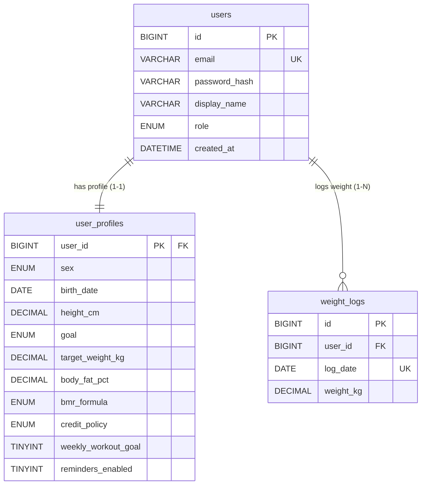

# Phân Hệ 1: Quản Lý Người Dùng, Hồ Sơ & Cân Nặng

> **Thuộc thư mục:** `docs/02_elaboration/database_design/`  
> **Các bảng trực thuộc:** `users`, `user_profiles`, `weight_logs`  
> **Quyết định thiết kế liên quan:** **DD1** (Cân nặng: Một nguồn chân lý duy nhất tại `weight_logs`).

---

## 1. Sơ Đồ Thực Thể Phân Hệ (ERD)

---

## 2. Từ Điển Dữ Liệu Chi Tiết (Data Dictionary)

### 2.1. Bảng `users`
Lưu trữ định danh tài khoản đăng nhập và phân quyền hệ thống.

| Cột | Kiểu dữ liệu | Null | Mặc định | Ý nghĩa & Quy tắc |
|---|---|:---:|---|---|
| `id` | `BIGINT UNSIGNED` | No | AUTO_INCREMENT | Khóa chính |
| `email` | `VARCHAR(255)` | No | | Địa chỉ email đăng nhập (chuẩn hóa chữ thường, duy nhất) |
| `password_hash` | `VARCHAR(255)` | No | | Chuỗi băm mật khẩu (`password_hash()` BCRYPT/Argon2id của PHP) |
| `display_name` | `VARCHAR(100)` | No | | Tên hiển thị của người dùng |
| `role` | `ENUM('member','admin')` | No | `'member'` | Quyền hạn: Quản trị viên hệ thống hoặc Thành viên |
| `created_at` | `DATETIME` | No | `CURRENT_TIMESTAMP` | Thời điểm tạo tài khoản |
| `updated_at` | `DATETIME` | No | `CURRENT_TIMESTAMP ON UPDATE CURRENT_TIMESTAMP` | Thời điểm cập nhật cuối |

* **Khóa chính:** `PRIMARY KEY (id)`
* **Ràng buộc duy nhất:** `UNIQUE KEY uq_users_email (email)`

---

### 2.2. Bảng `user_profiles`
Lưu trữ thông tin sinh học, mục tiêu cân nặng, công thức BMR và chính sách calo mặc định.  
*(Ghi chú DD1: Cột cân nặng đã được lược bỏ hoàn toàn; cân nặng hiện tại được truy vấn từ `weight_logs`).*

| Cột | Kiểu dữ liệu | Null | Mặc định | Ý nghĩa & Quy tắc |
|---|---|:---:|---|---|
| `user_id` | `BIGINT UNSIGNED` | No | | Khóa chính, tham chiếu tới `users.id` |
| `sex` | `ENUM('male','female')` | No | | Giới tính sinh học (phục vụ tính BMR) |
| `birth_date` | `DATE` | No | | Ngày sinh (dùng tính tuổi chính xác theo ngày) |
| `height_cm` | `DECIMAL(5,1)` | No | | Chiều cao tính bằng cm (phải > 0) |
| `goal` | `ENUM('lose','maintain','gain','build_muscle')` | No | | Mục tiêu vóc dáng |
| `target_weight_kg` | `DECIMAL(5,2)` | Yes | `NULL` | Cân nặng mục tiêu kỳ vọng (kg) |
| `body_fat_pct` | `DECIMAL(4,1)` | Yes | `NULL` | Tỷ lệ mỡ cơ thể % (bắt buộc nếu dùng Katch-McArdle) |
| `bmr_formula` | `ENUM('mifflin_st_jeor','katch_mcardle')` | No | `'mifflin_st_jeor'` | Công thức tính BMR được lựa chọn |
| `credit_policy` | `ENUM('full','partial','capped')` | No | `'partial'` | Chính sách cộng calo tập luyện mặc định |
| `weekly_workout_goal` | `TINYINT UNSIGNED` | No | | Số buổi tập mục tiêu mỗi tuần (0 đến 7) |
| `reminders_enabled` | `TINYINT(1)` | No | `1` | Cờ bật/tắt nhắc nhở ghi nhật ký |
| `created_at` | `DATETIME` | No | `CURRENT_TIMESTAMP` | Thời điểm tạo hồ sơ |
| `updated_at` | `DATETIME` | No | `CURRENT_TIMESTAMP ON UPDATE CURRENT_TIMESTAMP` | Thời điểm cập nhật cuối |

* **Khóa chính:** `PRIMARY KEY (user_id)`
* **Khóa ngoại:** `CONSTRAINT fk_profiles_user FOREIGN KEY (user_id) REFERENCES users (id) ON DELETE CASCADE`
* **Ràng buộc kiểm tra:**
  * `CONSTRAINT ck_profiles_height CHECK (height_cm > 0)`
  * `CONSTRAINT ck_profiles_goal_days CHECK (weekly_workout_goal BETWEEN 0 AND 7)`

---

### 2.3. Bảng `weight_logs`
Lưu vết lịch sử biến động cân nặng theo thời gian (vẽ biểu đồ tiến trình và xác định cân nặng hiện hành).

| Cột | Kiểu dữ liệu | Null | Mặc định | Ý nghĩa & Quy tắc |
|---|---|:---:|---|---|
| `id` | `BIGINT UNSIGNED` | No | AUTO_INCREMENT | Khóa chính |
| `user_id` | `BIGINT UNSIGNED` | No | | Mã người dùng |
| `log_date` | `DATE` | No | | Ngày ghi nhận cân nặng |
| `weight_kg` | `DECIMAL(5,2)` | No | | Cân nặng thực tế đo được (kg) |
| `created_at` | `DATETIME` | No | `CURRENT_TIMESTAMP` | Thời điểm ghi nhận |
| `updated_at` | `DATETIME` | No | `CURRENT_TIMESTAMP ON UPDATE CURRENT_TIMESTAMP` | Thời điểm cập nhật |

* **Khóa chính:** `PRIMARY KEY (id)`
* **Ràng buộc duy nhất:** `UNIQUE KEY uq_weight_user_date (user_id, log_date)` (Mỗi người dùng chỉ có 1 bản ghi mỗi ngày; ghi lại sẽ ghi đè).
* **Khóa ngoại:** `CONSTRAINT fk_weight_user FOREIGN KEY (user_id) REFERENCES users (id) ON DELETE CASCADE`
* **Ràng buộc kiểm tra:** `CONSTRAINT ck_weight_positive CHECK (weight_kg > 0)`
