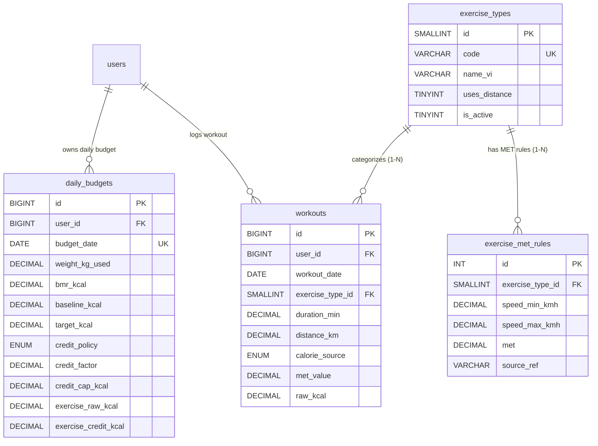

# Phân Hệ 2: Ngân Sách Calo Động & Vận Động Thể Chất

> **Thuộc thư mục:** `docs/02_elaboration/database_design/`  
> **Các bảng trực thuộc:** `daily_budgets`, `exercise_types`, `exercise_met_rules`, `workouts`  
> **Quyết định thiết kế liên quan:**  
> - **DD3:** Phân tách Calo thô (`workouts.raw_kcal`) vs Calo được cộng (`daily_budgets.exercise_credit_kcal`).  
> - **DD4:** Không lưu dư thừa "Calo còn lại", tính động khi hiển thị.

---

## 1. Sơ Đồ Thực Thể Phân Hệ (ERD)

---

## 2. Từ Điển Dữ Liệu Chi Tiết (Data Dictionary)

### 2.1. Bảng `daily_budgets`
Lưu trạng thái ngân sách năng lượng cố định và dẫn xuất cho từng ngày cụ thể của người dùng.

| Cột | Kiểu dữ liệu | Null | Mặc định | Ý nghĩa & Quy tắc |
|---|---|:---:|---|---|
| `id` | `BIGINT UNSIGNED` | No | AUTO_INCREMENT | Khóa chính |
| `user_id` | `BIGINT UNSIGNED` | No | | Mã người dùng |
| `budget_date` | `DATE` | No | | Ngày áp dụng ngân sách |
| `weight_kg_used` | `DECIMAL(5,2)` | No | | Cân nặng được dùng để tính BMR của ngày này |
| `bmr_formula` | `ENUM('mifflin_st_jeor','katch_mcardle')` | No | | Công thức BMR được áp dụng cho ngày |
| `bmr_kcal` | `DECIMAL(8,1)` | No | | Năng lượng chuyển hóa cơ bản (kcal) |
| `baseline_kcal` | `DECIMAL(8,1)` | No | | Calo duy trì cơ bản ($BMR \times 1.2$) |
| `goal_adjust_kcal` | `DECIMAL(8,1)` | No | `0` | Lượng calo bù trừ theo mục tiêu (ví dụ: -500 kcal) |
| `floor_applied` | `TINYINT(1)` | No | `0` | Cờ đánh dấu: 1 nếu ngân sách đã bị chặn ở sàn calo an toàn |
| `target_kcal` | `DECIMAL(8,1)` | No | | Ngân sách nạp mục tiêu ban đầu của ngày (sau khi xét sàn) |
| `credit_policy` | `ENUM('full','partial','capped')` | No | | Chính sách cộng calo tập áp dụng cho ngày này |
| `credit_factor` | `DECIMAL(4,2)` | No | | Hệ số nhân calo tập (1.00 hoặc 0.50) |
| `credit_cap_kcal` | `DECIMAL(8,1)` | Yes | `NULL` | Trần calo tập tối đa được cộng (500 kcal hoặc NULL) |
| `exercise_raw_kcal` | `DECIMAL(8,1)` | No | `0` | Tổng calo thô các buổi tập trong ngày (dẫn xuất từ `workouts`) |
| `exercise_credit_kcal` | `DECIMAL(8,1)` | No | `0` | Số calo tập thực tế được cộng thêm vào ngân sách |
| `created_at` | `DATETIME` | No | `CURRENT_TIMESTAMP` | Thời điểm tạo |
| `updated_at` | `DATETIME` | No | `CURRENT_TIMESTAMP ON UPDATE CURRENT_TIMESTAMP` | Thời điểm cập nhật (đồng bộ khi có buổi tập mới) |

* **Khóa chính:** `PRIMARY KEY (id)`
* **Ràng buộc duy nhất:** `UNIQUE KEY uq_budget_user_date (user_id, budget_date)`
* **Khóa ngoại:** `CONSTRAINT fk_budget_user FOREIGN KEY (user_id) REFERENCES users (id) ON DELETE CASCADE`
* **Ràng buộc kiểm tra:**
  * `CONSTRAINT ck_budget_target CHECK (target_kcal > 0)`
  * `CONSTRAINT ck_budget_credit CHECK (exercise_raw_kcal >= 0 AND exercise_credit_kcal >= 0)`

---

### 2.2. Bảng `exercise_types`
Danh mục loại hình vận động hỗ trợ trong hệ thống.

| Cột | Kiểu dữ liệu | Null | Mặc định | Ý nghĩa & Quy tắc |
|---|---|:---:|---|---|
| `id` | `SMALLINT UNSIGNED` | No | AUTO_INCREMENT | Khóa chính |
| `code` | `VARCHAR(40)` | No | | Mã định danh duy nhất (ví dụ: `running`, `cycling`) |
| `name_vi` | `VARCHAR(100)` | No | | Tên tiếng Việt hiển thị |
| `uses_distance` | `TINYINT(1)` | No | `0` | 1 nếu loại hình có đo quãng đường để tính tốc độ |
| `is_active` | `TINYINT(1)` | No | `1` | Trạng thái kích hoạt |

* **Khóa chính:** `PRIMARY KEY (id)`
* **Ràng buộc duy nhất:** `UNIQUE KEY uq_exercise_code (code)`

---

### 2.3. Bảng `exercise_met_rules`
Bảng tra chỉ số MET (Metabolic Equivalent of Task) theo tốc độ hoặc cường độ cố định.

| Cột | Kiểu dữ liệu | Null | Mặc định | Ý nghĩa & Quy tắc |
|---|---|:---:|---|---|
| `id` | `INT UNSIGNED` | No | AUTO_INCREMENT | Khóa chính |
| `exercise_type_id` | `SMALLINT UNSIGNED` | No | | Mã loại hình tập luyện |
| `speed_min_kmh` | `DECIMAL(4,1)` | Yes | `NULL` | Tốc độ tối thiểu (km/h); NULL nếu không chia dải tốc độ |
| `speed_max_kmh` | `DECIMAL(4,1)` | Yes | `NULL` | Tốc độ tối đa (km/h); NULL nếu không giới hạn trên |
| `met` | `DECIMAL(4,1)` | No | | Hệ số MET tra được |
| `source_ref` | `VARCHAR(100)` | Yes | `NULL` | Mã tham chiếu trong Compendium of Physical Activities |

* **Khóa chính:** `PRIMARY KEY (id)`
* **Chỉ mục:** `KEY ix_met_type (exercise_type_id)`
* **Khóa ngoại:** `CONSTRAINT fk_met_type FOREIGN KEY (exercise_type_id) REFERENCES exercise_types (id) ON DELETE CASCADE`
* **Ràng buộc kiểm tra:** `CONSTRAINT ck_met_positive CHECK (met > 0)`

---

### 2.4. Bảng `workouts`
Nhật ký các buổi tập luyện cá nhân của người dùng.

| Cột | Kiểu dữ liệu | Null | Mặc định | Ý nghĩa & Quy tắc |
|---|---|:---:|---|---|
| `id` | `BIGINT UNSIGNED` | No | AUTO_INCREMENT | Khóa chính |
| `user_id` | `BIGINT UNSIGNED` | No | | Mã người dùng |
| `workout_date` | `DATE` | No | | Ngày diễn ra buổi tập |
| `exercise_type_id` | `SMALLINT UNSIGNED` | No | | Loại hình tập |
| `duration_min` | `DECIMAL(6,1)` | No | | Thời lượng tập (phút) |
| `distance_km` | `DECIMAL(6,2)` | Yes | `NULL` | Quãng đường di chuyển (km) |
| `calorie_source` | `ENUM('met','device')` | No | | Nguồn số liệu calo: tự tính theo MET hoặc từ đồng hồ/thiết bị |
| `confidence` | `ENUM('high','medium','low')` | No | | Mức tin cậy (device = high, met = medium) |
| `met_value` | `DECIMAL(4,1)` | Yes | `NULL` | Giá trị MET đã áp dụng (bắt buộc nếu nguồn là `met`) |
| `weight_kg_used` | `DECIMAL(5,2)` | Yes | `NULL` | Cân nặng tại thời điểm tính (bắt buộc nếu nguồn là `met`) |
| `raw_kcal` | `DECIMAL(8,1)` | No | | Calo tiêu hao thô (chưa nhân hệ số chính sách) |
| `note` | `VARCHAR(255)` | Yes | `NULL` | Ghi chú thêm |
| `created_at` | `DATETIME` | No | `CURRENT_TIMESTAMP` | Thời điểm ghi |
| `updated_at` | `DATETIME` | No | `CURRENT_TIMESTAMP ON UPDATE CURRENT_TIMESTAMP` | Thời điểm cập nhật |

* **Khóa chính:** `PRIMARY KEY (id)`
* **Chỉ mục:** `KEY ix_workouts_user_date (user_id, workout_date)`
* **Khóa ngoại:**
  * `CONSTRAINT fk_workouts_user FOREIGN KEY (user_id) REFERENCES users (id) ON DELETE CASCADE`
  * `CONSTRAINT fk_workouts_type FOREIGN KEY (exercise_type_id) REFERENCES exercise_types (id) ON DELETE RESTRICT`
* **Ràng buộc kiểm tra:**
  * `CONSTRAINT ck_workouts_values CHECK (duration_min > 0 AND raw_kcal >= 0)`
  * `CONSTRAINT ck_workouts_met CHECK (calorie_source = 'device' OR (met_value IS NOT NULL AND weight_kg_used IS NOT NULL))`
