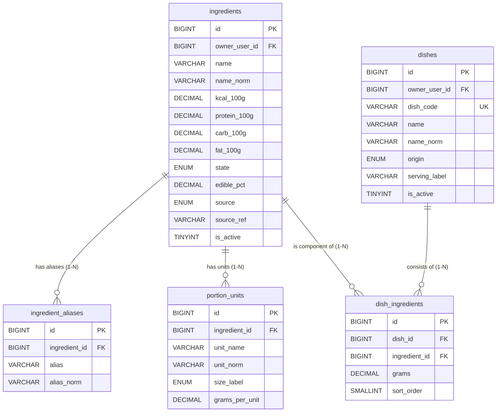

# Phân Hệ 3: Danh Mục Dinh Dưỡng, Đơn Vị Đo & Công Thức Món Ăn

> **Thuộc thư mục:** `docs/02_elaboration/database_design/`  
> **Các bảng trực thuộc:** `ingredients`, `ingredient_aliases`, `portion_units`, `dishes`, `dish_ingredients`  
> **Quyết định thiết kế liên quan:**  
> - **DD5:** Hợp nhất Danh mục hệ thống & Cá nhân qua cột `owner_user_id` (`NULL` = Hệ thống; `NOT NULL` = Cá nhân).  
> - **DD6:** Chặn xóa cứng nguyên liệu đang nằm trong công thức (`ON DELETE RESTRICT`).  
> - Ánh xạ AI: Cột `dishes.dish_code` dùng để map với nhãn dự đoán của AI Vision Microservice.

---

## 1. Sơ Đồ Thực Thể Phân Hệ (ERD)

---

## 2. Từ Điển Dữ Liệu Chi Tiết (Data Dictionary)

### 2.1. Bảng `ingredients`
Danh mục nguyên liệu thực phẩm (hệ thống và cá nhân dùng chung).

| Cột | Kiểu dữ liệu | Null | Mặc định | Ý nghĩa & Quy tắc |
|---|---|:---:|---|---|
| `id` | `BIGINT UNSIGNED` | No | AUTO_INCREMENT | Khóa chính |
| `owner_user_id` | `BIGINT UNSIGNED` | Yes | `NULL` | Chủ sở hữu: `NULL` là nguyên liệu hệ thống; khác NULL là của người dùng |
| `name` | `VARCHAR(150)` | No | | Tên nguyên liệu hiển thị (ví dụ: "Thịt lợn nạc") |
| `name_norm` | `VARCHAR(150)` | No | | Tên chuẩn hóa (chữ thường, không dấu, đ -> d) phục vụ tìm kiếm |
| `kcal_100g` | `DECIMAL(7,2)` | No | | Năng lượng trên 100g phần ăn được (kcal) |
| `protein_100g` | `DECIMAL(6,2)` | No | | Đạm (g) trên 100g |
| `carb_100g` | `DECIMAL(6,2)` | No | | Tinh bột (g) trên 100g |
| `fat_100g` | `DECIMAL(6,2)` | No | | Chất béo (g) trên 100g |
| `state` | `ENUM('raw','cooked','na')` | No | `'na'` | Trạng thái: sống / chín / không áp dụng |
| `edible_pct` | `DECIMAL(5,2)` | No | `100.00` | Tỷ lệ phần ăn được (%) |
| `source` | `ENUM('vdd','usda','manual','user')` | No | | Nguồn dữ liệu (VDD: Viện Dinh Dưỡng, USDA, Tự nhập) |
| `source_ref` | `VARCHAR(100)` | Yes | `NULL` | Mã tra cứu trong tài liệu nguồn (dùng đối soát và seed) |
| `is_active` | `TINYINT(1)` | No | `1` | 1: còn dùng; 0: ngưng dùng (soft disable, không xóa cứng) |
| `created_at` | `DATETIME` | No | `CURRENT_TIMESTAMP` | Thời điểm tạo |
| `updated_at` | `DATETIME` | No | `CURRENT_TIMESTAMP ON UPDATE CURRENT_TIMESTAMP` | Thời điểm cập nhật |

* **Khóa chính:** `PRIMARY KEY (id)`
* **Ràng buộc duy nhất:**
  * `UNIQUE KEY uq_ingredients_source_ref (source, source_ref)`
  * `UNIQUE KEY uq_ingredients_owner_name (owner_user_id, name_norm)`
* **Chỉ mục:** `KEY ix_ingredients_name_norm (name_norm)`
* **Khóa ngoại:** `CONSTRAINT fk_ingredients_owner FOREIGN KEY (owner_user_id) REFERENCES users (id) ON DELETE CASCADE`
* **Ràng buộc kiểm tra:**
  * `CONSTRAINT ck_ingredients_nonneg CHECK (kcal_100g >= 0 AND protein_100g >= 0 AND carb_100g >= 0 AND fat_100g >= 0)`
  * `CONSTRAINT ck_ingredients_macro_sum CHECK (protein_100g + carb_100g + fat_100g <= 100)`
  * `CONSTRAINT ck_ingredients_edible CHECK (edible_pct > 0 AND edible_pct <= 100)`

---

### 2.2. Bảng `ingredient_aliases`
Lưu trữ các từ đồng nghĩa, tên gọi địa phương 3 miền (Bắc – Trung – Nam) và tên gọi thông tục của nguyên liệu (ví dụ: "hột vịt" $\rightarrow$ "trứng vịt", "đậu phộng" $\rightarrow$ "lạc", "nấm mèo" $\rightarrow$ "mộc nhĩ"). Bảng này đóng vai trò làm chỉ mục tra cứu (Search Autocomplete / Synonym Lookup) hỗ trợ người dùng khi tìm kiếm nguyên liệu để:
1. Tùy chỉnh (custom) thành phần món ăn gốc từ 67 món của hệ thống.
2. Tự lập công thức món ăn cá nhân hóa (personalized dishes) từ danh mục `ingredients`.

| Cột | Kiểu dữ liệu | Null | Mặc định | Ý nghĩa & Quy tắc |
|---|---|:---:|---|---|
| `id` | `BIGINT UNSIGNED` | No | AUTO_INCREMENT | Khóa chính |
| `ingredient_id` | `BIGINT UNSIGNED` | No | | Mã nguyên liệu gốc |
| `alias` | `VARCHAR(150)` | No | | Tên đồng nghĩa (ví dụ: "hột vịt" -> "trứng vịt") |
| `alias_norm` | `VARCHAR(150)` | No | | Chuẩn hóa không dấu |

* **Khóa chính:** `PRIMARY KEY (id)`
* **Ràng buộc duy nhất:** `UNIQUE KEY uq_alias_ingredient (ingredient_id, alias_norm)`
* **Chỉ mục:** `KEY ix_alias_norm (alias_norm)`
* **Khóa ngoại:** `CONSTRAINT fk_alias_ingredient FOREIGN KEY (ingredient_id) REFERENCES ingredients (id) ON DELETE CASCADE`

---

### 2.3. Bảng `portion_units`
Bảng quy đổi ước lượng đơn vị dân gian Việt Nam sang gram theo từng nguyên liệu.

| Cột | Kiểu dữ liệu | Null | Mặc định | Ý nghĩa & Quy tắc |
|---|---|:---:|---|---|
| `id` | `BIGINT UNSIGNED` | No | AUTO_INCREMENT | Khóa chính |
| `ingredient_id` | `BIGINT UNSIGNED` | No | | Mã nguyên liệu |
| `unit_name` | `VARCHAR(40)` | No | | Tên đơn vị (bát, chén, quả, đùi, miếng...) |
| `unit_norm` | `VARCHAR(40)` | No | | Chuẩn hóa tên đơn vị |
| `size_label` | `ENUM('small','medium','large')` | No | `'medium'` | Kích thước (nhỏ, vừa, lớn) |
| `grams_per_unit` | `DECIMAL(7,1)` | No | | Số gram tương ứng |
| `note` | `VARCHAR(150)` | Yes | `NULL` | Ghi chú |

* **Khóa chính:** `PRIMARY KEY (id)`
* **Ràng buộc duy nhất:** `UNIQUE KEY uq_portion (ingredient_id, unit_norm, size_label)`
* **Khóa ngoại:** `CONSTRAINT fk_portion_ingredient FOREIGN KEY (ingredient_id) REFERENCES ingredients (id) ON DELETE CASCADE`
* **Ràng buộc kiểm tra:** `CONSTRAINT ck_portion_positive CHECK (grams_per_unit > 0)`

---

### 2.4. Bảng `dishes`
Danh mục món ăn hoàn chỉnh (hệ thống, món tự tạo, món đã lưu).

| Cột | Kiểu dữ liệu | Null | Mặc định | Ý nghĩa & Quy tắc |
|---|---|:---:|---|---|
| `id` | `BIGINT UNSIGNED` | No | AUTO_INCREMENT | Khóa chính |
| `owner_user_id` | `BIGINT UNSIGNED` | Yes | `NULL` | `NULL` là món hệ thống; khác `NULL` là món người dùng |
| `dish_code` | `VARCHAR(60)` | Yes | `NULL` | Mã món duy nhất ánh xạ trực tiếp nhãn AI (chỉ có ở món hệ thống) |
| `name` | `VARCHAR(150)` | No | | Tên món (ví dụ: "Cơm tấm sườn bì chả") |
| `name_norm` | `VARCHAR(150)` | No | | Tên chuẩn hóa không dấu |
| `origin` | `ENUM('system','custom','saved')` | No | | Nguồn gốc món: hệ thống, tự tạo mới, hoặc lưu từ nhật ký |
| `serving_label` | `VARCHAR(60)` | No | `'1 phần'` | Tên khẩu phần chuẩn ("1 dĩa", "1 tô", "1 ổ") |
| `is_active` | `TINYINT(1)` | No | `1` | Trạng thái sử dụng |
| `created_at` | `DATETIME` | No | `CURRENT_TIMESTAMP` | Thời điểm tạo |
| `updated_at` | `DATETIME` | No | `CURRENT_TIMESTAMP ON UPDATE CURRENT_TIMESTAMP` | Thời điểm cập nhật |

* **Khóa chính:** `PRIMARY KEY (id)`
* **Ràng buộc duy nhất:**
  * `UNIQUE KEY uq_dishes_code (dish_code)`
  * `UNIQUE KEY uq_dishes_owner_name (owner_user_id, name_norm)`
* **Chỉ mục:** `KEY ix_dishes_name_norm (name_norm)`
* **Khóa ngoại:** `CONSTRAINT fk_dishes_owner FOREIGN KEY (owner_user_id) REFERENCES users (id) ON DELETE CASCADE`

---

### 2.5. Bảng `dish_ingredients`
Công thức cấu thành món ăn (danh sách nguyên liệu và khối lượng cho 1 khẩu phần chuẩn).

| Cột | Kiểu dữ liệu | Null | Mặc định | Ý nghĩa & Quy tắc |
|---|---|:---:|---|---|
| `id` | `BIGINT UNSIGNED` | No | AUTO_INCREMENT | Khóa chính |
| `dish_id` | `BIGINT UNSIGNED` | No | | Mã món ăn |
| `ingredient_id` | `BIGINT UNSIGNED` | No | | Mã nguyên liệu cấu thành |
| `grams` | `DECIMAL(7,1)` | No | | Khối lượng nguyên liệu cho 1 suất chuẩn (g) |
| `sort_order` | `SMALLINT UNSIGNED` | No | `0` | Thứ tự hiển thị trong công thức |

* **Khóa chính:** `PRIMARY KEY (id)`
* **Ràng buộc duy nhất:** `UNIQUE KEY uq_dish_ingredient (dish_id, ingredient_id)`
* **Chỉ mục:** `KEY ix_di_ingredient (ingredient_id)`
* **Khóa ngoại:**
  * `CONSTRAINT fk_di_dish FOREIGN KEY (dish_id) REFERENCES dishes (id) ON DELETE CASCADE`
  * `CONSTRAINT fk_di_ingredient FOREIGN KEY (ingredient_id) REFERENCES ingredients (id) ON DELETE RESTRICT` (Ngăn xóa nguyên liệu khi còn trong công thức món ăn).
* **Ràng buộc kiểm tra:** `CONSTRAINT ck_di_grams CHECK (grams BETWEEN 0.1 AND 2000)`
