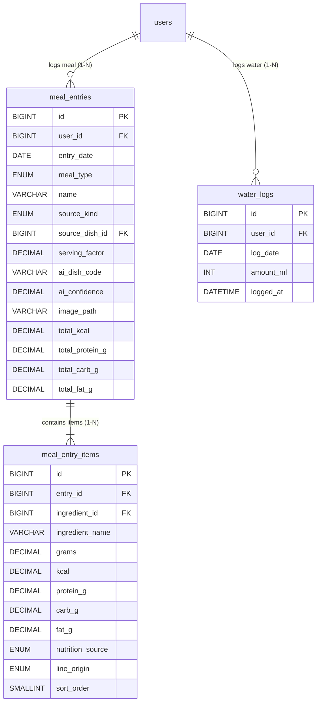

# Phân Hệ 4: Nhật Ký Ăn Uống (Snapshot Bất Biến) & Theo Dõi Nước Uống

> **Thuộc thư mục:** `docs/02_elaboration/database_design/`  
> **Các bảng trực thuộc:** `meal_entries`, `meal_entry_items`, `water_logs`  
> **Quyết định thiết kế liên quan:**  
> - **DD2:** Cơ chế **Snapshot nhật ký bất biến**: `meal_entry_items` lưu cố định tên nguyên liệu, gram, kcal và macro tại thời điểm ăn. Khóa ngoại tham chiếu danh mục dùng `ON DELETE SET NULL`, đảm bảo việc chỉnh sửa hoặc xóa danh mục gốc không làm sai lệch lịch sử calo đã nạp của người dùng.

---

## 1. Sơ Đồ Thực Thể Phân Hệ (ERD)

---

## 2. Từ Điển Dữ Liệu Chi Tiết (Data Dictionary)

### 2.1. Bảng `meal_entries`
Nhật ký bữa ăn tổng thể của người dùng theo từng bữa trong ngày.

| Cột | Kiểu dữ liệu | Null | Mặc định | Ý nghĩa & Quy tắc |
|---|---|:---:|---|---|
| `id` | `BIGINT UNSIGNED` | No | AUTO_INCREMENT | Khóa chính |
| `user_id` | `BIGINT UNSIGNED` | No | | Mã người dùng |
| `entry_date` | `DATE` | No | | Ngày ăn |
| `meal_type` | `ENUM('breakfast','lunch','dinner','snack')` | No | | Bữa ăn: Sáng, Trưa, Tối, Bữa phụ |
| `name` | `VARCHAR(150)` | No | | Tên món ăn hoặc tên bữa ăn ghi nhận |
| `source_kind` | `ENUM('ai','manual','saved')` | No | | Nguồn ghi nhận: Từ nhận diện AI, ghi thủ công, hay chọn từ món đã lưu |
| `source_dish_id` | `BIGINT UNSIGNED` | Yes | `NULL` | Tham chiếu món gốc (nếu có, chỉ để truy vết) |
| `serving_factor` | `DECIMAL(5,2)` | Yes | `NULL` | Hệ số khẩu phần lúc chọn (ví dụ: 1.5 suất) |
| `ai_dish_code` | `VARCHAR(60)` | Yes | `NULL` | Nhãn AI nhận diện nếu từ AI |
| `ai_confidence` | `DECIMAL(4,3)` | Yes | `NULL` | Độ tin cậy của AI |
| `image_path` | `VARCHAR(255)` | Yes | `NULL` | Đường dẫn lưu ảnh vĩnh viễn (nếu người dùng tích chọn lưu ảnh) |
| `total_kcal` | `DECIMAL(8,1)` | No | | Tổng calo của bữa (lưu cứng snapshot) |
| `total_protein_g` | `DECIMAL(8,1)` | No | | Tổng protein (g) |
| `total_carb_g` | `DECIMAL(8,1)` | No | | Tổng tinh bột (g) |
| `total_fat_g` | `DECIMAL(8,1)` | No | | Tổng chất béo (g) |
| `created_at` | `DATETIME` | No | `CURRENT_TIMESTAMP` | Thời điểm ghi |
| `updated_at` | `DATETIME` | No | `CURRENT_TIMESTAMP ON UPDATE CURRENT_TIMESTAMP` | Thời điểm sửa |

* **Khóa chính:** `PRIMARY KEY (id)`
* **Chỉ mục:** `KEY ix_meals_user_date (user_id, entry_date)`
* **Khóa ngoại:**
  * `CONSTRAINT fk_meals_user FOREIGN KEY (user_id) REFERENCES users (id) ON DELETE CASCADE`
  * `CONSTRAINT fk_meals_dish FOREIGN KEY (source_dish_id) REFERENCES dishes (id) ON DELETE SET NULL`
* **Ràng buộc kiểm tra:** `CONSTRAINT ck_meals_totals CHECK (total_kcal >= 0 AND total_protein_g >= 0 AND total_carb_g >= 0 AND total_fat_g >= 0)`

---

### 2.2. Bảng `meal_entry_items`
Chi tiết từng nguyên liệu thành phần trong bữa ăn đã lưu (Snapshot hoàn chỉnh).

| Cột | Kiểu dữ liệu | Null | Mặc định | Ý nghĩa & Quy tắc |
|---|---|:---:|---|---|
| `id` | `BIGINT UNSIGNED` | No | AUTO_INCREMENT | Khóa chính |
| `entry_id` | `BIGINT UNSIGNED` | No | | Mã bữa ăn nhật ký |
| `ingredient_id` | `BIGINT UNSIGNED` | Yes | `NULL` | Khóa ngoại mềm tới nguyên liệu gốc (chỉ để truy vết) |
| `ingredient_name` | `VARCHAR(150)` | No | | Tên nguyên liệu tại thời điểm ghi (bất biến) |
| `grams` | `DECIMAL(7,1)` | No | | Khối lượng nguyên liệu thực tế (g) |
| `kcal` | `DECIMAL(8,1)` | No | | Năng lượng của lượng gram này |
| `protein_g` | `DECIMAL(8,1)` | No | | Đạm (g) |
| `carb_g` | `DECIMAL(8,1)` | No | | Tinh bột (g) |
| `fat_g` | `DECIMAL(8,1)` | No | | Chất béo (g) |
| `nutrition_source` | `ENUM('vdd','usda','manual','user')` | No | | Nguồn dinh dưỡng dùng tính dòng này (NFR-05) |
| `line_origin` | `ENUM('recipe','description','manual')` | No | | Nguồn gốc dòng: từ công thức chuẩn, bóc tách từ mô tả, hay gõ tay |
| `sort_order` | `SMALLINT UNSIGNED` | No | `0` | Thứ tự hiển thị |

* **Khóa chính:** `PRIMARY KEY (id)`
* **Chỉ mục:** `KEY ix_items_entry (entry_id)`
* **Khóa ngoại:**
  * `CONSTRAINT fk_items_entry FOREIGN KEY (entry_id) REFERENCES meal_entries (id) ON DELETE CASCADE`
  * `CONSTRAINT fk_items_ingredient FOREIGN KEY (ingredient_id) REFERENCES ingredients (id) ON DELETE SET NULL`
* **Ràng buộc kiểm tra:**
  * `CONSTRAINT ck_items_grams CHECK (grams BETWEEN 0.1 AND 2000)`
  * `CONSTRAINT ck_items_nonneg CHECK (kcal >= 0 AND protein_g >= 0 AND carb_g >= 0 AND fat_g >= 0)`

---

### 2.3. Bảng `water_logs`
Lưu trữ nhật ký uống nước trong ngày.

| Cột | Kiểu dữ liệu | Null | Mặc định | Ý nghĩa & Quy tắc |
|---|---|:---:|---|---|
| `id` | `BIGINT UNSIGNED` | No | AUTO_INCREMENT | Khóa chính |
| `user_id` | `BIGINT UNSIGNED` | No | | Mã người dùng |
| `log_date` | `DATE` | No | | Ngày uống nước |
| `amount_ml` | `INT UNSIGNED` | No | | Lượng nước uống thêm mỗi lần (ml) |
| `logged_at` | `DATETIME` | No | `CURRENT_TIMESTAMP` | Thời điểm ghi |

* **Khóa chính:** `PRIMARY KEY (id)`
* **Chỉ mục:** `KEY ix_water_user_date (user_id, log_date)`
* **Khóa ngoại:** `CONSTRAINT fk_water_user FOREIGN KEY (user_id) REFERENCES users (id) ON DELETE CASCADE`
* **Ràng buộc kiểm tra:** `CONSTRAINT ck_water_positive CHECK (amount_ml > 0)`
