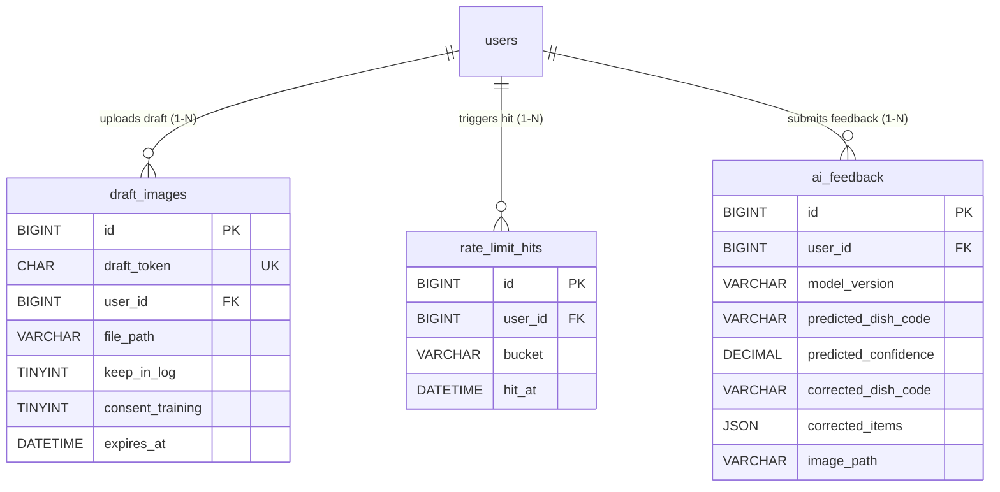

# Phân Hệ 5: Phụ Trợ & Dịch Vụ AI Microservice

> **Thuộc thư mục:** `docs/02_elaboration/database_design/`  
> **Các bảng trực thuộc:** `draft_images`, `rate_limit_hits`, `ai_feedback`  
> **Quyết định thiết kế liên quan:**  
> - Quản lý vòng đời ảnh upload: Zero-Disk I/O khi nhận diện; chỉ lưu đĩa tạm thời nếu người dùng chọn giữ ảnh (FR-03.18).  
> - Chống quá tải & lạm dụng AI Service: Quản lý Rate Limit cấp cơ sở dữ liệu (`rate_limit_hits`, NFR-03).  
> - Tái đào tạo & Cải tiến mô hình: Thu thập dữ liệu feedback (`ai_feedback`, FR-03.16).

---

## 1. Sơ Đồ Thực Thể Phân Hệ (ERD)

---

## 2. Từ Điển Dữ Liệu Chi Tiết (Data Dictionary)

### 2.1. Bảng `draft_images`
Quản lý ảnh tải lên tạm thời khi người dùng chọn "Giữ ảnh vào nhật ký" trong lúc chờ duyệt bản nháp (FR-03.18).

| Cột | Kiểu dữ liệu | Null | Mặc định | Ý nghĩa & Quy tắc |
|---|---|:---:|---|---|
| `id` | `BIGINT UNSIGNED` | No | AUTO_INCREMENT | Khóa chính |
| `draft_token` | `CHAR(32)` | No | | Token phiên nhận diện bản nháp |
| `user_id` | `BIGINT UNSIGNED` | No | | Người tải ảnh |
| `file_path` | `VARCHAR(255)` | No | | Đường dẫn tệp tạm trên đĩa |
| `keep_in_log` | `TINYINT(1)` | No | `0` | 1 nếu người dùng muốn lưu ảnh vào nhật ký |
| `consent_training` | `TINYINT(1)` | No | `0` | 1 nếu người dùng đồng ý đóng góp ảnh huấn luyện AI |
| `created_at` | `DATETIME` | No | `CURRENT_TIMESTAMP` | Thời điểm tạo |
| `expires_at` | `DATETIME` | No | | Thời điểm hết hạn (cron xóa tệp sau hạn này) |

* **Khóa chính:** `PRIMARY KEY (id)`
* **Ràng buộc duy nhất:** `UNIQUE KEY uq_draft_token (draft_token)`
* **Chỉ mục:** `KEY ix_draft_expires (expires_at)`
* **Khóa ngoại:** `CONSTRAINT fk_draft_user FOREIGN KEY (user_id) REFERENCES users (id) ON DELETE CASCADE`

---

### 2.2. Bảng `rate_limit_hits`
Theo dõi tần suất gọi API (ví dụ: giới hạn số lần gọi phân tích ảnh AI chống spam/quá tải, NFR-03).

| Cột | Kiểu dữ liệu | Null | Mặc định | Ý nghĩa & Quy tắc |
|---|---|:---:|---|---|
| `id` | `BIGINT UNSIGNED` | No | AUTO_INCREMENT | Khóa chính |
| `user_id` | `BIGINT UNSIGNED` | No | | Người dùng thực hiện request |
| `bucket` | `VARCHAR(40)` | No | | Tên bucket giới hạn tốc độ (ví dụ: `'analyze'`) |
| `hit_at` | `DATETIME(3)` | No | `CURRENT_TIMESTAMP(3)` | Thời điểm thực hiện (độ chính xác mili giây) |

* **Khóa chính:** `PRIMARY KEY (id)`
* **Chỉ mục:** `KEY ix_rl_lookup (user_id, bucket, hit_at)`
* **Khóa ngoại:** `CONSTRAINT fk_rl_user FOREIGN KEY (user_id) REFERENCES users (id) ON DELETE CASCADE`

---

### 2.3. Bảng `ai_feedback`
Thu thập phản hồi đính chính kết quả AI khi người dùng đồng ý đóng góp (FR-03.16 - Yêu cầu Could).

| Cột | Kiểu dữ liệu | Null | Mặc định | Ý nghĩa & Quy tắc |
|---|---|:---:|---|---|
| `id` | `BIGINT UNSIGNED` | No | AUTO_INCREMENT | Khóa chính |
| `user_id` | `BIGINT UNSIGNED` | No | | Người dùng gửi góp ý |
| `model_version` | `VARCHAR(40)` | No | | Phiên bản model AI đã dự đoán |
| `predicted_dish_code` | `VARCHAR(60)` | Yes | `NULL` | Nhãn AI đã dự đoán |
| `predicted_confidence` | `DECIMAL(4,3)` | Yes | `NULL` | Độ tin cậy AI đã đưa ra |
| `corrected_dish_code` | `VARCHAR(60)` | Yes | `NULL` | Nhãn chuẩn do người dùng sửa lại |
| `corrected_items` | `JSON` | Yes | `NULL` | Chi tiết nguyên liệu chỉnh sửa (định dạng JSON) |
| `image_path` | `VARCHAR(255)` | Yes | `NULL` | Đường dẫn ảnh đóng góp nếu được cho phép |
| `created_at` | `DATETIME` | No | `CURRENT_TIMESTAMP` | Thời điểm ghi nhận |

* **Khóa chính:** `PRIMARY KEY (id)`
* **Chỉ mục:** `KEY ix_feedback_user (user_id)`
* **Khóa ngoại:** `CONSTRAINT fk_feedback_user FOREIGN KEY (user_id) REFERENCES users (id) ON DELETE CASCADE`
