# Thiết Kế CSDL: Lược Đồ Liên Kết Chuỗi Bảng & Kiến Trúc Tổng Thể

> **Phân mục:** `docs/02_elaboration/database_design/`  
> **Hệ quản trị CSDL:** MySQL >= 8.0.16 / MariaDB >= 10.2.1 (hỗ trợ `CHECK` constraints).  
> **Engine:** InnoDB | **Collation:** `utf8mb4_unicode_ci` | **Timezone:** `UTC+07:00`.  
> **Kịch bản DDL nguồn:** [`database/schema.sql`](../../../database/schema.sql)

---

## 1. Bản Đồ Liên Kết Chuỗi Bảng Tổng Thể (High-Level Table Relationship)

Sơ đồ thể hiện chuỗi liên kết logic và luồng dữ liệu giữa 18 bảng chia thành 5 phân hệ:

```mermaid
flowchart TB
    %% 5 Phân hệ
    subgraph G1["1. Tài khoản & Hồ sơ (3 bảng)"]
        users["users\n(Tài khoản gốc)"]
        user_profiles["user_profiles\n(Hồ sơ thể chất)"]
        weight_logs["weight_logs\n(Nguồn duy nhất cân nặng)"]
        users --- user_profiles
        users --- weight_logs
    end

    subgraph G2["2. Ngân sách & Vận động (4 bảng)"]
        daily_budgets["daily_budgets\n(Ngân sách calo ngày)"]
        workouts["workouts\n(Nhật ký tập luyện)"]
        exercise_types["exercise_types\n(Môn tập)"]
        exercise_met_rules["exercise_met_rules\n(Hệ số MET)"]
        exercise_types --- exercise_met_rules
        exercise_types --- workouts
    end

    subgraph G3["3. Dinh dưỡng & Món ăn (5 bảng)"]
        ingredients["ingredients\n(Nguyên liệu 100g)"]
        ingredient_aliases["ingredient_aliases\n(Tên đồng nghĩa)"]
        portion_units["portion_units\n(Quy đổi chén/bát)"]
        dishes["dishes\n(Món ăn + dish_code AI)"]
        dish_ingredients["dish_ingredients\n(Công thức chuẩn)"]
        ingredients --- ingredient_aliases
        ingredients --- portion_units
        dishes --- dish_ingredients
        ingredients --- dish_ingredients
    end

    subgraph G4["4. Nhật ký Ăn uống & Nước (3 bảng)"]
        meal_entries["meal_entries\n(Bữa ăn: Sáng/Trưa/Tối)"]
        meal_entry_items["meal_entry_items\n(Snapshot nguyên liệu & calo)"]
        water_logs["water_logs\n(Nhật ký uống nước)"]
        meal_entries --- meal_entry_items
    end

    subgraph G5["5. Phụ trợ & AI Service (3 bảng)"]
        draft_images["draft_images\n(Ảnh tạm upload)"]
        rate_limit_hits["rate_limit_hits\n(Chặn spam API AI)"]
        ai_feedback["ai_feedback\n(Đánh giá kết quả AI)"]
    end

    %% Chuỗi liên kết ngoại (Foreign Keys & Soft Links)
    users -->|1-N| daily_budgets
    users -->|1-N| workouts
    users -->|1-N| water_logs
    users -->|1-N| meal_entries
    users -.->|Sở hữu món/nguyên liệu cá nhân| ingredients
    users -.->|Sở hữu món/nguyên liệu cá nhân| dishes
    users -->|1-N| draft_images
    users -->|1-N| rate_limit_hits
    users -->|1-N| ai_feedback

    workouts -->|Đồng bộ calo tập| daily_budgets
    dishes -.->|SET NULL khi xóa món gốc| meal_entries
    ingredients -.->|SET NULL khi xóa nguyên liệu| meal_entry_items
```

---

## 2. Danh Mục 5 Phân Hệ Chi Tiết

Hồ sơ thiết kế chi tiết (gồm ERD từng nhóm và từ điển dữ liệu Data Dictionary cụ thể từng cột) được chia tách thành 5 tài liệu riêng biệt để xem nhanh, không gây lag máy:

| STT | Tài liệu chi tiết | Số bảng | Bảng trực thuộc | Nội dung trọng tâm |
| :---: | :--- | :---: | :--- | :--- |
| **01** | [01_user_management.md](./01_user_management.md) | 3 | `users`, `user_profiles`, `weight_logs` | Định danh, phân quyền, hồ sơ BMR, nguyên tắc "cân nặng 1 nguồn chân lý". |
| **02** | [02_budget_and_workouts.md](./02_budget_and_workouts.md) | 4 | `daily_budgets`, `exercise_types`, `exercise_met_rules`, `workouts` | Ngân sách calo động theo ngày, quy tắc MET, calo tập thô vs calo được cộng. |
| **03** | [03_nutrition_and_dishes.md](./03_nutrition_and_dishes.md) | 5 | `ingredients`, `ingredient_aliases`, `portion_units`, `dishes`, `dish_ingredients` | Thành phần dinh dưỡng 100g, quy đổi đơn vị dân gian, công thức món ăn & `dish_code` khớp nhãn AI. |
| **04** | [04_meal_and_water_logs.md](./04_meal_and_water_logs.md) | 3 | `meal_entries`, `meal_entry_items`, `water_logs` | Cơ chế **Snapshot bất biến** cho bữa ăn, chi tiết nguyên liệu, theo dõi nước uống. |
| **05** | [05_auxiliary_and_ai.md](./05_auxiliary_and_ai.md) | 3 | `draft_images`, `rate_limit_hits`, `ai_feedback` | Quản lý vòng đời ảnh upload tạm, bộ đếm Rate Limit chống DDoS, lưu góp ý sửa nhãn AI. |

---

## 3. Các Quyết Định Thiết Kế Cốt Lõi (DD1 – DD7)

1. **DD1 (Cân nặng một nguồn):** `user_profiles` không lưu cân nặng. Mọi tính toán BMR đều lấy bản ghi mới nhất từ `weight_logs`.
2. **DD2 (Snapshot nhật ký ăn uống bất biến):** `meal_entry_items` lưu cứng tên nguyên liệu, gram, kcal và macro tại thời điểm ăn. Khóa ngoại tới `ingredients`/`dishes` dùng `ON DELETE SET NULL`.
3. **DD3 (Calo tập luyện phân tách):** `workouts` chỉ lưu calo thô (`raw_kcal`). Phần calo được cộng (`exercise_credit_kcal`) được tính và ghi tại `daily_budgets`.
4. **DD4 (Không lưu dư thừa "Calo còn lại"):** Calo còn lại được tính động khi hiển thị.
5. **DD5 (Hợp nhất Danh mục hệ thống & Cá nhân):** Dùng chung `ingredients` và `dishes`, phân biệt bằng `owner_user_id` (`NULL` = Hệ thống; khác NULL = Cá nhân).
6. **DD6 (Chặn xóa danh mục đang dùng):** Khóa ngoại `dish_ingredients.ingredient_id` dùng `ON DELETE RESTRICT`.
7. **DD7 (Ràng buộc kiểm tra nghiêm ngặt):** Dùng `CHECK` constraints cho dải dữ liệu thực tế ($0.1 - 2000g$, macro $\le 100g$, số ngày tập $0 - 7$).

---

## 4. Ranh Giới Giao Dịch (ACID Transactions)

```mermaid
flowchart TD
    subgraph T1["Transaction 1: Đăng ký & Khảo sát (UC01)"]
        T1A["INSERT users"] --> T1B["INSERT user_profiles"]
        T1B --> T1C["INSERT weight_logs (Cân ban đầu)"]
        T1C --> T1D["INSERT daily_budgets (Ngân sách ngày 1)"]
    end

    subgraph T2["Transaction 2: Ghi / Sửa Nhật ký Ăn (UC05/UC06/UC14)"]
        T2A["INSERT/UPDATE meal_entries"] --> T2B["DELETE cũ (nếu sửa) & INSERT meal_entry_items"]
        T2B --> T2C["UPDATE/DELETE draft_images (Dọn ảnh tạm)"]
    end

    subgraph T3["Transaction 3: Ghi Bài tập & Cập nhật Calo (UC07)"]
        T3A["INSERT/UPDATE/DELETE workouts"] --> T3B["SELECT SUM(raw_kcal) FROM workouts"]
        T3B --> T3C["Áp chính sách & UPDATE daily_budgets"]
    end

    subgraph T4["Transaction 4: Sửa Hồ sơ & Cập nhật BMR (UC03)"]
        T4A["UPDATE user_profiles"] --> T4B["INSERT weight_logs (nếu có cân mới)"]
        T4B --> T4C["Tính lại BMR & UPDATE daily_budgets hôm nay"]
    end
```

